# 1 Data wrangling and filtering
Sandra Erdmann

# Description

The dataset analysed in the following script is from this publication:
Erdmann et al., 2025. Population structure of Acropora kenti at inshore
reefs of the Great Barrier Reef. Molecular Ecology.

This script analyses a SNP’s dataset from DArT using the package
darTRverse (version 2024), which contains 7 subpackages:
https://github.com/green-striped-gecko/dartRverse

# Abbreviations

Reef names:

- BRR = Bramble Reef

- EP = East Pelorus

- GB = Geoffrey Bay

- HaR = Havannah Reef

- HB = Horseshoe Bay

- HFB = Huntingfield Bay

- JB = John Brewer Reef

- KR = Keeper Reef

- LPB = Little Pioneer Bay

- MB = Maud Bay

- MR = Middle Reef

- PB = Picnic Bay

- SO = South Orpheus

- WB = Wilson Bay

- WP = West Pelorus

Data sets:

ak = Acropora kenti SNP dataset ak.filtered = used ak, which has been
filtered for all downstream analysis ak.filtered.nr = used ak.filtered
and removed replicates (nr = no replicates) ak.filtered.nr.nm = = used
ak.filtered.nr and removed migrants (nm = no migrants) ak.pop = used
ak.filtered.nr to run population structure analysis ak.pop.nm = used
ak.pop and removed migrants ak.pop.mag = population structure dataset
for Magnetic Island only ak.rel = used ak.filtered.nr.nm to run
relatedness analysis ak.gen = used ak.filtered.nr.nm to calculate
genetic diversity estimates (Fst, Fis, He, Ho) ak.gen.mag = used ak.gen
to calculate genetic diversity metrics for Magnetic Island only
ak.gen.adj = used ak.gen to calculate genetic diversity metrics for
adjacent reefs only

# Installation

https://green-striped-gecko.github.io/kioloa/install.html

``` r
# Install the necessary bioconductor packages
install.packages("devtools")
install.packages("BiocManager")
BiocManager::install("SNPRelate")

# Install dartRverse (dartRverse) & core (dartR.base, dartR.data)
install.packages("dartRverse")
```

``` r
if (!requireNamespace("BiocManager", quietly = TRUE))
    install.packages("BiocManager")

BiocManager::install("snpStats")
```

``` r
# Install dartR packages
install.packages("dartR.sim")
install.packages("dartR.popgen")
install.packages("dartR.spatial")
install.packages("dartR.captive")

# Update dartR.base
dartRverse_install(package = "dartR.base", rep = "github", branch = "dev")
# Check which packages and versions are installed
dartRverse_install()
```

## Load library

``` r
library(dartRverse)
```

    **********************************************
    **** Welcome to dartRverse [Version 1.0.6] ****
    **********************************************

    ── Core dartRverse packages ────────────────────────────────────── dartRverse ──
    ✔ dartR.base 1.0.6     ✔ dartR.data 1.0.8
    ── Installed dartRverse packages   ─────────────────────────────── dartRverse ──
    ✔ dartR.captive 1.0.2     ✔ dartR.sim     0.70 
    ✔ dartR.popgen  1.0.0     ✔ dartR.spatial 1.0.3
    ── Not [yet] installed dartRverse packages ─────────────────────── dartRverse ──
    ✖ dartR.sexlinked      

# Load and inspect raw dataset

The SNP input dart file is named
Report_DAc23-8597_5_moreOrders_SNP_2.csv. The metadata file is called
“ind_metrics_SNP2.csv” and contains information for all individuals,
such as, ID, name of populations, locations and coordinates of sample
locations.

``` r
# Merge the DartR SNP dataset with the metadata file
if (file.exists("cache/ak.rdata")) {
  load("cache/ak.rdata")
} else {

  ak <- gl.read.dart(filename="raw_data/Report_DAc23-8597_5_moreOrders_SNP_2.csv", ind.metafile = "ind_metrics_SNP2.csv")
 # Save merged SNP and metadata file
  save(ak, file="cache/ak.rdata")    
}
```

``` r
# Get names of individuals, location and population
nInd(ak)
```

    [1] 528

``` r
nLoc(ak)
```

    [1] 55255

``` r
nPop(ak)
```

    [1] 15

``` r
# Create a table showing the number of individuals per population
table(pop(ak))
```


    BRR  EP  GB HaR  HB HFB  JB  KR LPB  MB  MR  PB  SO  WB  WP 
     21 109  29  28  29  23  21  21  35  18  25  26 112  22   9 

``` r
# Create a barplot from that table
barplot(table(pop(ak)), las=2)
```


``` r
# Run a smearplot to assess quality of dataset
gl.smearplot(ak)
```

      Processing genlight object with SNP data
    Starting gl.smearplot 

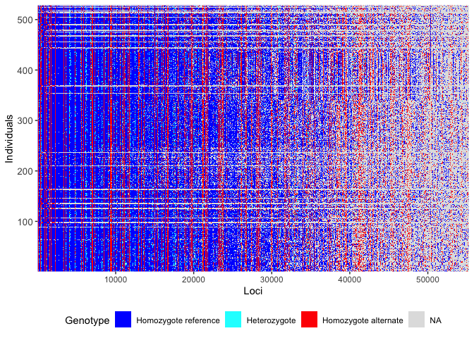

    Completed: gl.smearplot 

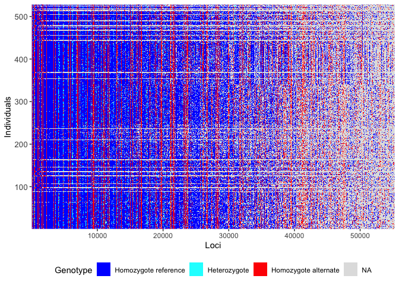

# Assess callrate

``` r
# Get names of individual samples
ak$ind.names
```

      [1] "A1"                "A159"              "B1"               
      [4] "A13"               "A24"               "A85"              
      [7] "A102"              "A113"              "A125"             
     [10] "A138"              "A149"              "A2"               
     [13] "A160"              "B2"                "B15"              
     [16] "A15"               "A25"               "A88"              
     [19] "A105"              "A114"              "A126"             
     [22] "A139"              "A150"              "A3"               
     [25] "A161"              "B3"                "B17"              
     [28] "A17"               "A89"               "A106"             
     [31] "A116"              "A127"              "A140"             
     [34] "A151"              "A7"                "A164"             
     [37] "B7"                "B18"               "A18"              
     [40] "A28"               "A90"               "A107"             
     [43] "A117"              "A130"              "A141"             
     [46] "A152"              "A8"                "A166"             
     [49] "B8"                "B19"               "A19"              
     [52] "A29"               "A92"               "A108"             
     [55] "A120"              "A132"              "A142"             
     [58] "A153"              "A9"                "A167"             
     [61] "B9"                "B21"               "A21"              
     [64] "A31"               "A99"               "A109"             
     [67] "A122"              "A134"              "A145"             
     [70] "A154"              "A10"               "A168"             
     [73] "B10"               "A22"               "A82"              
     [76] "A100"              "A111"              "A123"             
     [79] "A135"              "A146"              "A155"             
     [82] "A11"               "A169"              "B11"              
     [85] "A23"               "A84"               "A101"             
     [88] "A112"              "A124"              "A136"             
     [91] "A148"              "A156"              "HaR_06/05/2022_12"
     [94] "HaR_06/05/2022_31" "HaR_06/05/2022_40" "MR_14/03/2022_6"  
     [97] "MR_14/03/2022_34"  "MR_14/03/2022_46"  "KR_29/03/2022_29" 
    [100] "KR_29/03/2022_41"  "KR_29/03/2022_49"  "HaR_06/05/2022_15"
    [103] "HaR_06/05/2022_32" "HaR_06/05/2022_41" "MR_14/03/2022_7"  
    [106] "MR_14/03/2022_35"  "MR_14/03/2022_47"  "KR_29/03/2022_30" 
    [109] "KR_29/03/2022_42"  "KR_29/03/2022_50"  "HaR_06/05/2022_19"
    [112] "HaR_06/05/2022_33" "HaR_06/05/2022_42" "MR_14/03/2022_8"  
    [115] "MR_14/03/2022_37"  "MR_14/03/2022_48"  "KR_29/03/2022_31" 
    [118] "KR_29/03/2022_43"  "HaR_06/05/2022_1"  "HaR_06/05/2022_20"
    [121] "HaR_06/05/2022_34" "HaR_06/05/2022_43" "20"               
    [124] "MR_14/03/2022_9"   "MR_14/03/2022_38"  "MR_14/03/2022_49" 
    [127] "KR_29/03/2022_32"  "KR_29/03/2022_44"  "HaR_06/05/2022_7" 
    [130] "HaR_06/05/2022_23" "HaR_06/05/2022_35" "HaR_06/05/2022_44"
    [133] "MR_14/03/2022_1"   "MR_14/03/2022_10"  "MR_14/03/2022_39" 
    [136] "MR_14/03/2022_50"  "KR_29/03/2022_33"  "KR_29/03/2022_45" 
    [139] "HaR_06/05/2022_8"  "HaR_06/05/2022_24" "HaR_06/05/2022_36"
    [142] "HaR_06/05/2022_50" "MR_14/03/2022_3"   "MR_14/03/2022_11" 
    [145] "MR_14/03/2022_41"  "KR_29/03/2022_26"  "KR_29/03/2022_34" 
    [148] "KR_29/03/2022_46"  "HaR_06/05/2022_9"  "HaR_06/05/2022_25"
    [151] "HaR_06/05/2022_37" "MR_14/03/2022_4"   "MR_14/03/2022_12" 
    [154] "MR_14/03/2022_44"  "KR_29/03/2022_27"  "KR_29/03/2022_35" 
    [157] "KR_29/03/2022_47"  "HaR_06/05/2022_10" "HaR_06/05/2022_29"
    [160] "HaR_06/05/2022_38" "MR_14/03/2022_5"   "MR_14/03/2022_13" 
    [163] "MR_14/03/2022_45"  "KR_29/03/2022_28"  "KR_29/03/2022_36" 
    [166] "KR_29/03/2022_48"  "HaR_06/05/2022_11" "At_34_J20"        
    [169] "At_O18"            "At_O48"            "At_47_J20"        
    [172] "At_12_J20"         "At_162_J20.1"      "At_51_N"          
    [175] "At_69_N"           "At_76_A"           "At_80_A"          
    [178] "At_35_J20"         "At_O62"            "At_O19"           
    [181] "At_O49"            "At_52_J20"         "At_14_J20"        
    [184] "At_163_J20.1"      "At_32_N"           "At_53_N"          
    [187] "At_70_N"           "At_39_J20"         "At_O20"           
    [190] "At_O50"            "At_56_J20"         "At_165_J20"       
    [193] "At_38_N"           "At_54_N"           "At_33_F"          
    [196] "At_66_A"           "At_71_A"           "At_40_J20"        
    [199] "At_O78"            "At_O42"            "At_O52"           
    [202] "At_58_J20"         "At_20_J20"         "At_170_N"         
    [205] "At_43_N"           "At_55_N"           "At_57_F"          
    [208] "At_72_A"           "At_41_J20"         "At_O3"            
    [211] "At_O43"            "At_O53"            "At_59_J20"        
    [214] "At_27_J20"         "At_O55"            "At_45_N"          
    [217] "At_O73"            "At_62_A"           "At_42_J20"        
    [220] "At_O44"            "At_4_J20"          "At_30_J20"        
    [223] "At_O56"            "At_48_N"           "At_63_N"          
    [226] "At_O76"            "At_75_A"           "At_79_A"          
    [229] "At_44_J20"         "At_O16"            "At_O45"           
    [232] "At_5_J20"          "At_157_J20"        "At_O57"           
    [235] "At_49_N"           "At_67_N"           "At_O10"           
    [238] "At_65_A"           "At_46_J20"         "At_O17"           
    [241] "At_O47"            "At_6_J20"          "At_158_J20"       
    [244] "At_50_N"           "At_O51"            "At_78_A"          
    [247] "At_4_F"            "At_D26_3.20"       "At_D34_3.20"      
    [250] "At_D42_3.20"       "At_23_J20"         "At_33_F20"        
    [253] "At_45_F20"         "At_58_F20"         "At_73_F20"        
    [256] "At_S2_3.20"        "At_S10_3.20"       "At_S18_3.20"      
    [259] "At_6_N"            "At_D27_3.20"       "At_D35_3.20"      
    [262] "At_D43_3.20"       "At_24_J20"         "At_34_N"          
    [265] "At_48_F20"         "At_60_F20"         "At_74_F20"        
    [268] "At_S3_3.20"        "At_S11_3.20"       "At_S19_3.20"      
    [271] "At_7_J20"          "At_D28_3.20"       "At_D36_3.20"      
    [274] "At_D44_3.20"       "At_25_J20"         "At_35_N"          
    [277] "At_49_F20"         "At_61_F20"         "At_75_F20"        
    [280] "At_S4_3.20"        "At_S12_3.20"       "At_S20_3.20"      
    [283] "At_8_J20"          "At_D29_3.20"       "At_D37_3.20"      
    [286] "At_D45_3.20"       "At_29_J20"         "At_36_F20"        
    [289] "At_51_F20"         "At_62_F20"         "At_76_F20"        
    [292] "At_S5_3.20"        "At_S13_3.20"       "At_S21_3.20"      
    [295] "At_9_J20"          "At_D30_3.20"       "At_D38_3.20"      
    [298] "At_D46_3.20"       "At_154_J20"        "At_37_F20"        
    [301] "At_53_F20"         "At_66_F20"         "At_77_F20"        
    [304] "At_S6_3.20"        "At_S14_3.20"       "At_S22_3.20"      
    [307] "At_11_J20"         "At_D31_3.20"       "At_D39_3.20"      
    [310] "At_D47_3.20"       "At_162_J20"        "At_38_F20"        
    [313] "At_54_F20"         "At_67_F20"         "At_78_F20"        
    [316] "At_S7_3.20"        "At_S15_3.20"       "At_S23_3.20"      
    [319] "At_16_F"           "At_D32_3.20"       "At_D40_3.20"      
    [322] "At_163_J20"        "At_41_F20"         "At_55_F20"        
    [325] "At_71_F20"         "At_80_F20"         "At_S8_3.20"       
    [328] "At_S16_3.20"       "At_S24_3.20"       "At_17_J20"        
    [331] "At_D33_3.20"       "At_D41_3.20"       "At_31_F20"        
    [334] "At_43_F20"         "At_57_F20"         "At_72_F20"        
    [337] "At_S1_3.20"        "At_S9_3.20"        "At_S17_3.20"      
    [340] "At_S25_3.20"       "HB_27/11/21_10"    "HB_27/11/21_18"   
    [343] "HB_27/11/21_26"    "PB_25/11/21_09"    "PB_25/11/21_32"   
    [346] "PB_05/04/22_47"    "WB_03/04/2022_14"  "WB_03/04/2022_26" 
    [349] "WB_03/04/2022_38"  "HB_27/11/21_11"    "HB_27/11/21_19"   
    [352] "HB_27/11/21_28"    "PB_25/11/21_11"    "PB_05/04/22_40"   
    [355] "PB_05/04/22_48"    "WB_03/04/2022_16"  "WB_03/04/2022_27" 
    [358] "HB_27/11/21_12"    "HB_27/11/21_20"    "PB_25/11/21_01"   
    [361] "PB_25/11/21_12"    "PB_05/04/22_41"    "PB_05/04/22_49"   
    [364] "WB_03/04/2022_20"  "WB_03/04/2022_30"  "HB_27/11/21_13"   
    [367] "HB_27/11/21_21"    "PB_25/11/21_02"    "PB_25/11/21_13"   
    [370] "PB_05/04/22_42"    "PB_05/04/22_50"    "WB_03/04/2022_21" 
    [373] "WB_03/04/2022_31"  "HB_27/11/21_14"    "HB_27/11/21_22"   
    [376] "PB_25/11/21_04"    "PB_25/11/21_14"    "PB_05/04/22_43"   
    [379] "WB_03/04/2022_3"   "WB_03/04/2022_22"  "WB_03/04/2022_32" 
    [382] "HB_27/11/21_15"    "HB_27/11/21_23"    "PB_25/11/21_06"   
    [385] "PB_25/11/21_26"    "PB_05/04/22_44"    "WB_03/04/2022_8"  
    [388] "WB_03/04/2022_23"  "WB_03/04/2022_35"  "HB_27/11/21_16"   
    [391] "HB_27/11/21_24"    "PB_25/11/21_07"    "PB_25/11/21_28"   
    [394] "PB_05/04/22_45"    "WB_03/04/2022_11"  "WB_03/04/2022_24" 
    [397] "WB_03/04/2022_36"  "HB_27/11/21_17"    "HB_27/11/21_25"   
    [400] "PB_25/11/21_08"    "PB_25/11/21_30"    "PB_05/04/22_46"   
    [403] "WB_03/04/2022_13"  "WB_03/04/2022_25"  "WB_03/04/2022_37" 
    [406] "GB_03/03/2022_1"   "GB_03/03/2022_10"  "GB_03/03/2022_18" 
    [409] "GB_03/03/2022_28"  "GB_03/03/2022_2"   "GB_03/03/2022_11" 
    [412] "GB_03/03/2022_19"  "GB_03/03/2022_29"  "GB_03/03/2022_3"  
    [415] "GB_03/03/2022_12"  "GB_03/03/2022_20"  "GB_03/03/2022_30" 
    [418] "GB_03/03/2022_4"   "GB_03/03/2022_13"  "GB_03/03/2022_21" 
    [421] "GB_03/03/2022_31"  "GB_03/03/2022_5"   "GB_03/03/2022_14" 
    [424] "GB_03/03/2022_22"  "GB_03/03/2022_32"  "GB_03/03/2022_6"  
    [427] "GB_03/03/2022_15"  "GB_03/03/2022_23"  "GB_03/03/2022_7"  
    [430] "GB_03/03/2022_16"  "GB_03/03/2022_26"  "GB_03/03/2022_8"  
    [433] "GB_03/03/2022_17"  "GB_03/03/2022_27"  "HB_1"             
    [436] "JB_50"             "BRR_27"            "BRR_42"           
    [439] "HB_9"              "HFB_7"             "HFB_16"           
    [442] "HFB_24"            "MB_12"             "MB_24"            
    [445] "JB_12"             "JB_38"             "HB_2"             
    [448] "BRR_1"             "BRR_28"            "BRR_43"           
    [451] "HB_10"             "HFB_8"             "HFB_17"           
    [454] "HFB_25"            "MB_13"             "MB_27"            
    [457] "JB_13"             "JB_41"             "HB_3"             
    [460] "BRR_4"             "BRR_31"            "BRR_44"           
    [463] "HB_11"             "HFB_9"             "HFB_18"           
    [466] "MB_1"              "MB_17"             "MB_33"            
    [469] "JB_14"             "JB_42"             "HB_4"             
    [472] "BRR_5"             "BRR_36"            "BRR_46"           
    [475] "HFB_1"             "HFB_10"            "HFB_19"           
    [478] "MB_2"              "MB_18"             "MB_34"            
    [481] "JB_18"             "JB_43"             "HB_5"             
    [484] "BRR_9"             "BRR_38"            "BRR_47"           
    [487] "HFB_2"             "HFB_11"            "HFB_20"           
    [490] "MB_5"              "MB_19"             "JB_3"             
    [493] "JB_20"             "JB_44"             "HB_6"             
    [496] "BRR_10"            "BRR_39"            "BRR_48"           
    [499] "HFB_4"             "HFB_12"            "HFB_21"           
    [502] "MB_6"              "MB_20"             "JB_4"             
    [505] "JB_21"             "JB_45"             "HB_7"             
    [508] "BRR_13"            "BRR_40"            "HFB_5"            
    [511] "HFB_13"            "HFB_22"            "MB_9"             
    [514] "MB_21"             "JB_7"              "JB_29"            
    [517] "JB_46"             "HB_8"              "BRR_26"           
    [520] "BRR_41"            "HFB_6"             "HFB_14"           
    [523] "HFB_23"            "MB_10"             "MB_22"            
    [526] "JB_11"             "JB_31"             "JB_49"            

``` r
# Inspect the individual call rates and remove duplicates with the lower call rate
gl.report.callrate(ak, method = "ind", ind.to.list = 528)
```

    Starting gl.report.callrate 
      Processing genlight object with SNP data

      Reporting Call Rate by Individual
      No. of loci = 55255 
      No. of individuals = 528 
        Minimum      :  0.07713329 
        1st quartile :  0.6937607 
        Median       :  0.7149941 
        Mean         :  0.6486324 
        3r quartile  :  0.7236585 
        Maximum      :  0.7547009 
        Missing Rate Overall:  0.3514 

    Listing 15 populations and their average CallRates
      Monitor again after filtering
       Population CallRate   N
    1         BRR   0.6819  21
    2          EP   0.6587 109
    3          GB   0.7241  29
    4         HaR   0.7093  28
    5          HB   0.7243  29
    6         HFB   0.6135  23
    7          JB   0.5409  21
    8          KR   0.5416  21
    9         LPB   0.7124  35
    10         MB   0.3010  18
    11         MR   0.5031  25
    12         PB   0.5889  26
    13         SO   0.6938 112
    14         WB   0.6921  22
    15         WP   0.7202   9

    Listing 528 individuals with the lowest CallRates
      Use this list to see which individuals will be lost on filtering by individual
      Set ind.to.list parameter to see more individuals
               Individual Population   CallRate
    1               MB_21         MB 0.07713329
    2                MB_2         MB 0.07722378
    3               JB_41         JB 0.07740476
    4              At_O10         EP 0.07892498
    5               At_O3         SO 0.07899738
    6               MB_10         MB 0.07932314
    7    KR_29/03/2022_28         KR 0.08364854
    8                JB_7         JB 0.08411908
    9               MB_33         MB 0.08987422
    10     PB_25/11/21_02         PB 0.09003710
    11              JB_29         JB 0.09103249
    12   KR_29/03/2022_46         KR 0.09159352
    13              JB_31         JB 0.09168401
    14     PB_25/11/21_14         PB 0.09186499
    15             HFB_21        HFB 0.09202787
    16              MB_34         MB 0.09242602
    17   KR_29/03/2022_29         KR 0.09324043
    18     PB_05/04/22_40         PB 0.09497783
    19              JB_21         JB 0.09702289
    20   KR_29/03/2022_42         KR 0.09705909
    21             BRR_26        BRR 0.09743915
    22              HFB_2        HFB 0.10487739
    23              MB_27         MB 0.10509456
    24              MB_18         MB 0.10529364
    25               MB_9         MB 0.10621663
    26              MB_12         MB 0.10623473
    27             HFB_20        HFB 0.10625283
    28              MB_17         MB 0.10672337
    29              MB_19         MB 0.10730251
    30              HFB_1        HFB 0.10757398
    31              MB_13         MB 0.10893132
    32   KR_29/03/2022_27         KR 0.10978192
    33     PB_25/11/21_01         PB 0.11208035
    34     PB_25/11/21_13         PB 0.11226133
    35   MR_14/03/2022_46         MR 0.11436069
    36   MR_14/03/2022_47         MR 0.11504841
    37   KR_29/03/2022_26         KR 0.11562755
    38   MR_14/03/2022_39         MR 0.11588092
    39   MR_14/03/2022_35         MR 0.11665913
    40   MR_14/03/2022_45         MR 0.11883088
    41   MR_14/03/2022_50         MR 0.11893946
    42   MR_14/03/2022_38         MR 0.12192562
    43   MR_14/03/2022_49         MR 0.12630531
    44   MR_14/03/2022_34         MR 0.14237626
    45              JB_12         JB 0.16192200
    46               A124        LPB 0.16382228
    47            At_75_A         EP 0.38566646
    48            At_76_A         EP 0.50726631
    49                A31         SO 0.52445932
    50             At_O47         EP 0.52878473
    51             At_O45         EP 0.54867433
    52             At_O76         EP 0.55307212
    53            At_62_A         EP 0.56232015
    54             At_O55         EP 0.56396706
    55             At_O17         SO 0.56778572
    56             At_O50         EP 0.56803909
    57             At_O73         EP 0.56921546
    58             At_O57         EP 0.56937834
    59             At_O51         EP 0.56992127
    60             At_O20         SO 0.57124242
    61             At_O42         EP 0.57214732
    62             At_O18         SO 0.57810153
    63             At_O44         EP 0.58298796
    64             At_O78         EP 0.58396525
    65             At_O56         EP 0.58447199
    66             At_O16         SO 0.58450819
    67            At_49_N         EP 0.58610081
    68             At_O43         EP 0.58713239
    69            At_65_A         EP 0.59183784
    70             At_O53         EP 0.59415438
    71             At_O19         SO 0.59440775
    72            At_79_A         EP 0.59455253
    73             At_O62         EP 0.59743010
    74            At_55_N         EP 0.59847978
    75            At_67_N         EP 0.59920369
    76            At_51_N         EP 0.59974663
    77         At_157_J20         SO 0.60141164
    78            At_33_F         EP 0.60334811
    79            At_72_A         EP 0.60340241
    80             At_O48         EP 0.60448828
    81             At_O49         EP 0.60561035
    82  HaR_06/05/2022_12        HaR 0.60794498
    83            At_78_A         EP 0.61096733
    84            At_45_N         EP 0.61822460
    85          At_20_J20         EP 0.61911139
    86         At_158_J20         SO 0.61934667
    87            At_70_N         EP 0.61994390
    88       At_162_J20.1         SO 0.62001629
    89             At_O52         EP 0.62041444
    90          At_30_J20         SO 0.62139173
    91            At_54_N         EP 0.62226043
    92            At_63_N         EP 0.62236902
    93           At_170_N         SO 0.62293005
    94            At_50_N         EP 0.62493892
    95       At_163_J20.1         SO 0.62502941
    96          At_14_J20         SO 0.62687540
    97            At_48_N         EP 0.62841372
    98            At_57_F         EP 0.62913763
    99          At_12_J20         SO 0.63136368
    100           At_71_A         EP 0.63154466
    101           At_38_N         EP 0.63192471
    102           At_32_N         EP 0.63614153
    103            BRR_41        BRR 0.63921817
    104 HaR_06/05/2022_44        HaR 0.64582391
    105           At_69_N         EP 0.64776038
    106        At_165_J20         SO 0.64852050
    107           At_43_N         EP 0.65025790
    108         At_43_F20         EP 0.65170573
    109           At_80_A         EP 0.65358791
    110         At_27_J20         SO 0.65385938
    111  WB_03/04/2022_22         WB 0.65460139
    112           At_66_A         EP 0.65755135
    113 HaR_06/05/2022_10        HaR 0.65899919
    114  WB_03/04/2022_38         WB 0.66008506
    115               A23         SO 0.66035653
    116               B17         SO 0.66236540
    117   MR_14/03/2022_4         MR 0.66433807
    118              A169         SO 0.67031038
    119  WB_03/04/2022_11         WB 0.67619220
    120       At_S16_3.20         SO 0.67972129
    121  WB_03/04/2022_31         WB 0.68024613
    122               A17         SO 0.68093385
    123  WB_03/04/2022_27         WB 0.68124152
    124         At_78_F20         EP 0.68525925
    125              MB_6         MB 0.68578409
    126    PB_25/11/21_11         PB 0.68647181
    127  WB_03/04/2022_24         WB 0.68773867
    128  WB_03/04/2022_32         WB 0.69067053
    129  WB_03/04/2022_14         WB 0.69238983
    130       At_S23_3.20         SO 0.69269749
    131  WB_03/04/2022_23         WB 0.69298706
    132  WB_03/04/2022_35         WB 0.69374717
    133                B1         SO 0.69376527
    134    PB_25/11/21_28         PB 0.69396435
    135    PB_25/11/21_09         PB 0.69405484
    136    PB_05/04/22_41         PB 0.69476066
    137         At_76_F20         EP 0.69501403
    138 HaR_06/05/2022_24        HaR 0.69515881
    139  WB_03/04/2022_30         WB 0.69535789
    140  WB_03/04/2022_36         WB 0.69541218
    141  WB_03/04/2022_21         WB 0.69566555
    142    PB_25/11/21_32         PB 0.69608180
    143  WB_03/04/2022_16         WB 0.69696860
    144         At_62_F20         EP 0.69733056
    145    PB_05/04/22_48         PB 0.69745724
    146         At_71_F20         EP 0.69767442
    147    PB_25/11/21_12         PB 0.69919464
    148        At_163_J20         SO 0.69957470
    149                20         WB 0.69964709
    150  WB_03/04/2022_26         WB 0.69984617
    151       At_D30_3.20         SO 0.69988236
    152                A9         SO 0.69999095
    153         At_42_J20         EP 0.70055199
    154    PB_05/04/22_49         PB 0.70071487
    155    PB_25/11/21_26         PB 0.70084155
    156    PB_25/11/21_30         PB 0.70125780
    157    PB_05/04/22_46         PB 0.70133020
    158       At_D40_3.20         EP 0.70152927
    159           At_53_N         EP 0.70230748
    160         At_72_F20         EP 0.70236178
    161       At_D42_3.20         EP 0.70247036
    162   WB_03/04/2022_3         WB 0.70248846
    163         At_58_F20         EP 0.70268754
    164        At_S5_3.20         SO 0.70270564
    165           At_16_F         SO 0.70272374
    166    PB_05/04/22_50         PB 0.70274183
    167       At_D44_3.20         EP 0.70286852
    168       At_D39_3.20         EP 0.70299520
    169            BRR_42        BRR 0.70308569
    170       At_S18_3.20         SO 0.70326667
    171    PB_05/04/22_44         PB 0.70328477
    172  WB_03/04/2022_37         WB 0.70341146
    173    HB_27/11/21_10         HB 0.70344765
    174         At_61_F20         EP 0.70346575
    175       At_D38_3.20         EP 0.70346575
    176         At_73_F20         EP 0.70373722
    177       At_D28_3.20         SO 0.70420776
    178         At_67_F20         EP 0.70431635
    179    PB_05/04/22_45         PB 0.70431635
    180         At_31_F20         EP 0.70446113
    181  HaR_06/05/2022_7        HaR 0.70455162
    182            HFB_25        HFB 0.70460592
    183            At_6_N         SO 0.70473260
    184  WB_03/04/2022_20         WB 0.70484119
    185  KR_29/03/2022_35         KR 0.70520315
    186  WB_03/04/2022_13         WB 0.70529364
    187       At_S14_3.20         SO 0.70576418
    188            HFB_16        HFB 0.70594516
    189            HFB_19        HFB 0.70599946
    190            BRR_48        BRR 0.70618044
    191       At_D36_3.20         EP 0.70632522
    192         At_60_F20         EP 0.70663288
    193    PB_05/04/22_47         PB 0.70672337
    194  MR_14/03/2022_41         MR 0.70681386
    195       At_S13_3.20         SO 0.70683196
    196   GB_03/03/2022_4         GB 0.70692245
    197       At_D31_3.20         EP 0.70708533
    198        At_S2_3.20         SO 0.70750158
    199         At_75_F20         EP 0.70751968
    200       At_S12_3.20         SO 0.70786354
    201        At_S1_3.20         SO 0.70789974
    202               A19         SO 0.70811691
    203       At_D32_3.20         EP 0.70824360
    204   WB_03/04/2022_8         WB 0.70833409
    205            BRR_40        BRR 0.70894942
    206        At_S4_3.20         SO 0.70903991
    207       At_D41_3.20         EP 0.70907610
    208         At_36_F20         EP 0.70922088
    209       At_D47_3.20         EP 0.70922088
    210            BRR_13        BRR 0.70949235
    211  WB_03/04/2022_25         WB 0.70972763
    212       At_D26_3.20         SO 0.70974572
    213         At_45_F20         EP 0.70978192
    214            BRR_28        BRR 0.70980002
    215         At_66_F20         EP 0.70981812
    216    HB_27/11/21_15         HB 0.70998100
    217       At_S15_3.20         SO 0.71003529
    218         At_29_J20         SO 0.71007149
    219            HFB_24        HFB 0.71028866
    220             JB_50         JB 0.71043344
    221    PB_05/04/22_42         PB 0.71050584
    222         At_59_J20         EP 0.71059633
    223 HaR_06/05/2022_43        HaR 0.71066872
    224         At_25_J20         SO 0.71075921
    225        At_S9_3.20         SO 0.71088589
    226             MB_22         MB 0.71097638
    227              JB_3         JB 0.71110307
    228       At_S25_3.20         SO 0.71160981
    229        At_162_J20         SO 0.71164600
    230       At_D45_3.20         EP 0.71188128
    231        At_S7_3.20         SO 0.71188128
    232   MR_14/03/2022_3         MR 0.71204416
    233       At_S19_3.20         SO 0.71220704
    234             JB_18         JB 0.71224324
    235    HB_27/11/21_18         HB 0.71226133
    236   MR_14/03/2022_5         MR 0.71246041
    237                A1         SO 0.71251470
    238    HB_27/11/21_17         HB 0.71256900
    239             MB_24         MB 0.71282237
    240            HFB_22        HFB 0.71298525
    241        At_S3_3.20         SO 0.71305764
    242        At_S8_3.20         SO 0.71320243
    243            BRR_44        BRR 0.71320243
    244               A13         SO 0.71322052
    245            At_4_F         SO 0.71322052
    246             BRR_1        BRR 0.71347389
    247       At_S24_3.20         SO 0.71351009
    248       At_S20_3.20         SO 0.71354629
    249       At_S21_3.20         SO 0.71361868
    250       At_D37_3.20         EP 0.71394444
    251              A155         SO 0.71410732
    252             JB_46         JB 0.71416161
    253         At_58_J20         EP 0.71441499
    254              MB_5         MB 0.71448738
    255  KR_29/03/2022_31         KR 0.71452357
    256        At_S6_3.20         SO 0.71454167
    257       At_D34_3.20         EP 0.71455977
    258  KR_29/03/2022_36         KR 0.71459596
    259            BRR_39        BRR 0.71468645
    260               B19         SO 0.71484933
    261       At_D29_3.20         SO 0.71486743
    262            HFB_18        HFB 0.71488553
    263    PB_25/11/21_04         PB 0.71493982
    264              A105        LPB 0.71499412
    265   MR_14/03/2022_1         MR 0.71499412
    266  KR_29/03/2022_47         KR 0.71503031
    267  MR_14/03/2022_13         MR 0.71513890
    268         At_24_J20         SO 0.71526559
    269 HaR_06/05/2022_25        HaR 0.71546466
    270             JB_49         JB 0.71555515
    271            HFB_12        HFB 0.71557325
    272          At_7_J20         SO 0.71559135
    273       At_S10_3.20         SO 0.71564564
    274       At_S22_3.20         SO 0.71577233
    275             BRR_5        BRR 0.71577233
    276              A164         SO 0.71582662
    277  KR_29/03/2022_49         KR 0.71591711
    278 HaR_06/05/2022_42        HaR 0.71593521
    279       At_D35_3.20         EP 0.71595331
    280            HFB_23        HFB 0.71597141
    281              MB_1         MB 0.71606189
    282         At_40_J20         EP 0.71624287
    283             MB_20         MB 0.71626097
    284  KR_29/03/2022_33         KR 0.71636956
    285             JB_43         JB 0.71649624
    286              A152         SO 0.71653244
    287               A82         WP 0.71660483
    288         At_35_J20         EP 0.71660483
    289              A153         SO 0.71665913
    290       At_D33_3.20         EP 0.71667722
    291               A89         WP 0.71674962
    292            BRR_46        BRR 0.71674962
    293               A92         WP 0.71682201
    294       At_D27_3.20         SO 0.71684010
    295              A167         SO 0.71687630
    296         At_80_F20         EP 0.71687630
    297       At_S17_3.20         SO 0.71691250
    298    PB_25/11/21_08         PB 0.71700299
    299         At_77_F20         EP 0.71716587
    300 HaR_06/05/2022_41        HaR 0.71720206
    301          At_9_J20         SO 0.71723826
    302         At_17_J20         SO 0.71727445
    303 HaR_06/05/2022_35        HaR 0.71741924
    304  HaR_06/05/2022_8        HaR 0.71745543
    305            BRR_36        BRR 0.71747353
    306              A166         SO 0.71750973
    307             BRR_4        BRR 0.71758212
    308              JB_4         JB 0.71758212
    309 HaR_06/05/2022_15        HaR 0.71763641
    310             JB_42         JB 0.71778120
    311              A101        LPB 0.71781739
    312 HaR_06/05/2022_38        HaR 0.71803457
    313 HaR_06/05/2022_36        HaR 0.71807076
    314              A108        LPB 0.71808886
    315         At_46_J20         EP 0.71808886
    316               A90         WP 0.71812506
    317            BRR_38        BRR 0.71816125
    318             JB_44         JB 0.71816125
    319 HaR_06/05/2022_40        HaR 0.71830604
    320  GB_03/03/2022_20         GB 0.71830604
    321          At_8_J20         SO 0.71834223
    322       At_D43_3.20         EP 0.71836033
    323          At_5_J20         SO 0.71837843
    324 HaR_06/05/2022_20        HaR 0.71841462
    325            BRR_43        BRR 0.71854131
    326            HFB_17        HFB 0.71861370
    327  GB_03/03/2022_12         GB 0.71874039
    328            BRR_27        BRR 0.71875848
    329         At_74_F20         EP 0.71881278
    330             JB_38         JB 0.71881278
    331            BRR_31        BRR 0.71883088
    332  KR_29/03/2022_43         KR 0.71888517
    333  KR_29/03/2022_48         KR 0.71890327
    334   GB_03/03/2022_3         GB 0.71904805
    335         At_23_J20         SO 0.71906615
    336       At_D46_3.20         EP 0.71908425
    337               A88         WP 0.71924713
    338 HaR_06/05/2022_33        HaR 0.71928332
    339 HaR_06/05/2022_50        HaR 0.71928332
    340 HaR_06/05/2022_23        HaR 0.71931952
    341  HaR_06/05/2022_9        HaR 0.71937381
    342          At_4_J20         SO 0.71944620
    343            BRR_47        BRR 0.71944620
    344         At_41_J20         EP 0.71950050
    345              HB_6         HB 0.71950050
    346          At_6_J20         SO 0.71955479
    347             JB_14         JB 0.71968148
    348         At_11_J20         SO 0.71969957
    349    HB_27/11/21_12         HB 0.71977197
    350                A3         SO 0.71984436
    351        At_154_J20         SO 0.71993485
    352  KR_29/03/2022_34         KR 0.71995295
    353              A112        LPB 0.72007963
    354               A84         WP 0.72009773
    355             JB_13         JB 0.72018822
    356              A109        LPB 0.72053208
    357    HB_27/11/21_19         HB 0.72055018
    358             JB_11         JB 0.72058637
    359             JB_45         JB 0.72062257
    360  GB_03/03/2022_15         GB 0.72069496
    361    HB_27/11/21_26         HB 0.72078545
    362    PB_25/11/21_06         PB 0.72078545
    363            BRR_10        BRR 0.72091213
    364              A111        LPB 0.72093023
    365  KR_29/03/2022_32         KR 0.72105692
    366  MR_14/03/2022_37         MR 0.72134648
    367    HB_27/11/21_22         HB 0.72140078
    368         At_56_J20         EP 0.72141888
    369  GB_03/03/2022_28         GB 0.72147317
    370             JB_20         JB 0.72159986
    371              A168         SO 0.72169034
    372             BRR_9        BRR 0.72190752
    373              A106        LPB 0.72197991
    374               A29         SO 0.72207040
    375             HB_11         HB 0.72210660
    376                B8         SO 0.72212469
    377              A122        LPB 0.72219709
    378  HaR_06/05/2022_1        HaR 0.72219709
    379 HaR_06/05/2022_11        HaR 0.72219709
    380         At_57_F20         EP 0.72219709
    381               A28         SO 0.72223328
    382   GB_03/03/2022_5         GB 0.72234187
    383  GB_03/03/2022_29         GB 0.72241426
    384   GB_03/03/2022_6         GB 0.72241426
    385 HaR_06/05/2022_31        HaR 0.72261334
    386               A85         WP 0.72277622
    387  KR_29/03/2022_30         KR 0.72277622
    388    PB_25/11/21_07         PB 0.72292100
    389  GB_03/03/2022_32         GB 0.72310198
    390  GB_03/03/2022_26         GB 0.72310198
    391   GB_03/03/2022_7         GB 0.72319247
    392 HaR_06/05/2022_32        HaR 0.72322867
    393  KR_29/03/2022_41         KR 0.72337345
    394 HaR_06/05/2022_29        HaR 0.72339155
    395               A24         SO 0.72355443
    396    HB_27/11/21_13         HB 0.72364492
    397            HFB_13        HFB 0.72369921
    398         At_53_F20         EP 0.72380780
    399    HB_27/11/21_23         HB 0.72384400
    400                A2         SO 0.72388019
    401  KR_29/03/2022_50         KR 0.72400688
    402  GB_03/03/2022_30         GB 0.72402498
    403  GB_03/03/2022_10         GB 0.72404307
    404  KR_29/03/2022_44         KR 0.72407927
    405 HaR_06/05/2022_19        HaR 0.72409737
    406  MR_14/03/2022_12         MR 0.72426025
    407  GB_03/03/2022_11         GB 0.72426025
    408               A21         SO 0.72429644
    409  MR_14/03/2022_10         MR 0.72444123
    410    HB_27/11/21_28         HB 0.72444123
    411         At_55_F20         EP 0.72451362
    412         At_49_F20         EP 0.72464030
    413              HB_3         HB 0.72464030
    414 HaR_06/05/2022_37        HaR 0.72467650
    415               A22         SO 0.72474889
    416             HFB_5        HFB 0.72474889
    417    HB_27/11/21_16         HB 0.72478509
    418              A156         SO 0.72480319
    419                A7         SO 0.72482128
    420 HaR_06/05/2022_34        HaR 0.72487558
    421  GB_03/03/2022_16         GB 0.72498416
    422                A8         SO 0.72500226
    423   GB_03/03/2022_8         GB 0.72500226
    424            HFB_14        HFB 0.72502036
    425              A154         SO 0.72505656
    426  GB_03/03/2022_31         GB 0.72520134
    427    HB_27/11/21_14         HB 0.72527373
    428              A117        LPB 0.72530993
    429   GB_03/03/2022_1         GB 0.72532802
    430  MR_14/03/2022_48         MR 0.72534612
    431  GB_03/03/2022_13         GB 0.72543661
    432               A99         WP 0.72547281
    433   MR_14/03/2022_8         MR 0.72554520
    434              A125        LPB 0.72567188
    435              A100         WP 0.72568998
    436    HB_27/11/21_24         HB 0.72570808
    437               B21         SO 0.72574428
    438    HB_27/11/21_11         HB 0.72574428
    439            HFB_11        HFB 0.72594335
    440  GB_03/03/2022_18         GB 0.72599765
    441    HB_27/11/21_25         HB 0.72612433
    442             HFB_6        HFB 0.72614243
    443   GB_03/03/2022_2         GB 0.72630531
    444              A135        LPB 0.72632341
    445              A149        LPB 0.72643200
    446   MR_14/03/2022_6         MR 0.72645010
    447   MR_14/03/2022_9         MR 0.72648629
    448         At_39_J20         EP 0.72659488
    449         At_47_J20         EP 0.72661298
    450              HB_4         HB 0.72664917
    451               B18         SO 0.72675776
    452         At_37_F20         EP 0.72684825
    453              A159         SO 0.72688444
    454                B3         SO 0.72690254
    455  GB_03/03/2022_23         GB 0.72693874
    456              A146        LPB 0.72701113
    457   MR_14/03/2022_7         MR 0.72706542
    458              A139        LPB 0.72739119
    459                B7         SO 0.72748168
    460         At_34_J20         EP 0.72771695
    461  GB_03/03/2022_17         GB 0.72777124
    462             HB_10         HB 0.72789793
    463              A134        LPB 0.72791603
    464              A150        LPB 0.72798842
    465              A127        LPB 0.72811510
    466              HB_5         HB 0.72827798
    467  KR_29/03/2022_45         KR 0.72842277
    468    HB_27/11/21_21         HB 0.72844087
    469              A141        LPB 0.72845896
    470  MR_14/03/2022_44         MR 0.72845896
    471  GB_03/03/2022_14         GB 0.72854945
    472               A18         SO 0.72871233
    473               A10         SO 0.72887521
    474              HB_2         HB 0.72892951
    475               B11         SO 0.72907429
    476              A113        LPB 0.72914668
    477              HB_9         HB 0.72916478
    478              A123        LPB 0.72925527
    479              A107        LPB 0.72929147
    480  GB_03/03/2022_22         GB 0.72949054
    481              A120        LPB 0.72959913
    482             HFB_4        HFB 0.72959913
    483              A130        LPB 0.72963533
    484  GB_03/03/2022_19         GB 0.72972582
    485              A126        LPB 0.73003348
    486         At_52_J20         EP 0.73037734
    487              HB_8         HB 0.73037734
    488               B10         SO 0.73052212
    489              A136        LPB 0.73059452
    490              A142        LPB 0.73063071
    491         At_54_F20         EP 0.73070310
    492  GB_03/03/2022_21         GB 0.73072120
    493  MR_14/03/2022_11         MR 0.73079359
    494              A132        LPB 0.73093838
    495               A11         SO 0.73111936
    496              A145        LPB 0.73113745
    497         At_48_F20         EP 0.73128224
    498                B9         SO 0.73180708
    499              HB_7         HB 0.73202425
    500              A140        LPB 0.73213284
    501               A15         SO 0.73236811
    502         At_33_F20         EP 0.73238621
    503  GB_03/03/2022_27         GB 0.73274817
    504              HB_1         HB 0.73301964
    505               A25         SO 0.73311013
    506           At_34_N         EP 0.73334540
    507             HFB_7        HFB 0.73343589
    508              A151         SO 0.73356257
    509            HFB_10        HFB 0.73419600
    510         At_41_F20         EP 0.73434078
    511             HFB_8        HFB 0.73444937
    512         At_51_F20         EP 0.73448557
    513       At_S11_3.20         SO 0.73479323
    514           At_35_N         EP 0.73495611
    515              A148        LPB 0.73656683
    516              A160         SO 0.73665732
    517              A114        LPB 0.73743553
    518                B2         SO 0.73763460
    519         At_38_F20         EP 0.73819564
    520             HFB_9        HFB 0.73872048
    521              A138        LPB 0.74034929
    522               B15         SO 0.74080174
    523    PB_05/04/22_43         PB 0.74091032
    524              A116        LPB 0.74324496
    525              A161         SO 0.74443942
    526         At_44_J20         EP 0.74724459
    527              A102        LPB 0.75325310
    528    HB_27/11/21_20         HB 0.75470093

    )

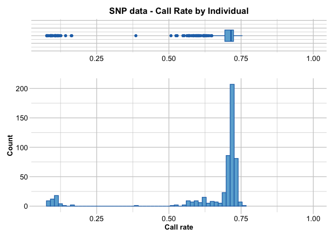

    Completed: gl.report.callrate 

# Remove duplicates

Remove the following duplicates: At_162_J20.1’, ‘At_163_J20.1’, ‘B1’,
‘A2’, ‘A3’, ‘A7’, ‘B8’, ‘A9’, ‘A10’, ‘B11’, ‘A15’, ‘B17’, ‘B18’, ‘A19’,
‘A21’, ‘WB_03/04/2022_36’

``` r
if (file.exists("cache/ak1.rdata")){
  load("cache/ak1.rdata")
} else {
  # Drop duplicates from current dataset
  ak1 <- gl.drop.ind(ak, ind.list=c('At_162_J20.1', 'At_163_J20.1', 'B1', 'A2', 'A3', 'A7', 'B8', 'A9', 'A10', 'B11', 'A15', 'B17', 'B18', 'A19', 'A21', 'WB_03/04/2022_36'))
  # Filter for monomorphs after removing duplicates}
  ak1 <- gl.filter.monomorphs(ak1)
  # Recalculate locus metrics
  ak1 <- gl.recalc.metrics(ak1)
  save(ak1,file = "cache/ak1.rdata")
}
```

# Filtering

## ak.clean filtering

Filter dataset for

1.  reproducibility 0.99
2.  read depth \>10 and \<100
3.  maf (0.005)
4.  call rate for loci (0.8)
5.  call rate for individuals (0.75)
6.  monomorphs
7.  secondaries
8.  missing loci.

``` r
nInd(ak1)
```

    [1] 512

``` r
nLoc(ak1)
```

    [1] 55242

### Reproducibility 0.99

A metrics that investigates if calling a SNP twice results in the same
outcome.

``` r
# Inspect the current reproducibility to remove unreliable loci
gl.report.reproducibility(ak1)
```

    Starting gl.report.reproducibility 
      Processing genlight object with SNP data
      Reporting Repeatability by Locus
      No. of loci = 55242 
      No. of individuals = 512 
        Minimum      :  0.867647 
        1st quartile :  0.996429 
        Median       :  1 
        Mean         :  0.9952046 
        3r quartile  :  1 
        Maximum      :  1 
        Missing Rate Overall:  0.35 

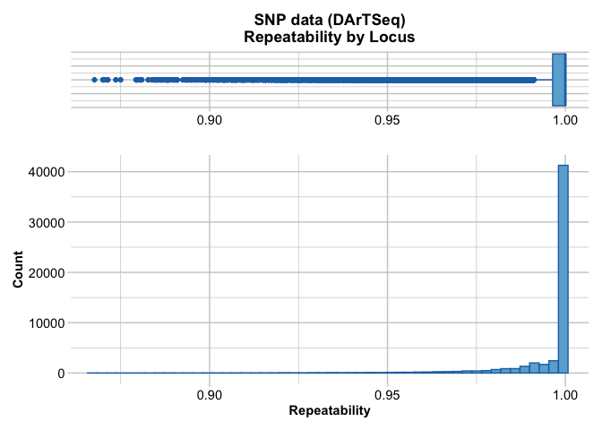

       Quantile Threshold Retained Percent Filtered Percent
    1      100%  1.000000    41262    74.7    13980    25.3
    2       95%  1.000000    41262    74.7    13980    25.3
    3       90%  1.000000    41262    74.7    13980    25.3
    4       85%  1.000000    41262    74.7    13980    25.3
    5       80%  1.000000    41262    74.7    13980    25.3
    6       75%  1.000000    41262    74.7    13980    25.3
    7       70%  1.000000    41262    74.7    13980    25.3
    8       65%  1.000000    41262    74.7    13980    25.3
    9       60%  1.000000    41262    74.7    13980    25.3
    10      55%  1.000000    41262    74.7    13980    25.3
    11      50%  1.000000    41262    74.7    13980    25.3
    12      45%  1.000000    41262    74.7    13980    25.3
    13      40%  1.000000    41262    74.7    13980    25.3
    14      35%  1.000000    41262    74.7    13980    25.3
    15      30%  1.000000    41262    74.7    13980    25.3
    16      25%  0.996429    41434    75.0    13808    25.0
    17      20%  0.994792    44222    80.1    11020    19.9
    18      15%  0.990909    46975    85.0     8267    15.0
    19      10%  0.984375    49762    90.1     5480     9.9
    20       5%  0.971014    52482    95.0     2760     5.0
    21       0%  0.867647    55242   100.0        0     0.0
    Completed: gl.report.reproducibility 

``` r
# Filter loci for reproducibility due to high missing rate
ak2 <- gl.filter.reproducibility(ak1)
```

    Starting gl.filter.reproducibility 
      Processing genlight object with SNP data
      Removing loci with repeatability less than 0.99 

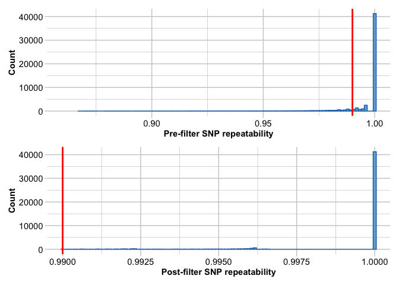

    Completed: gl.filter.reproducibility 

``` r
nInd(ak2)
```

    [1] 512

``` r
nLoc(ak2)
```

    [1] 47411

### Read depth \>10 \<100

Loci with high (= unreliable) and low read depth (= non-confident)
should be removed.

``` r
# Inspect the current read depth
gl.report.rdepth(ak2)
```

    Starting gl.report.rdepth 
      Processing genlight object with SNP data
      Reporting Read Depth by Locus
      No. of loci = 47411 
      No. of individuals = 512 
        Minimum      :  2.5 
        1st quartile :  7.8 
        Median       :  17.2 
        Mean         :  22.41511 
        3r quartile  :  32.1 
        Maximum      :  303.1 
        Missing Rate Overall:  0.36 

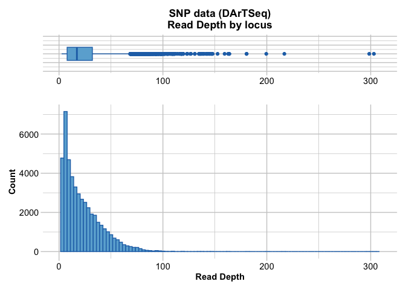

       Quantile Threshold Retained Percent Filtered Percent
    1      100%     303.1        1     0.0    47410   100.0
    2       95%      58.0     2384     5.0    45027    95.0
    3       90%      47.8     4758    10.0    42653    90.0
    4       85%      41.4     7121    15.0    40290    85.0
    5       80%      36.2     9507    20.1    37904    79.9
    6       75%      32.1    11881    25.1    35530    74.9
    7       70%      28.5    14243    30.0    33168    70.0
    8       65%      25.3    16615    35.0    30796    65.0
    9       60%      22.4    18985    40.0    28426    60.0
    10      55%      19.7    21408    45.2    26003    54.8
    11      50%      17.2    23749    50.1    23662    49.9
    12      45%      14.9    26163    55.2    21248    44.8
    13      40%      12.8    28488    60.1    18923    39.9
    14      35%      10.9    30935    65.2    16476    34.8
    15      30%       9.3    33261    70.2    14150    29.8
    16      25%       7.8    35668    75.2    11743    24.8
    17      20%       6.6    38022    80.2     9389    19.8
    18      15%       5.6    40350    85.1     7061    14.9
    19      10%       4.6    42922    90.5     4489     9.5
    20       5%       3.8    45219    95.4     2192     4.6
    21       0%       2.5    47411   100.0        0     0.0
    Completed: gl.report.rdepth 

``` r
# Filter for a read depth greater than 10 and lower than 100.
ak3 <- gl.filter.rdepth(ak2, lower = 10, upper = 100)
```

    Starting gl.filter.rdepth 
      Processing genlight object with SNP data
      Removing loci with rdepth <= 10 and >= 100 


    Completed: gl.filter.rdepth 

``` r
nInd(ak3)
```

    [1] 512

``` r
nLoc(ak3)
```

    [1] 32122

### Minor allele frequency (maf) 0.005

With approximately 500 individual samples this filter will remove
variant loci supported by a minor allele count of just 1 or 2.

``` r
# Inspect the current minor allele frequency
gl.report.maf(ak3)
```

    Starting gl.report.maf 
      Processing genlight object with SNP data
    Starting gl.report.maf 

      Reporting Minor Allele Frequency (MAF) by Locus for population BRR 
      No. of loci = 13392 
      No. of individuals = 21 
        Minimum      :  0.02380952 
        1st quantile :  0.05263158 
        Median       :  0.125 
        Mean         :  0.1712857 
        3r quantile  :  0.25 
        Maximum      :  0.5 
        Missing Rate Overall:  0.28 

      Reporting Minor Allele Frequency (MAF) by Locus for population EP 
      No. of loci = 17539 
      No. of individuals = 109 
        Minimum      :  0.004587156 
        1st quantile :  0.02222222 
        Median       :  0.07407407 
        Mean         :  0.1323123 
        3r quantile  :  0.2096774 
        Maximum      :  0.5 
        Missing Rate Overall:  0.31 

      Reporting Minor Allele Frequency (MAF) by Locus for population GB 
      No. of loci = 8803 
      No. of individuals = 29 
        Minimum      :  0.01724138 
        1st quantile :  0.07142857 
        Median       :  0.1724138 
        Mean         :  0.2021379 
        3r quantile  :  0.3242647 
        Maximum      :  0.5 
        Missing Rate Overall:  0.24 

      Reporting Minor Allele Frequency (MAF) by Locus for population HaR 
      No. of loci = 13523 
      No. of individuals = 28 
        Minimum      :  0.01785714 
        1st quantile :  0.06521739 
        Median       :  0.1428571 
        Mean         :  0.1800118 
        3r quantile  :  0.275 
        Maximum      :  0.5 
        Missing Rate Overall:  0.29 

      Reporting Minor Allele Frequency (MAF) by Locus for population HB 
      No. of loci = 11806 
      No. of individuals = 29 
        Minimum      :  0.01724138 
        1st quantile :  0.06317935 
        Median       :  0.1551724 
        Mean         :  0.1907456 
        3r quantile  :  0.3 
        Maximum      :  0.5 
        Missing Rate Overall:  0.26 

      Reporting Minor Allele Frequency (MAF) by Locus for population HFB 
      No. of loci = 16326 
      No. of individuals = 23 
        Minimum      :  0.02173913 
        1st quantile :  0.06666667 
        Median       :  0.1428571 
        Mean         :  0.1801029 
        3r quantile  :  0.2631579 
        Maximum      :  0.5 
        Missing Rate Overall:  0.34 

      Reporting Minor Allele Frequency (MAF) by Locus for population JB 
      No. of loci = 15466 
      No. of individuals = 21 
        Minimum      :  0.02380952 
        1st quantile :  0.07142857 
        Median       :  0.1538462 
        Mean         :  0.1864368 
        3r quantile  :  0.2666667 
        Maximum      :  0.5 
        Missing Rate Overall:  0.4 

      Reporting Minor Allele Frequency (MAF) by Locus for population KR 
      No. of loci = 16430 
      No. of individuals = 21 
        Minimum      :  0.02380952 
        1st quantile :  0.07142857 
        Median       :  0.1428571 
        Mean         :  0.1848357 
        3r quantile  :  0.2631579 
        Maximum      :  0.5 
        Missing Rate Overall:  0.4 

      Reporting Minor Allele Frequency (MAF) by Locus for population LPB 
      No. of loci = 12963 
      No. of individuals = 35 
        Minimum      :  0.01428571 
        1st quantile :  0.05714286 
        Median       :  0.125 
        Mean         :  0.1736131 
        3r quantile  :  0.2727273 
        Maximum      :  0.5 
        Missing Rate Overall:  0.3 

      Reporting Minor Allele Frequency (MAF) by Locus for population MB 
      No. of loci = 13061 
      No. of individuals = 18 
        Minimum      :  0.02777778 
        1st quantile :  0.1666667 
        Median       :  0.25 
        Mean         :  0.2769762 
        3r quantile  :  0.4 
        Maximum      :  0.5 
        Missing Rate Overall:  0.58 

      Reporting Minor Allele Frequency (MAF) by Locus for population MR 
      No. of loci = 12712 
      No. of individuals = 25 
        Minimum      :  0.02 
        1st quantile :  0.1 
        Median       :  0.2142857 
        Mean         :  0.2283774 
        3r quantile  :  0.34375 
        Maximum      :  0.5 
        Missing Rate Overall:  0.4 

      Reporting Minor Allele Frequency (MAF) by Locus for population PB 
      No. of loci = 13714 
      No. of individuals = 26 
        Minimum      :  0.01923077 
        1st quantile :  0.0625 
        Median       :  0.125 
        Mean         :  0.173352 
        3r quantile  :  0.25 
        Maximum      :  0.5 
        Missing Rate Overall:  0.32 

      Reporting Minor Allele Frequency (MAF) by Locus for population SO 
      No. of loci = 17116 
      No. of individuals = 97 
        Minimum      :  0.005154639 
        1st quantile :  0.02380952 
        Median       :  0.07879953 
        Mean         :  0.13623 
        3r quantile  :  0.2166667 
        Maximum      :  0.5 
        Missing Rate Overall:  0.3 

      Reporting Minor Allele Frequency (MAF) by Locus for population WB 
      No. of loci = 10193 
      No. of individuals = 21 
        Minimum      :  0.02380952 
        1st quantile :  0.075 
        Median       :  0.1666667 
        Mean         :  0.2023097 
        3r quantile  :  0.3181818 
        Maximum      :  0.5 
        Missing Rate Overall:  0.25 

      Reporting Minor Allele Frequency (MAF) by Locus for population WP 
      No. of loci = 7455 
      No. of individuals = 9 
        Minimum      :  0.05555556 
        1st quantile :  0.1111111 
        Median       :  0.2222222 
        Mean         :  0.236656 
        3r quantile  :  0.3333333 
        Maximum      :  0.5 
        Missing Rate Overall:  0.21 

      Reporting Minor Allele Frequency (MAF) by Locus OVERALL
      No. of loci = 32122 
      No. of individuals = 512 
        Minimum      :  0.0009784736 
        1st quantile :  0.007494647 
        Median       :  0.03403189 
        Mean         :  0.09146794 
        3r quantile  :  0.1220414 
        Maximum      :  0.5 
        Missing Rate Overall:  0.33 

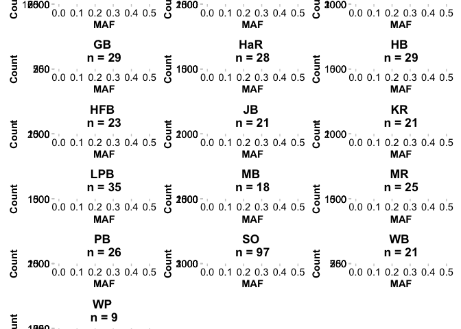

       Quantile    Threshold Retained Percent Filtered Percent
    1      100% 0.5000000000       18     0.1    32104    99.9
    2       95% 0.3898305085     1607     5.0    30515    95.0
    3       90% 0.2965367965     3213    10.0    28909    90.0
    4       85% 0.2233727811     4819    15.0    27303    85.0
    5       80% 0.1640625000     6425    20.0    25697    80.0
    6       75% 0.1220472441     8031    25.0    24091    75.0
    7       70% 0.0916955017     9637    30.0    22485    70.0
    8       65% 0.0733695652    11243    35.0    20879    65.0
    9       60% 0.0572597137    12849    40.0    19273    60.0
    10      55% 0.0445292621    14455    45.0    17667    55.0
    11      50% 0.0340136054    16063    50.0    16059    50.0
    12      45% 0.0256410256    17678    55.0    14444    45.0
    13      40% 0.0187793427    19274    60.0    12848    40.0
    14      35% 0.0137157107    20880    65.0    11242    35.0
    15      30% 0.0098039216    22490    70.0     9632    30.0
    16      25% 0.0074946467    24092    75.0     8030    25.0
    17      20% 0.0061349693    25699    80.0     6423    20.0
    18      15% 0.0043383948    27319    85.0     4803    15.0
    19      10% 0.0027247956    28912    90.0     3210    10.0
    20       5% 0.0021598272    30519    95.0     1603     5.0
    21       0% 0.0009784736    32122   100.0        0     0.0
    Completed: gl.report.maf 

``` r
# Filter for a minor allele frequency of 0.005
ak4 <- gl.filter.maf(ak3,  threshold = 0.005)
```

    Starting gl.filter.maf 
      Processing genlight object with SNP data
      Removing loci with MAF < 0.005 over all the dataset
                    and recalculating FreqHoms and FreqHets

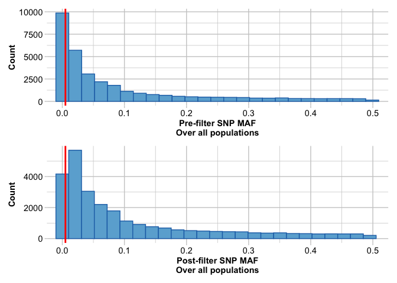

    Completed: gl.filter.maf 

``` r
nInd(ak4)
```

    [1] 512

``` r
nLoc(ak4)
```

    [1] 26456

### Call rate for loci 0.8

Retaining only loci that are consistently called across samples (at
least 80%)

``` r
# Inspect the current call rate for loci
gl.report.callrate(ak4)
```

    Starting gl.report.callrate 
      Processing genlight object with SNP data
      Reporting Call Rate by Locus
      No. of loci = 26456 
      No. of individuals = 512 
        Minimum      :  0.197266 
        1st quartile :  0.396484 
        Median       :  0.703125 
        Mean         :  0.6425537 
        3r quartile  :  0.884766 
        Maximum      :  1 
        Missing Rate Overall:  0.3574 

       Quantile Threshold Retained Percent Filtered Percent
    1      100%  1.000000        2     0.0    26454   100.0
    2       95%  0.935547     1367     5.2    25089    94.8
    3       90%  0.914062     2691    10.2    23765    89.8
    4       85%  0.906250     4280    16.2    22176    83.8
    5       80%  0.898438     5365    20.3    21091    79.7
    6       75%  0.884766     6770    25.6    19686    74.4
    7       70%  0.863281     8018    30.3    18438    69.7
    8       65%  0.833984     9268    35.0    17188    65.0
    9       60%  0.794922    10592    40.0    15864    60.0
    10      55%  0.751953    11957    45.2    14499    54.8
    11      50%  0.703125    13277    50.2    13179    49.8
    12      45%  0.648438    14573    55.1    11883    44.9
    13      40%  0.582031    15910    60.1    10546    39.9
    14      35%  0.517578    17216    65.1     9240    34.9
    15      30%  0.457031    18533    70.1     7923    29.9
    16      25%  0.396484    19847    75.0     6609    25.0
    17      20%  0.349609    21188    80.1     5268    19.9
    18      15%  0.304688    22542    85.2     3914    14.8
    19      10%  0.269531    23839    90.1     2617     9.9
    20       5%  0.236328    25196    95.2     1260     4.8
    21       0%  0.197266    26456   100.0        0     0.0


    Completed: gl.report.callrate 

``` r
# Filter fora call rate of 0.8
ak5 <- gl.filter.callrate(ak4, method = "loc", threshold = 0.8)
```

    Starting gl.filter.callrate 
      Processing genlight object with SNP data
      Recalculating Call Rate
      Removing loci based on Call Rate, threshold = 0.8 

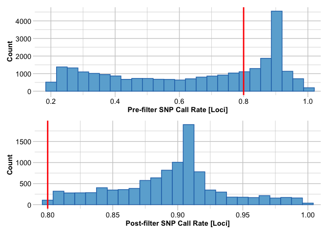

    Completed: gl.filter.callrate 

``` r
nInd(ak5)
```

    [1] 512

``` r
nLoc(ak5)
```

    [1] 10398

### Call rate for individual 0.75

Most individuals have high callrates (\>80% across all loci) but there
is a cluster of very poorly sequenced individuals with low call rates.
We remove these individuals from the dataset as they have sequenced
poorly.

``` r
# Inspect the current callrate for individuals
gl.report.callrate(ak5, method="ind")
```

    Starting gl.report.callrate 
      Processing genlight object with SNP data

      Reporting Call Rate by Individual
      No. of loci = 10398 
      No. of individuals = 512 
        Minimum      :  0.1293518 
        1st quartile :  0.9579967 
        Median       :  0.9676861 
        Mean         :  0.8931634 
        3r quartile  :  0.9719417 
        Maximum      :  0.9855741 
        Missing Rate Overall:  0.1068 

    Listing 15 populations and their average CallRates
      Monitor again after filtering
       Population CallRate   N
    1         BRR   0.9305  21
    2          EP   0.9470 109
    3          GB   0.9631  29
    4         HaR   0.9634  28
    5          HB   0.9647  29
    6         HFB   0.8283  23
    7          JB   0.7472  21
    8          KR   0.7441  21
    9         LPB   0.9523  35
    10         MB   0.4370  18
    11         MR   0.6926  25
    12         PB   0.8120  26
    13         SO   0.9564  97
    14         WB   0.9598  21
    15         WP   0.9717   9

    Listing 20 individuals with the lowest CallRates
      Use this list to see which individuals will be lost on filtering by individual
      Set ind.to.list parameter to see more individuals
             Individual Population  CallRate
    1  KR_29/03/2022_28         KR 0.1293518
    2              MB_2         MB 0.1320446
    3             MB_21         MB 0.1366609
    4             MB_10         MB 0.1376226
    5             JB_41         JB 0.1383920
    6              JB_7         JB 0.1548375
    7    PB_25/11/21_02         PB 0.1598384
    8             MB_33         MB 0.1657049
    9             At_O3         SO 0.1663781
    10            JB_31         JB 0.1663781
    11            JB_29         JB 0.1676284
    12           HFB_21        HFB 0.1687825
    13            MB_34         MB 0.1695518
    14           At_O10         EP 0.1702250
    15   PB_25/11/21_14         PB 0.1703212
    16 KR_29/03/2022_29         KR 0.1710906
    17 KR_29/03/2022_46         KR 0.1716676
    18           BRR_26        BRR 0.1752260
    19 KR_29/03/2022_42         KR 0.1761877
    20   PB_05/04/22_40         PB 0.1782073

    )


    Completed: gl.report.callrate 

``` r
# Filter for a call rate for individuals of 0.75
ak6 <-gl.filter.callrate(ak5, method ="ind", threshold=0.75)
```

    Starting gl.filter.callrate 
      Processing genlight object with SNP data
      Recalculating Call Rate
      Removing individuals based on Call Rate, threshold = 0.75 
      Individuals deleted (CallRate <=  0.75 ):
    A124[LPB], MR_14/03/2022_34[MR], MR_14/03/2022_46[MR], KR_29/03/2022_29[KR], MR_14/03/2022_35[MR], MR_14/03/2022_47[MR], KR_29/03/2022_42[KR], MR_14/03/2022_38[MR], MR_14/03/2022_49[MR], MR_14/03/2022_39[MR], MR_14/03/2022_50[MR], KR_29/03/2022_26[KR], KR_29/03/2022_46[KR], KR_29/03/2022_27[KR], MR_14/03/2022_45[MR], KR_29/03/2022_28[KR], At_O3[SO], At_75_A[EP], At_O10[EP], PB_05/04/22_40[PB], PB_25/11/21_01[PB], PB_25/11/21_02[PB], PB_25/11/21_13[PB], PB_25/11/21_14[PB], MB_12[MB], JB_12[JB], MB_13[MB], MB_27[MB], JB_41[JB], MB_17[MB], MB_33[MB], HFB_1[HFB], MB_2[MB], MB_18[MB], MB_34[MB], HFB_2[HFB], HFB_20[HFB], MB_19[MB], HFB_21[HFB], JB_21[JB], MB_9[MB], MB_21[MB], JB_7[JB], JB_29[JB], BRR_26[BRR], MB_10[MB], JB_31[JB],

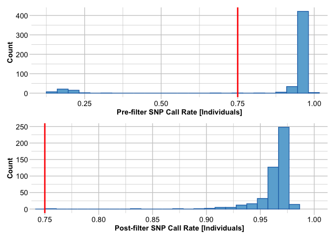

      Note: Locus metrics not recalculated
      Note: Resultant monomorphic loci not deleted
    Completed: gl.filter.callrate 

``` r
# Recalculate locus metrics
ak6 <- gl.recalc.metrics(ak6)
```

    Starting gl.recalc.metrics 
      Processing genlight object with SNP data
    Starting utils.recalc.avgpic 
      Processing genlight object with SNP data
      Recalculating OneRatioRef, OneRatioSnp, PICRef, PICSnp, AvgPIC
    Completed: utils.recalc.avgpic 
    Starting utils.recalc.callrate 
      Processing genlight object with SNP data
      Recalculating locus metric CallRate
    Completed: utils.recalc.callrate 
    Starting utils.recalc.maf 
      Processing genlight object with SNP data
      Recalculating FreqHoms and FreqHets
    Starting utils.recalc.freqhets 
      Processing genlight object with SNP data
      Recalculating locus metric freqHets
    Completed: utils.recalc.freqhets 
    Starting utils.recalc.freqhomref 
      Processing genlight object with SNP data
      Recalculating locus metric freqHomRef
    Completed: utils.recalc.freqhomref 
    Starting utils.recalc.freqhomsnp 
      Processing genlight object with SNP data
      Recalculating locus metric freqHomSnp
    Completed: utils.recalc.freqhomsnp 
      Recalculating Minor Allele Frequency (MAF)
    Completed: utils.recalc.maf 
      Locus metrics recalculated
    Completed: gl.recalc.metrics 

``` r
nInd(ak6)
```

    [1] 465

``` r
nLoc(ak6)
```

    [1] 10398

### Monomorphs

This step deletes monomorphic loci from a genlight {adegenet} object. A
DArT dataset will not have monomorphic loci, but they can arise, along
with loci when populations or individuals are deleted.

``` r
# Inspect the current number of monomorphs
gl.report.monomorphs(ak6)
```

    Starting gl.report.monomorphs 
      Processing genlight object with SNP data
      Identifying monomorphic loci

      No. of loci: 10398 
        Polymorphic loci: 6515 
        Monomorphic loci: 3883 
        Loci scored all NA: 0 
      No. of individuals: 465 
      No. of populations: 15 

    Completed: gl.report.monomorphs 

``` r
# Filter for monomorphs
ak7 <- gl.filter.monomorphs(ak6 ,verbose = 5)
```

    Starting gl.filter.monomorphs 
    [dartR.base vers. 1.0.6 Build = v.2024.1 ]
      Processing genlight object with SNP data
      Identifying monomorphic loci
      Removing monomorphic loci and loci with all missing 
                           data
        Original No. of loci: 10398 
        Monomorphic loci: 3883 
        Loci scored all NA: 0 
        No. of loci deleted: 3883 
        No. of loci retained: 6515 
        No. of individuals: 465 
        No. of populations: 15 
    Completed: gl.filter.monomorphs 

``` r
nInd(ak7)
```

    [1] 465

``` r
nLoc(ak7)
```

    [1] 6515

### Secondaries

Secondaries are fragments with more than one SNP. These multiple SNP
loci within a fragment are likely to be linked, and so you may wish to
remove secondaries. The filter removes loci that may not be inherited
independently. Filtering secondaries at the end of the filtering process
ensures that highly quality loci remain in the dataset.

``` r
# Inspect the current number of secondaries
gl.report.secondaries(ak7)
```

    Starting gl.report.secondaries 
      Processing genlight object with SNP data
    Counting ....
    Estimating parameters (lambda) of the Poisson expectation
    [1] 1.234882
    [1] 0.8756925
    [1] 0.7204627
    [1] 0.6340782
    [1] 0.5798705
    [1] 0.5433838
    [1] 0.5176874
    [1] 0.4990193
    [1] 0.4851531
    [1] 0.4746848
    [1] 0.4666851
    [1] 0.4605151
    [1] 0.4557224
    [1] 0.4519792
    [1] 0.4490432
    [1] 0.4467326
    [1] 0.4449093
    [1] 0.4434677
    [1] 0.442326
    [1] 0.4414206
    [1] 0.4407018
    [1] 0.4401308
    [1] 0.4396769
    [1] 0.4393158
    [1] 0.4390285
    [1] 0.4387998
    [1] 0.4386178
    [1] 0.4384728
    [1] 0.4383573
    [1] 0.4382653
    [1] 0.438192
    [1] 0.4381337
    [1] 0.4380871
    [1] 0.4380501
    [1] 0.4380205
    [1] 0.437997
    [1] 0.4379782
    [1] 0.4379633
    [1] 0.4379514
      Converged on Lambda of 0.437941895803126 

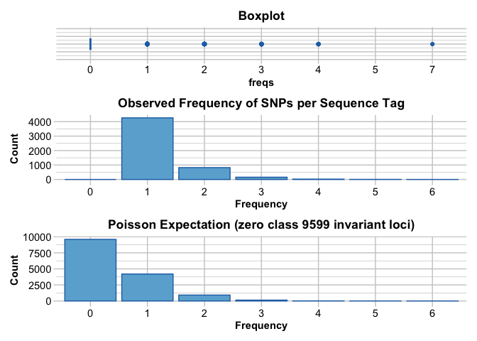

      Total number of SNP loci scored: 6515 
       Number of sequence tags in total: 5275 
       Estimated number of invariant sequence tags: 9599 
       Number of sequence tags with secondaries: 1010 
       Number of secondary SNP loci that would be removed on 
                filtering: 1240 
       Number of SNP loci that would be retained on filtering: 5275 
       Number of invariant sites in sequenced tags: 321456 
       Mean length of sequence tags: 62.1746 
       Total Number of invariant sites (including invariant sequence 
                tags): 918270 
    Completed: gl.report.secondaries 

                   Param        Value
    1       n.total.tags 5.275000e+03
    2 n.SNPs.secondaries 1.240000e+03
    3   n.invariant.tags 9.599000e+03
    4 n.tags.secondaries 1.010000e+03
    5          n.inv.gen 3.214560e+05
    6       mean.len.tag 6.217460e+01
    7        n.invariant 9.182700e+05
    8             Lambda 4.379419e-01

``` r
# Filter for secondaries
ak8 <- gl.filter.secondaries(ak7, verbose = 5)
```

    Starting gl.filter.secondaries 
    [dartR.base vers. 1.0.6 Build = v.2023.3 ]
      Processing genlight object with SNP data
      Total number of SNP loci: 6515 
      Selecting one SNP per sequence tag at random
        Number of secondaries: 1240 
        Number of loci after secondaries removed: 5275 
    Completed: gl.filter.secondaries 

``` r
nInd(ak8)
```

    [1] 465

``` r
nLoc(ak8)
```

    [1] 5275

### Remove missing loci

A DArT dataset will not have individuals for which all calls are scored
as missing (NA) across all loci, but such individuals may sneak in to
the dataset when loci are deleted. Retaining individual or loci with all
NAs can cause issues for several functions.

``` r
# Remove missing loci
ak9 <-gl.filter.allna(ak8)
```

    Starting gl.filter.allna 
      Identifying and removing loci and individuals scored all 
                    missing (NA)
      Deleting loci that are scored as all missing (NA)
      Deleting individuals that are scored as all missing (NA)
    Completed: gl.filter.allna 

``` r
nInd(ak9)
```

    [1] 465

``` r
nLoc(ak9)
```

    [1] 5275

``` r
# Run a smearplot to assess quality of dataset
gl.smearplot(ak9)
```

      Processing genlight object with SNP data
    Starting gl.smearplot 


    Completed: gl.smearplot 

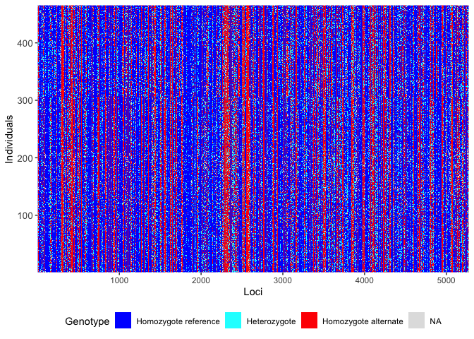

``` r
# Recalculate locus metrics
ak9 <- gl.recalc.metrics(ak9)
```

    Starting gl.recalc.metrics 
      Processing genlight object with SNP data
    Starting utils.recalc.avgpic 
      Processing genlight object with SNP data
      Recalculating OneRatioRef, OneRatioSnp, PICRef, PICSnp, AvgPIC
    Completed: utils.recalc.avgpic 
    Starting utils.recalc.callrate 
      Processing genlight object with SNP data
      Recalculating locus metric CallRate
    Completed: utils.recalc.callrate 
    Starting utils.recalc.maf 
      Processing genlight object with SNP data
      Recalculating FreqHoms and FreqHets
    Starting utils.recalc.freqhets 
      Processing genlight object with SNP data
      Recalculating locus metric freqHets
    Completed: utils.recalc.freqhets 
    Starting utils.recalc.freqhomref 
      Processing genlight object with SNP data
      Recalculating locus metric freqHomRef
    Completed: utils.recalc.freqhomref 
    Starting utils.recalc.freqhomsnp 
      Processing genlight object with SNP data
      Recalculating locus metric freqHomSnp
    Completed: utils.recalc.freqhomsnp 
      Recalculating Minor Allele Frequency (MAF)
    Completed: utils.recalc.maf 
      Locus metrics recalculated
    Completed: gl.recalc.metrics 

# Inspect filtered dataset

``` r
# A compliance check ensures the dataset has no monomorphic loci, no missing data, properly assigned populations, individual names are unique, coordinates are correct, and recalculates locus metrics.
gl.compliance.check(ak9)
```

    Starting gl.compliance.check 
      Processing genlight object with SNP data
      Checking coding of SNPs
        SNP data scored NA, 0, 1 or 2 confirmed
      Checking for population assignments
        Population assignments confirmed
      Checking locus metrics and flags
      Recalculating locus metrics
      Checking for monomorphic loci
        No monomorphic loci detected
      Checking for loci with all missing data
        No loci with all missing data detected
      Checking whether individual names are unique.
      Checking for individual metrics
        Individual metrics confirmed
      Spelling of coordinates checked and changed if necessary to 
                lat/lon
    Completed: gl.compliance.check 

``` r
nInd(ak9)
```

    [1] 465

``` r
nLoc(ak9)
```

    [1] 5275

``` r
nPop(ak9)
```

    [1] 15

``` r
# Create a table showing the number of individuals per population
table(pop(ak9))
```


    BRR  EP  GB HaR  HB HFB  JB  KR LPB  MB  MR  PB  SO  WB  WP 
     20 107  29  28  29  19  15  15  34   6  16  21  96  21   9 

``` r
# Create a barplot from that table
barplot(table(pop(ak9)), las=2)
```

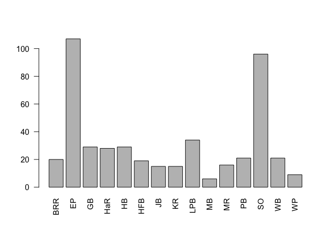

``` r
# rename the dataset after the filtering process is completed
ak.filtered <- ak9
```

``` r
# Get names of individuals
ak.filtered$ind.names
```

      [1] "A1"                "A159"              "A13"              
      [4] "A24"               "A85"               "A102"             
      [7] "A113"              "A125"              "A138"             
     [10] "A149"              "A160"              "B2"               
     [13] "B15"               "A25"               "A88"              
     [16] "A105"              "A114"              "A126"             
     [19] "A139"              "A150"              "A161"             
     [22] "B3"                "A17"               "A89"              
     [25] "A106"              "A116"              "A127"             
     [28] "A140"              "A151"              "A164"             
     [31] "B7"                "A18"               "A28"              
     [34] "A90"               "A107"              "A117"             
     [37] "A130"              "A141"              "A152"             
     [40] "A8"                "A166"              "B19"              
     [43] "A29"               "A92"               "A108"             
     [46] "A120"              "A132"              "A142"             
     [49] "A153"              "A167"              "B9"               
     [52] "B21"               "A31"               "A99"              
     [55] "A109"              "A122"              "A134"             
     [58] "A145"              "A154"              "A168"             
     [61] "B10"               "A22"               "A82"              
     [64] "A100"              "A111"              "A123"             
     [67] "A135"              "A146"              "A155"             
     [70] "A11"               "A169"              "A23"              
     [73] "A84"               "A101"              "A112"             
     [76] "A136"              "A148"              "A156"             
     [79] "HaR_06/05/2022_12" "HaR_06/05/2022_31" "HaR_06/05/2022_40"
     [82] "MR_14/03/2022_6"   "KR_29/03/2022_41"  "KR_29/03/2022_49" 
     [85] "HaR_06/05/2022_15" "HaR_06/05/2022_32" "HaR_06/05/2022_41"
     [88] "MR_14/03/2022_7"   "KR_29/03/2022_30"  "KR_29/03/2022_50" 
     [91] "HaR_06/05/2022_19" "HaR_06/05/2022_33" "HaR_06/05/2022_42"
     [94] "MR_14/03/2022_8"   "MR_14/03/2022_37"  "MR_14/03/2022_48" 
     [97] "KR_29/03/2022_31"  "KR_29/03/2022_43"  "HaR_06/05/2022_1" 
    [100] "HaR_06/05/2022_20" "HaR_06/05/2022_34" "HaR_06/05/2022_43"
    [103] "20"                "MR_14/03/2022_9"   "KR_29/03/2022_32" 
    [106] "KR_29/03/2022_44"  "HaR_06/05/2022_7"  "HaR_06/05/2022_23"
    [109] "HaR_06/05/2022_35" "HaR_06/05/2022_44" "MR_14/03/2022_1"  
    [112] "MR_14/03/2022_10"  "KR_29/03/2022_33"  "KR_29/03/2022_45" 
    [115] "HaR_06/05/2022_8"  "HaR_06/05/2022_24" "HaR_06/05/2022_36"
    [118] "HaR_06/05/2022_50" "MR_14/03/2022_3"   "MR_14/03/2022_11" 
    [121] "MR_14/03/2022_41"  "KR_29/03/2022_34"  "HaR_06/05/2022_9" 
    [124] "HaR_06/05/2022_25" "HaR_06/05/2022_37" "MR_14/03/2022_4"  
    [127] "MR_14/03/2022_12"  "MR_14/03/2022_44"  "KR_29/03/2022_35" 
    [130] "KR_29/03/2022_47"  "HaR_06/05/2022_10" "HaR_06/05/2022_29"
    [133] "HaR_06/05/2022_38" "MR_14/03/2022_5"   "MR_14/03/2022_13" 
    [136] "KR_29/03/2022_36"  "KR_29/03/2022_48"  "HaR_06/05/2022_11"
    [139] "At_34_J20"         "At_O18"            "At_O48"           
    [142] "At_47_J20"         "At_12_J20"         "At_51_N"          
    [145] "At_69_N"           "At_76_A"           "At_80_A"          
    [148] "At_35_J20"         "At_O62"            "At_O19"           
    [151] "At_O49"            "At_52_J20"         "At_14_J20"        
    [154] "At_32_N"           "At_53_N"           "At_70_N"          
    [157] "At_39_J20"         "At_O20"            "At_O50"           
    [160] "At_56_J20"         "At_165_J20"        "At_38_N"          
    [163] "At_54_N"           "At_33_F"           "At_66_A"          
    [166] "At_71_A"           "At_40_J20"         "At_O78"           
    [169] "At_O42"            "At_O52"            "At_58_J20"        
    [172] "At_20_J20"         "At_170_N"          "At_43_N"          
    [175] "At_55_N"           "At_57_F"           "At_72_A"          
    [178] "At_41_J20"         "At_O43"            "At_O53"           
    [181] "At_59_J20"         "At_27_J20"         "At_O55"           
    [184] "At_45_N"           "At_O73"            "At_62_A"          
    [187] "At_42_J20"         "At_O44"            "At_4_J20"         
    [190] "At_30_J20"         "At_O56"            "At_48_N"          
    [193] "At_63_N"           "At_O76"            "At_79_A"          
    [196] "At_44_J20"         "At_O16"            "At_O45"           
    [199] "At_5_J20"          "At_157_J20"        "At_O57"           
    [202] "At_49_N"           "At_67_N"           "At_65_A"          
    [205] "At_46_J20"         "At_O17"            "At_O47"           
    [208] "At_6_J20"          "At_158_J20"        "At_50_N"          
    [211] "At_O51"            "At_78_A"           "At_4_F"           
    [214] "At_D26_3.20"       "At_D34_3.20"       "At_D42_3.20"      
    [217] "At_23_J20"         "At_33_F20"         "At_45_F20"        
    [220] "At_58_F20"         "At_73_F20"         "At_S2_3.20"       
    [223] "At_S10_3.20"       "At_S18_3.20"       "At_6_N"           
    [226] "At_D27_3.20"       "At_D35_3.20"       "At_D43_3.20"      
    [229] "At_24_J20"         "At_34_N"           "At_48_F20"        
    [232] "At_60_F20"         "At_74_F20"         "At_S3_3.20"       
    [235] "At_S11_3.20"       "At_S19_3.20"       "At_7_J20"         
    [238] "At_D28_3.20"       "At_D36_3.20"       "At_D44_3.20"      
    [241] "At_25_J20"         "At_35_N"           "At_49_F20"        
    [244] "At_61_F20"         "At_75_F20"         "At_S4_3.20"       
    [247] "At_S12_3.20"       "At_S20_3.20"       "At_8_J20"         
    [250] "At_D29_3.20"       "At_D37_3.20"       "At_D45_3.20"      
    [253] "At_29_J20"         "At_36_F20"         "At_51_F20"        
    [256] "At_62_F20"         "At_76_F20"         "At_S5_3.20"       
    [259] "At_S13_3.20"       "At_S21_3.20"       "At_9_J20"         
    [262] "At_D30_3.20"       "At_D38_3.20"       "At_D46_3.20"      
    [265] "At_154_J20"        "At_37_F20"         "At_53_F20"        
    [268] "At_66_F20"         "At_77_F20"         "At_S6_3.20"       
    [271] "At_S14_3.20"       "At_S22_3.20"       "At_11_J20"        
    [274] "At_D31_3.20"       "At_D39_3.20"       "At_D47_3.20"      
    [277] "At_162_J20"        "At_38_F20"         "At_54_F20"        
    [280] "At_67_F20"         "At_78_F20"         "At_S7_3.20"       
    [283] "At_S15_3.20"       "At_S23_3.20"       "At_16_F"          
    [286] "At_D32_3.20"       "At_D40_3.20"       "At_163_J20"       
    [289] "At_41_F20"         "At_55_F20"         "At_71_F20"        
    [292] "At_80_F20"         "At_S8_3.20"        "At_S16_3.20"      
    [295] "At_S24_3.20"       "At_17_J20"         "At_D33_3.20"      
    [298] "At_D41_3.20"       "At_31_F20"         "At_43_F20"        
    [301] "At_57_F20"         "At_72_F20"         "At_S1_3.20"       
    [304] "At_S9_3.20"        "At_S17_3.20"       "At_S25_3.20"      
    [307] "HB_27/11/21_10"    "HB_27/11/21_18"    "HB_27/11/21_26"   
    [310] "PB_25/11/21_09"    "PB_25/11/21_32"    "PB_05/04/22_47"   
    [313] "WB_03/04/2022_14"  "WB_03/04/2022_26"  "WB_03/04/2022_38" 
    [316] "HB_27/11/21_11"    "HB_27/11/21_19"    "HB_27/11/21_28"   
    [319] "PB_25/11/21_11"    "PB_05/04/22_48"    "WB_03/04/2022_16" 
    [322] "WB_03/04/2022_27"  "HB_27/11/21_12"    "HB_27/11/21_20"   
    [325] "PB_25/11/21_12"    "PB_05/04/22_41"    "PB_05/04/22_49"   
    [328] "WB_03/04/2022_20"  "WB_03/04/2022_30"  "HB_27/11/21_13"   
    [331] "HB_27/11/21_21"    "PB_05/04/22_42"    "PB_05/04/22_50"   
    [334] "WB_03/04/2022_21"  "WB_03/04/2022_31"  "HB_27/11/21_14"   
    [337] "HB_27/11/21_22"    "PB_25/11/21_04"    "PB_05/04/22_43"   
    [340] "WB_03/04/2022_3"   "WB_03/04/2022_22"  "WB_03/04/2022_32" 
    [343] "HB_27/11/21_15"    "HB_27/11/21_23"    "PB_25/11/21_06"   
    [346] "PB_25/11/21_26"    "PB_05/04/22_44"    "WB_03/04/2022_8"  
    [349] "WB_03/04/2022_23"  "WB_03/04/2022_35"  "HB_27/11/21_16"   
    [352] "HB_27/11/21_24"    "PB_25/11/21_07"    "PB_25/11/21_28"   
    [355] "PB_05/04/22_45"    "WB_03/04/2022_11"  "WB_03/04/2022_24" 
    [358] "HB_27/11/21_17"    "HB_27/11/21_25"    "PB_25/11/21_08"   
    [361] "PB_25/11/21_30"    "PB_05/04/22_46"    "WB_03/04/2022_13" 
    [364] "WB_03/04/2022_25"  "WB_03/04/2022_37"  "GB_03/03/2022_1"  
    [367] "GB_03/03/2022_10"  "GB_03/03/2022_18"  "GB_03/03/2022_28" 
    [370] "GB_03/03/2022_2"   "GB_03/03/2022_11"  "GB_03/03/2022_19" 
    [373] "GB_03/03/2022_29"  "GB_03/03/2022_3"   "GB_03/03/2022_12" 
    [376] "GB_03/03/2022_20"  "GB_03/03/2022_30"  "GB_03/03/2022_4"  
    [379] "GB_03/03/2022_13"  "GB_03/03/2022_21"  "GB_03/03/2022_31" 
    [382] "GB_03/03/2022_5"   "GB_03/03/2022_14"  "GB_03/03/2022_22" 
    [385] "GB_03/03/2022_32"  "GB_03/03/2022_6"   "GB_03/03/2022_15" 
    [388] "GB_03/03/2022_23"  "GB_03/03/2022_7"   "GB_03/03/2022_16" 
    [391] "GB_03/03/2022_26"  "GB_03/03/2022_8"   "GB_03/03/2022_17" 
    [394] "GB_03/03/2022_27"  "HB_1"              "JB_50"            
    [397] "BRR_27"            "BRR_42"            "HB_9"             
    [400] "HFB_7"             "HFB_16"            "HFB_24"           
    [403] "MB_24"             "JB_38"             "HB_2"             
    [406] "BRR_1"             "BRR_28"            "BRR_43"           
    [409] "HB_10"             "HFB_8"             "HFB_17"           
    [412] "HFB_25"            "JB_13"             "HB_3"             
    [415] "BRR_4"             "BRR_31"            "BRR_44"           
    [418] "HB_11"             "HFB_9"             "HFB_18"           
    [421] "MB_1"              "JB_14"             "JB_42"            
    [424] "HB_4"              "BRR_5"             "BRR_36"           
    [427] "BRR_46"            "HFB_10"            "HFB_19"           
    [430] "JB_18"             "JB_43"             "HB_5"             
    [433] "BRR_9"             "BRR_38"            "BRR_47"           
    [436] "HFB_11"            "MB_5"              "JB_3"             
    [439] "JB_20"             "JB_44"             "HB_6"             
    [442] "BRR_10"            "BRR_39"            "BRR_48"           
    [445] "HFB_4"             "HFB_12"            "MB_6"             
    [448] "MB_20"             "JB_4"              "JB_45"            
    [451] "HB_7"              "BRR_13"            "BRR_40"           
    [454] "HFB_5"             "HFB_13"            "HFB_22"           
    [457] "JB_46"             "HB_8"              "BRR_41"           
    [460] "HFB_6"             "HFB_14"            "HFB_23"           
    [463] "MB_22"             "JB_11"             "JB_49"            

``` r
# Rename sample "20" to WB_36 for consistency
ak.filtered$ind.names[ak.filtered$ind.names == "20"] <- "WB_36"
```

``` r
# Confirm name change
ak.filtered$ind.names
```

      [1] "A1"                "A159"              "A13"              
      [4] "A24"               "A85"               "A102"             
      [7] "A113"              "A125"              "A138"             
     [10] "A149"              "A160"              "B2"               
     [13] "B15"               "A25"               "A88"              
     [16] "A105"              "A114"              "A126"             
     [19] "A139"              "A150"              "A161"             
     [22] "B3"                "A17"               "A89"              
     [25] "A106"              "A116"              "A127"             
     [28] "A140"              "A151"              "A164"             
     [31] "B7"                "A18"               "A28"              
     [34] "A90"               "A107"              "A117"             
     [37] "A130"              "A141"              "A152"             
     [40] "A8"                "A166"              "B19"              
     [43] "A29"               "A92"               "A108"             
     [46] "A120"              "A132"              "A142"             
     [49] "A153"              "A167"              "B9"               
     [52] "B21"               "A31"               "A99"              
     [55] "A109"              "A122"              "A134"             
     [58] "A145"              "A154"              "A168"             
     [61] "B10"               "A22"               "A82"              
     [64] "A100"              "A111"              "A123"             
     [67] "A135"              "A146"              "A155"             
     [70] "A11"               "A169"              "A23"              
     [73] "A84"               "A101"              "A112"             
     [76] "A136"              "A148"              "A156"             
     [79] "HaR_06/05/2022_12" "HaR_06/05/2022_31" "HaR_06/05/2022_40"
     [82] "MR_14/03/2022_6"   "KR_29/03/2022_41"  "KR_29/03/2022_49" 
     [85] "HaR_06/05/2022_15" "HaR_06/05/2022_32" "HaR_06/05/2022_41"
     [88] "MR_14/03/2022_7"   "KR_29/03/2022_30"  "KR_29/03/2022_50" 
     [91] "HaR_06/05/2022_19" "HaR_06/05/2022_33" "HaR_06/05/2022_42"
     [94] "MR_14/03/2022_8"   "MR_14/03/2022_37"  "MR_14/03/2022_48" 
     [97] "KR_29/03/2022_31"  "KR_29/03/2022_43"  "HaR_06/05/2022_1" 
    [100] "HaR_06/05/2022_20" "HaR_06/05/2022_34" "HaR_06/05/2022_43"
    [103] "WB_36"             "MR_14/03/2022_9"   "KR_29/03/2022_32" 
    [106] "KR_29/03/2022_44"  "HaR_06/05/2022_7"  "HaR_06/05/2022_23"
    [109] "HaR_06/05/2022_35" "HaR_06/05/2022_44" "MR_14/03/2022_1"  
    [112] "MR_14/03/2022_10"  "KR_29/03/2022_33"  "KR_29/03/2022_45" 
    [115] "HaR_06/05/2022_8"  "HaR_06/05/2022_24" "HaR_06/05/2022_36"
    [118] "HaR_06/05/2022_50" "MR_14/03/2022_3"   "MR_14/03/2022_11" 
    [121] "MR_14/03/2022_41"  "KR_29/03/2022_34"  "HaR_06/05/2022_9" 
    [124] "HaR_06/05/2022_25" "HaR_06/05/2022_37" "MR_14/03/2022_4"  
    [127] "MR_14/03/2022_12"  "MR_14/03/2022_44"  "KR_29/03/2022_35" 
    [130] "KR_29/03/2022_47"  "HaR_06/05/2022_10" "HaR_06/05/2022_29"
    [133] "HaR_06/05/2022_38" "MR_14/03/2022_5"   "MR_14/03/2022_13" 
    [136] "KR_29/03/2022_36"  "KR_29/03/2022_48"  "HaR_06/05/2022_11"
    [139] "At_34_J20"         "At_O18"            "At_O48"           
    [142] "At_47_J20"         "At_12_J20"         "At_51_N"          
    [145] "At_69_N"           "At_76_A"           "At_80_A"          
    [148] "At_35_J20"         "At_O62"            "At_O19"           
    [151] "At_O49"            "At_52_J20"         "At_14_J20"        
    [154] "At_32_N"           "At_53_N"           "At_70_N"          
    [157] "At_39_J20"         "At_O20"            "At_O50"           
    [160] "At_56_J20"         "At_165_J20"        "At_38_N"          
    [163] "At_54_N"           "At_33_F"           "At_66_A"          
    [166] "At_71_A"           "At_40_J20"         "At_O78"           
    [169] "At_O42"            "At_O52"            "At_58_J20"        
    [172] "At_20_J20"         "At_170_N"          "At_43_N"          
    [175] "At_55_N"           "At_57_F"           "At_72_A"          
    [178] "At_41_J20"         "At_O43"            "At_O53"           
    [181] "At_59_J20"         "At_27_J20"         "At_O55"           
    [184] "At_45_N"           "At_O73"            "At_62_A"          
    [187] "At_42_J20"         "At_O44"            "At_4_J20"         
    [190] "At_30_J20"         "At_O56"            "At_48_N"          
    [193] "At_63_N"           "At_O76"            "At_79_A"          
    [196] "At_44_J20"         "At_O16"            "At_O45"           
    [199] "At_5_J20"          "At_157_J20"        "At_O57"           
    [202] "At_49_N"           "At_67_N"           "At_65_A"          
    [205] "At_46_J20"         "At_O17"            "At_O47"           
    [208] "At_6_J20"          "At_158_J20"        "At_50_N"          
    [211] "At_O51"            "At_78_A"           "At_4_F"           
    [214] "At_D26_3.20"       "At_D34_3.20"       "At_D42_3.20"      
    [217] "At_23_J20"         "At_33_F20"         "At_45_F20"        
    [220] "At_58_F20"         "At_73_F20"         "At_S2_3.20"       
    [223] "At_S10_3.20"       "At_S18_3.20"       "At_6_N"           
    [226] "At_D27_3.20"       "At_D35_3.20"       "At_D43_3.20"      
    [229] "At_24_J20"         "At_34_N"           "At_48_F20"        
    [232] "At_60_F20"         "At_74_F20"         "At_S3_3.20"       
    [235] "At_S11_3.20"       "At_S19_3.20"       "At_7_J20"         
    [238] "At_D28_3.20"       "At_D36_3.20"       "At_D44_3.20"      
    [241] "At_25_J20"         "At_35_N"           "At_49_F20"        
    [244] "At_61_F20"         "At_75_F20"         "At_S4_3.20"       
    [247] "At_S12_3.20"       "At_S20_3.20"       "At_8_J20"         
    [250] "At_D29_3.20"       "At_D37_3.20"       "At_D45_3.20"      
    [253] "At_29_J20"         "At_36_F20"         "At_51_F20"        
    [256] "At_62_F20"         "At_76_F20"         "At_S5_3.20"       
    [259] "At_S13_3.20"       "At_S21_3.20"       "At_9_J20"         
    [262] "At_D30_3.20"       "At_D38_3.20"       "At_D46_3.20"      
    [265] "At_154_J20"        "At_37_F20"         "At_53_F20"        
    [268] "At_66_F20"         "At_77_F20"         "At_S6_3.20"       
    [271] "At_S14_3.20"       "At_S22_3.20"       "At_11_J20"        
    [274] "At_D31_3.20"       "At_D39_3.20"       "At_D47_3.20"      
    [277] "At_162_J20"        "At_38_F20"         "At_54_F20"        
    [280] "At_67_F20"         "At_78_F20"         "At_S7_3.20"       
    [283] "At_S15_3.20"       "At_S23_3.20"       "At_16_F"          
    [286] "At_D32_3.20"       "At_D40_3.20"       "At_163_J20"       
    [289] "At_41_F20"         "At_55_F20"         "At_71_F20"        
    [292] "At_80_F20"         "At_S8_3.20"        "At_S16_3.20"      
    [295] "At_S24_3.20"       "At_17_J20"         "At_D33_3.20"      
    [298] "At_D41_3.20"       "At_31_F20"         "At_43_F20"        
    [301] "At_57_F20"         "At_72_F20"         "At_S1_3.20"       
    [304] "At_S9_3.20"        "At_S17_3.20"       "At_S25_3.20"      
    [307] "HB_27/11/21_10"    "HB_27/11/21_18"    "HB_27/11/21_26"   
    [310] "PB_25/11/21_09"    "PB_25/11/21_32"    "PB_05/04/22_47"   
    [313] "WB_03/04/2022_14"  "WB_03/04/2022_26"  "WB_03/04/2022_38" 
    [316] "HB_27/11/21_11"    "HB_27/11/21_19"    "HB_27/11/21_28"   
    [319] "PB_25/11/21_11"    "PB_05/04/22_48"    "WB_03/04/2022_16" 
    [322] "WB_03/04/2022_27"  "HB_27/11/21_12"    "HB_27/11/21_20"   
    [325] "PB_25/11/21_12"    "PB_05/04/22_41"    "PB_05/04/22_49"   
    [328] "WB_03/04/2022_20"  "WB_03/04/2022_30"  "HB_27/11/21_13"   
    [331] "HB_27/11/21_21"    "PB_05/04/22_42"    "PB_05/04/22_50"   
    [334] "WB_03/04/2022_21"  "WB_03/04/2022_31"  "HB_27/11/21_14"   
    [337] "HB_27/11/21_22"    "PB_25/11/21_04"    "PB_05/04/22_43"   
    [340] "WB_03/04/2022_3"   "WB_03/04/2022_22"  "WB_03/04/2022_32" 
    [343] "HB_27/11/21_15"    "HB_27/11/21_23"    "PB_25/11/21_06"   
    [346] "PB_25/11/21_26"    "PB_05/04/22_44"    "WB_03/04/2022_8"  
    [349] "WB_03/04/2022_23"  "WB_03/04/2022_35"  "HB_27/11/21_16"   
    [352] "HB_27/11/21_24"    "PB_25/11/21_07"    "PB_25/11/21_28"   
    [355] "PB_05/04/22_45"    "WB_03/04/2022_11"  "WB_03/04/2022_24" 
    [358] "HB_27/11/21_17"    "HB_27/11/21_25"    "PB_25/11/21_08"   
    [361] "PB_25/11/21_30"    "PB_05/04/22_46"    "WB_03/04/2022_13" 
    [364] "WB_03/04/2022_25"  "WB_03/04/2022_37"  "GB_03/03/2022_1"  
    [367] "GB_03/03/2022_10"  "GB_03/03/2022_18"  "GB_03/03/2022_28" 
    [370] "GB_03/03/2022_2"   "GB_03/03/2022_11"  "GB_03/03/2022_19" 
    [373] "GB_03/03/2022_29"  "GB_03/03/2022_3"   "GB_03/03/2022_12" 
    [376] "GB_03/03/2022_20"  "GB_03/03/2022_30"  "GB_03/03/2022_4"  
    [379] "GB_03/03/2022_13"  "GB_03/03/2022_21"  "GB_03/03/2022_31" 
    [382] "GB_03/03/2022_5"   "GB_03/03/2022_14"  "GB_03/03/2022_22" 
    [385] "GB_03/03/2022_32"  "GB_03/03/2022_6"   "GB_03/03/2022_15" 
    [388] "GB_03/03/2022_23"  "GB_03/03/2022_7"   "GB_03/03/2022_16" 
    [391] "GB_03/03/2022_26"  "GB_03/03/2022_8"   "GB_03/03/2022_17" 
    [394] "GB_03/03/2022_27"  "HB_1"              "JB_50"            
    [397] "BRR_27"            "BRR_42"            "HB_9"             
    [400] "HFB_7"             "HFB_16"            "HFB_24"           
    [403] "MB_24"             "JB_38"             "HB_2"             
    [406] "BRR_1"             "BRR_28"            "BRR_43"           
    [409] "HB_10"             "HFB_8"             "HFB_17"           
    [412] "HFB_25"            "JB_13"             "HB_3"             
    [415] "BRR_4"             "BRR_31"            "BRR_44"           
    [418] "HB_11"             "HFB_9"             "HFB_18"           
    [421] "MB_1"              "JB_14"             "JB_42"            
    [424] "HB_4"              "BRR_5"             "BRR_36"           
    [427] "BRR_46"            "HFB_10"            "HFB_19"           
    [430] "JB_18"             "JB_43"             "HB_5"             
    [433] "BRR_9"             "BRR_38"            "BRR_47"           
    [436] "HFB_11"            "MB_5"              "JB_3"             
    [439] "JB_20"             "JB_44"             "HB_6"             
    [442] "BRR_10"            "BRR_39"            "BRR_48"           
    [445] "HFB_4"             "HFB_12"            "MB_6"             
    [448] "MB_20"             "JB_4"              "JB_45"            
    [451] "HB_7"              "BRR_13"            "BRR_40"           
    [454] "HFB_5"             "HFB_13"            "HFB_22"           
    [457] "JB_46"             "HB_8"              "BRR_41"           
    [460] "HFB_6"             "HFB_14"            "HFB_23"           
    [463] "MB_22"             "JB_11"             "JB_49"            

``` r
# Save filtered and clean dataset
save(ak.filtered, file="cache/ak.filtered.rdata")
```
