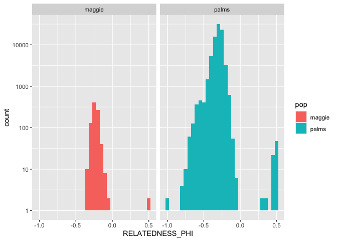
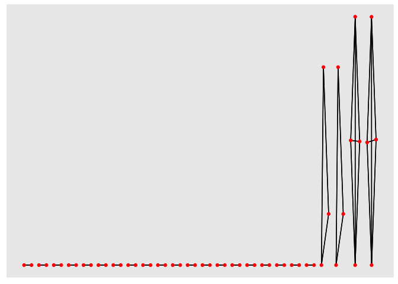
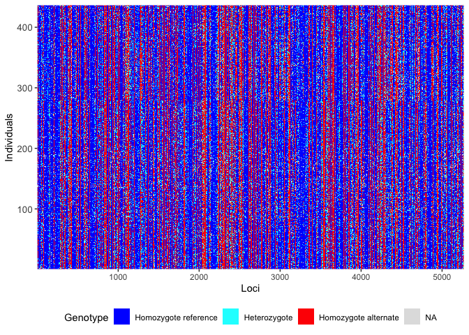

# Remove replicated (clonal) individuals
Sandra Erdmann and Ira Cooke

## Load Libraries

``` r
library(dartRverse)
```

    **********************************************
    **** Welcome to dartRverse [Version 1.0.6] ****
    **********************************************

    ── Core dartRverse packages ────────────────────────────────────── dartRverse ──
    ✔ dartR.base 1.0.6     ✔ dartR.data 1.0.8
    ── Installed dartRverse packages   ─────────────────────────────── dartRverse ──
    ✔ dartR.captive 1.0.2     ✔ dartR.sim     0.70 
    ✔ dartR.popgen  1.0.0     ✔ dartR.spatial 1.0.3
    ── Not [yet] installed dartRverse packages ─────────────────────── dartRverse ──
    ✖ dartR.sexlinked      

``` r
library(tidyverse)
```

    ── Attaching core tidyverse packages ──────────────────────── tidyverse 2.0.0 ──
    ✔ forcats   1.0.0     ✔ stringr   1.5.1
    ✔ lubridate 1.9.4     ✔ tibble    3.3.0
    ✔ purrr     1.1.0     ✔ tidyr     1.3.1
    ✔ readr     2.1.5     
    ── Conflicts ────────────────────────────────────────── tidyverse_conflicts() ──
    ✖ dplyr::filter() masks stats::filter()
    ✖ dplyr::lag()    masks stats::lag()
    ℹ Use the conflicted package (<http://conflicted.r-lib.org/>) to force all conflicts to become errors

``` r
library(ggraph)
library(igraph)
```


    Attaching package: 'igraph'

    The following objects are masked from 'package:lubridate':

        %--%, union

    The following objects are masked from 'package:purrr':

        compose, simplify

    The following object is masked from 'package:tidyr':

        crossing

    The following object is masked from 'package:tibble':

        as_data_frame

    The following objects are masked from 'package:dplyr':

        as_data_frame, groups, union

    The following objects are masked from 'package:stats':

        decompose, spectrum

    The following object is masked from 'package:base':

        union

``` r
load("cache/ak.filtered.rdata")
```

## Identify close relatives/replicates

Accurate identification of clones and close relatives relies on
estimates of population allele frequencies. From past studies we can
assume that there is strong population structure dividing two main
populations. We therefore perform an initial structure analysis to
assign individuals to these populations for the purposes of calculating
relatedness statistics.

``` r
gl2structure(ak.filtered, ind.names = NULL, add.columns = NULL, ploidy = 2, export.marker.names = TRUE, outfile = "ak.filtered.str", outpath = "structure", verbose = NULL)
```

Then run structure as follows

``` bash
structure -K 2 -L 5275 -N 465  -m ak.mainparams.txt -i ak.filtered.str -o ak.structure.k2.out
```

Read back the structure results and create tables assigning individuals
to one of the two populations

``` r
structure_ak_filtered <- read_table("structure/ak.structure.k2.out.anc.txt",col_names = c("X1", "Label","(%Miss)","C1","C2"),skip = 2)
```


    ── Column specification ────────────────────────────────────────────────────────
    cols(
      X1 = col_double(),
      Label = col_character(),
      `(%Miss)` = col_character(),
      C1 = col_double(),
      C2 = col_double()
    )

    Warning: 465 parsing failures.
    row col  expected    actual                                    file
      1  -- 5 columns 6 columns 'structure/ak.structure.k2.out.anc.txt'
      2  -- 5 columns 6 columns 'structure/ak.structure.k2.out.anc.txt'
      3  -- 5 columns 6 columns 'structure/ak.structure.k2.out.anc.txt'
      4  -- 5 columns 6 columns 'structure/ak.structure.k2.out.anc.txt'
      5  -- 5 columns 6 columns 'structure/ak.structure.k2.out.anc.txt'
    ... ... ......... ......... .......................................
    See problems(...) for more details.

``` r
# C2 is Maggie, C1 is Palms

maggie_ind <- structure_ak_filtered %>% 
  filter(C2>0.5) %>% pull(Label)
palms_ind <- structure_ak_filtered %>% 
  filter(C1>0.5) %>% pull(Label)

write.table(maggie_ind,file = "relatedness/maggie_ind.txt",row.names = FALSE,col.names = FALSE, quote = FALSE)
write.table(palms_ind,file = "relatedness/palms_ind.txt",row.names = FALSE,col.names = FALSE, quote = FALSE)
```

Next we use the program `vcftools` to calculate relatedness for Maggie
and Palms individuals separately (see scripts in directory
`relatedness`)

``` bash
vcftools --vcf 8597.f7.vcf --relatedness2 --keep maggie_ancestry.tsv --out 8597.maggie_ancestry
vcftools --vcf 8597.f7.vcf --relatedness2 --keep palms_ancestry.tsv --out 8597.palms_ancestry
```

``` r
palms_rel <- read_tsv("relatedness/ak.filtered.palms_ancestry.relatedness2") %>% 
  filter(INDV1 != INDV2) %>% add_column(pop="palms")
```

    Rows: 82944 Columns: 7
    ── Column specification ────────────────────────────────────────────────────────
    Delimiter: "\t"
    chr (2): INDV1, INDV2
    dbl (5): N_AaAa, N_AAaa, N1_Aa, N2_Aa, RELATEDNESS_PHI

    ℹ Use `spec()` to retrieve the full column specification for this data.
    ℹ Specify the column types or set `show_col_types = FALSE` to quiet this message.

``` r
maggie_rel <- read_tsv("relatedness/ak.filtered.maggie_ancestry.relatedness2") %>% 
  filter(INDV1 != INDV2) %>% add_column(pop="maggie")
```

    Rows: 900 Columns: 7
    ── Column specification ────────────────────────────────────────────────────────
    Delimiter: "\t"
    chr (2): INDV1, INDV2
    dbl (5): N_AaAa, N_AAaa, N1_Aa, N2_Aa, RELATEDNESS_PHI

    ℹ Use `spec()` to retrieve the full column specification for this data.
    ℹ Specify the column types or set `show_col_types = FALSE` to quiet this message.

``` r
all_rel <- rbind(palms_rel,maggie_rel)
```

Relatedness numbers don’t conform to ideal expectations. There are a lot
of negative values which is probably due to additional population
structure within palms/maggie. Nevertheless we can see a main peak
around 0 which represents the bulk of individuals which are probably
unrelated. Highly related individuals and potential clones show up as an
additional peak above relatedness values around 0.25. In both plots this
peak is quite distinct from the bulk of sample pairs.

``` r
all_rel %>% 
  ggplot(aes(x=RELATEDNESS_PHI)) + geom_histogram(aes(fill=pop),binwidth = 0.05) + scale_y_log10() + facet_wrap(~pop)
```

    Warning in scale_y_log10(): log-10 transformation introduced infinite values.

    Warning: Removed 33 rows containing missing values or values outside the scale range
    (`geom_bar()`).



Next we plot relationships among highly related individuals as a graph.
This is because not all such highly related groups are pairs. Sometimes
there are more than 2 individuals within a clonal cluster. We need to
identify these clusters so that we can pick one representative from each

``` r
rel_connected <- all_rel %>% 
  filter(RELATEDNESS_PHI>0.25)

rel_graph <- graph_from_data_frame(rel_connected)
ggraph(rel_graph) + geom_edge_link() + geom_node_point(color="red")
```

    Using "stress" as default layout



This gives a total of 54 individuals in 25 clusters. In order to pick a
representative from each of these clusters we need to calculate
missingness for all samples which we do using vcftools

``` bash
vcftools --gzvcf ak.filtered.vcf.gz --missing-indv --out ak.filtered
```

``` r
ak.filtered.imiss <- read_tsv("relatedness/ak.filtered.imiss")
```

    Rows: 465 Columns: 5
    ── Column specification ────────────────────────────────────────────────────────
    Delimiter: "\t"
    chr (1): INDV
    dbl (4): N_DATA, N_GENOTYPES_FILTERED, N_MISS, F_MISS

    ℹ Use `spec()` to retrieve the full column specification for this data.
    ℹ Specify the column types or set `show_col_types = FALSE` to quiet this message.

Joining missingness information with cluster membership allows us to
identify representatives of each cluster and then make a list of all
other individuals which will need to be removed from further analysis

``` r
representative_samples <- data.frame(cluster=components(rel_graph)$membership) %>% rownames_to_column("INDV") %>% 
  left_join(ak.filtered.imiss) %>% 
  group_by(cluster) %>% 
  slice_min(F_MISS,n=1) %>% 
  pull(INDV)
```

    Joining with `by = join_by(INDV)`

``` r
excluded_samples <- setdiff(rel_connected$INDV1,representative_samples)  

excluded_samples %>% 
  as.data.frame() %>% 
  write_tsv(file = "relatedness/excluded_relatives.tsv",col_names = FALSE)
```

## Create new genlight object with replicates/clones removed

``` r
ak.filtered.nr <- gl.drop.ind(ak.filtered, excluded_samples)
```

    Starting gl.drop.ind 
      Processing genlight object with SNP data
      Deleting specified individuals
      Warning: Resultant dataset may contain monomorphic loci
      Locus metrics not recalculated
    Completed: gl.drop.ind 

``` r
# Filter for monomorphs
ak.filtered.nr <- gl.filter.monomorphs(ak.filtered.nr)
```

    Starting gl.filter.monomorphs 
      Processing genlight object with SNP data
      Identifying monomorphic loci
      Removing monomorphic loci and loci with all missing 
                           data
    Completed: gl.filter.monomorphs 

``` r
# Recalculate locus metrics
ak.filtered.nr <- gl.recalc.metrics(ak.filtered.nr)
```

    Starting gl.recalc.metrics 
      Processing genlight object with SNP data
    Starting utils.recalc.avgpic 
      Processing genlight object with SNP data
      Recalculating OneRatioRef, OneRatioSnp, PICRef, PICSnp, AvgPIC
    Completed: utils.recalc.avgpic 
    Starting utils.recalc.callrate 
      Processing genlight object with SNP data
      Recalculating locus metric CallRate
    Completed: utils.recalc.callrate 
    Starting utils.recalc.maf 
      Processing genlight object with SNP data
      Recalculating FreqHoms and FreqHets
    Starting utils.recalc.freqhets 
      Processing genlight object with SNP data
      Recalculating locus metric freqHets
    Completed: utils.recalc.freqhets 
    Starting utils.recalc.freqhomref 
      Processing genlight object with SNP data
      Recalculating locus metric freqHomRef
    Completed: utils.recalc.freqhomref 
    Starting utils.recalc.freqhomsnp 
      Processing genlight object with SNP data
      Recalculating locus metric freqHomSnp
    Completed: utils.recalc.freqhomsnp 
      Recalculating Minor Allele Frequency (MAF)
    Completed: utils.recalc.maf 
      Locus metrics recalculated
    Completed: gl.recalc.metrics 

``` r
nInd(ak.filtered.nr)
```

    [1] 436

``` r
nLoc(ak.filtered.nr)
```

    [1] 5269

``` r
gl.smearplot(ak.filtered.nr)
```

      Processing genlight object with SNP data
    Starting gl.smearplot 


    Completed: gl.smearplot 



## Remove missing loci

A DArT dataset will not have individuals for which the calls are scored
as missing (NA) across all loci, but such individuals may sneak in to
the dataset when loci are deleted. Retaining individual or loci with all
NAs can cause issues for several functions

In this case there are no such individuals

``` r
# Filter for missing loci
ak.pop <-gl.filter.allna(ak.filtered.nr)
```

    Starting gl.filter.allna 
      Identifying and removing loci and individuals scored all 
                    missing (NA)
      Deleting loci that are scored as all missing (NA)
      Deleting individuals that are scored as all missing (NA)
    Completed: gl.filter.allna 

## Inspect filtered file

``` r
nInd(ak.pop)
```

    [1] 436

``` r
nLoc(ak.pop)
```

    [1] 5269

``` r
table(pop(ak.pop))
```


    BRR  EP  GB HaR  HB HFB  JB  KR LPB  MB  MR  PB  SO  WB  WP 
     20  95  29  28  28  19  15  15  34   6  16  21  80  21   9 

``` r
indNames(ak.pop)
```

      [1] "A1"                "A159"              "A13"              
      [4] "A24"               "A85"               "A102"             
      [7] "A113"              "A125"              "A138"             
     [10] "A149"              "A160"              "B2"               
     [13] "B15"               "A88"               "A105"             
     [16] "A114"              "A126"              "A139"             
     [19] "A150"              "A161"              "B3"               
     [22] "A89"               "A106"              "A116"             
     [25] "A127"              "A140"              "A151"             
     [28] "A164"              "B7"                "A18"              
     [31] "A28"               "A90"               "A107"             
     [34] "A117"              "A130"              "A141"             
     [37] "A152"              "A166"              "B19"              
     [40] "A29"               "A92"               "A108"             
     [43] "A120"              "A132"              "A142"             
     [46] "A153"              "A167"              "B21"              
     [49] "A99"               "A109"              "A122"             
     [52] "A134"              "A145"              "A168"             
     [55] "B10"               "A22"               "A82"              
     [58] "A100"              "A111"              "A123"             
     [61] "A135"              "A146"              "A155"             
     [64] "A169"              "A84"               "A101"             
     [67] "A112"              "A136"              "A148"             
     [70] "A156"              "HaR_06/05/2022_12" "HaR_06/05/2022_31"
     [73] "HaR_06/05/2022_40" "MR_14/03/2022_6"   "KR_29/03/2022_41" 
     [76] "KR_29/03/2022_49"  "HaR_06/05/2022_15" "HaR_06/05/2022_32"
     [79] "HaR_06/05/2022_41" "MR_14/03/2022_7"   "KR_29/03/2022_30" 
     [82] "KR_29/03/2022_50"  "HaR_06/05/2022_19" "HaR_06/05/2022_33"
     [85] "HaR_06/05/2022_42" "MR_14/03/2022_8"   "MR_14/03/2022_37" 
     [88] "MR_14/03/2022_48"  "KR_29/03/2022_31"  "KR_29/03/2022_43" 
     [91] "HaR_06/05/2022_1"  "HaR_06/05/2022_20" "HaR_06/05/2022_34"
     [94] "HaR_06/05/2022_43" "WB_36"             "MR_14/03/2022_9"  
     [97] "KR_29/03/2022_32"  "KR_29/03/2022_44"  "HaR_06/05/2022_7" 
    [100] "HaR_06/05/2022_23" "HaR_06/05/2022_35" "HaR_06/05/2022_44"
    [103] "MR_14/03/2022_1"   "MR_14/03/2022_10"  "KR_29/03/2022_33" 
    [106] "KR_29/03/2022_45"  "HaR_06/05/2022_8"  "HaR_06/05/2022_24"
    [109] "HaR_06/05/2022_36" "HaR_06/05/2022_50" "MR_14/03/2022_3"  
    [112] "MR_14/03/2022_11"  "MR_14/03/2022_41"  "KR_29/03/2022_34" 
    [115] "HaR_06/05/2022_9"  "HaR_06/05/2022_25" "HaR_06/05/2022_37"
    [118] "MR_14/03/2022_4"   "MR_14/03/2022_12"  "MR_14/03/2022_44" 
    [121] "KR_29/03/2022_35"  "KR_29/03/2022_47"  "HaR_06/05/2022_10"
    [124] "HaR_06/05/2022_29" "HaR_06/05/2022_38" "MR_14/03/2022_5"  
    [127] "MR_14/03/2022_13"  "KR_29/03/2022_36"  "KR_29/03/2022_48" 
    [130] "HaR_06/05/2022_11" "At_34_J20"         "At_O18"           
    [133] "At_O48"            "At_47_J20"         "At_12_J20"        
    [136] "At_51_N"           "At_69_N"           "At_76_A"          
    [139] "At_35_J20"         "At_O62"            "At_O19"           
    [142] "At_O49"            "At_52_J20"         "At_14_J20"        
    [145] "At_32_N"           "At_53_N"           "At_70_N"          
    [148] "At_39_J20"         "At_O20"            "At_O50"           
    [151] "At_56_J20"         "At_165_J20"        "At_54_N"          
    [154] "At_33_F"           "At_71_A"           "At_40_J20"        
    [157] "At_O78"            "At_O42"            "At_O52"           
    [160] "At_58_J20"         "At_170_N"          "At_55_N"          
    [163] "At_57_F"           "At_O43"            "At_O53"           
    [166] "At_59_J20"         "At_27_J20"         "At_O55"           
    [169] "At_O73"            "At_62_A"           "At_42_J20"        
    [172] "At_O44"            "At_4_J20"          "At_30_J20"        
    [175] "At_O56"            "At_63_N"           "At_O76"           
    [178] "At_79_A"           "At_44_J20"         "At_O16"           
    [181] "At_O45"            "At_5_J20"          "At_157_J20"       
    [184] "At_O57"            "At_49_N"           "At_67_N"          
    [187] "At_65_A"           "At_46_J20"         "At_O17"           
    [190] "At_O47"            "At_6_J20"          "At_158_J20"       
    [193] "At_50_N"           "At_O51"            "At_D26_3.20"      
    [196] "At_D34_3.20"       "At_D42_3.20"       "At_23_J20"        
    [199] "At_33_F20"         "At_45_F20"         "At_73_F20"        
    [202] "At_S2_3.20"        "At_S10_3.20"       "At_S18_3.20"      
    [205] "At_D27_3.20"       "At_D35_3.20"       "At_D43_3.20"      
    [208] "At_48_F20"         "At_60_F20"         "At_74_F20"        
    [211] "At_S3_3.20"        "At_S11_3.20"       "At_S19_3.20"      
    [214] "At_D28_3.20"       "At_D36_3.20"       "At_D44_3.20"      
    [217] "At_25_J20"         "At_35_N"           "At_49_F20"        
    [220] "At_61_F20"         "At_75_F20"         "At_S4_3.20"       
    [223] "At_S12_3.20"       "At_S20_3.20"       "At_D29_3.20"      
    [226] "At_D37_3.20"       "At_D45_3.20"       "At_36_F20"        
    [229] "At_51_F20"         "At_62_F20"         "At_76_F20"        
    [232] "At_S5_3.20"        "At_S13_3.20"       "At_S21_3.20"      
    [235] "At_D30_3.20"       "At_D38_3.20"       "At_D46_3.20"      
    [238] "At_154_J20"        "At_37_F20"         "At_53_F20"        
    [241] "At_66_F20"         "At_77_F20"         "At_S6_3.20"       
    [244] "At_S14_3.20"       "At_S22_3.20"       "At_D31_3.20"      
    [247] "At_D39_3.20"       "At_D47_3.20"       "At_162_J20"       
    [250] "At_38_F20"         "At_54_F20"         "At_67_F20"        
    [253] "At_78_F20"         "At_S7_3.20"        "At_S15_3.20"      
    [256] "At_S23_3.20"       "At_16_F"           "At_D32_3.20"      
    [259] "At_D40_3.20"       "At_163_J20"        "At_41_F20"        
    [262] "At_55_F20"         "At_71_F20"         "At_80_F20"        
    [265] "At_S8_3.20"        "At_S16_3.20"       "At_S24_3.20"      
    [268] "At_17_J20"         "At_D33_3.20"       "At_D41_3.20"      
    [271] "At_31_F20"         "At_43_F20"         "At_57_F20"        
    [274] "At_72_F20"         "At_S1_3.20"        "At_S9_3.20"       
    [277] "At_S17_3.20"       "At_S25_3.20"       "HB_27/11/21_10"   
    [280] "HB_27/11/21_18"    "HB_27/11/21_26"    "PB_25/11/21_09"   
    [283] "PB_25/11/21_32"    "PB_05/04/22_47"    "WB_03/04/2022_14" 
    [286] "WB_03/04/2022_26"  "WB_03/04/2022_38"  "HB_27/11/21_11"   
    [289] "HB_27/11/21_19"    "HB_27/11/21_28"    "PB_25/11/21_11"   
    [292] "PB_05/04/22_48"    "WB_03/04/2022_16"  "WB_03/04/2022_27" 
    [295] "HB_27/11/21_12"    "HB_27/11/21_20"    "PB_25/11/21_12"   
    [298] "PB_05/04/22_41"    "PB_05/04/22_49"    "WB_03/04/2022_20" 
    [301] "WB_03/04/2022_30"  "HB_27/11/21_13"    "HB_27/11/21_21"   
    [304] "PB_05/04/22_42"    "PB_05/04/22_50"    "WB_03/04/2022_21" 
    [307] "WB_03/04/2022_31"  "HB_27/11/21_14"    "HB_27/11/21_22"   
    [310] "PB_25/11/21_04"    "PB_05/04/22_43"    "WB_03/04/2022_3"  
    [313] "WB_03/04/2022_22"  "WB_03/04/2022_32"  "HB_27/11/21_15"   
    [316] "HB_27/11/21_23"    "PB_25/11/21_06"    "PB_25/11/21_26"   
    [319] "PB_05/04/22_44"    "WB_03/04/2022_8"   "WB_03/04/2022_23" 
    [322] "WB_03/04/2022_35"  "HB_27/11/21_16"    "HB_27/11/21_24"   
    [325] "PB_25/11/21_07"    "PB_25/11/21_28"    "PB_05/04/22_45"   
    [328] "WB_03/04/2022_11"  "WB_03/04/2022_24"  "HB_27/11/21_17"   
    [331] "HB_27/11/21_25"    "PB_25/11/21_08"    "PB_25/11/21_30"   
    [334] "PB_05/04/22_46"    "WB_03/04/2022_13"  "WB_03/04/2022_25" 
    [337] "WB_03/04/2022_37"  "GB_03/03/2022_1"   "GB_03/03/2022_10" 
    [340] "GB_03/03/2022_18"  "GB_03/03/2022_28"  "GB_03/03/2022_2"  
    [343] "GB_03/03/2022_11"  "GB_03/03/2022_19"  "GB_03/03/2022_29" 
    [346] "GB_03/03/2022_3"   "GB_03/03/2022_12"  "GB_03/03/2022_20" 
    [349] "GB_03/03/2022_30"  "GB_03/03/2022_4"   "GB_03/03/2022_13" 
    [352] "GB_03/03/2022_21"  "GB_03/03/2022_31"  "GB_03/03/2022_5"  
    [355] "GB_03/03/2022_14"  "GB_03/03/2022_22"  "GB_03/03/2022_32" 
    [358] "GB_03/03/2022_6"   "GB_03/03/2022_15"  "GB_03/03/2022_23" 
    [361] "GB_03/03/2022_7"   "GB_03/03/2022_16"  "GB_03/03/2022_26" 
    [364] "GB_03/03/2022_8"   "GB_03/03/2022_17"  "GB_03/03/2022_27" 
    [367] "HB_1"              "JB_50"             "BRR_27"           
    [370] "BRR_42"            "HB_9"              "HFB_7"            
    [373] "HFB_16"            "HFB_24"            "MB_24"            
    [376] "JB_38"             "HB_2"              "BRR_1"            
    [379] "BRR_28"            "BRR_43"            "HB_10"            
    [382] "HFB_8"             "HFB_17"            "HFB_25"           
    [385] "JB_13"             "HB_3"              "BRR_4"            
    [388] "BRR_31"            "BRR_44"            "HB_11"            
    [391] "HFB_9"             "HFB_18"            "MB_1"             
    [394] "JB_14"             "JB_42"             "BRR_5"            
    [397] "BRR_36"            "BRR_46"            "HFB_10"           
    [400] "HFB_19"            "JB_18"             "JB_43"            
    [403] "HB_5"              "BRR_9"             "BRR_38"           
    [406] "BRR_47"            "HFB_11"            "MB_5"             
    [409] "JB_3"              "JB_20"             "JB_44"            
    [412] "HB_6"              "BRR_10"            "BRR_39"           
    [415] "BRR_48"            "HFB_4"             "HFB_12"           
    [418] "MB_6"              "MB_20"             "JB_4"             
    [421] "JB_45"             "HB_7"              "BRR_13"           
    [424] "BRR_40"            "HFB_5"             "HFB_13"           
    [427] "HFB_22"            "JB_46"             "HB_8"             
    [430] "BRR_41"            "HFB_6"             "HFB_14"           
    [433] "HFB_23"            "MB_22"             "JB_11"            
    [436] "JB_49"            

``` r
save(ak.filtered.nr, file="cache/ak.filtered.nr.rdata")
```
