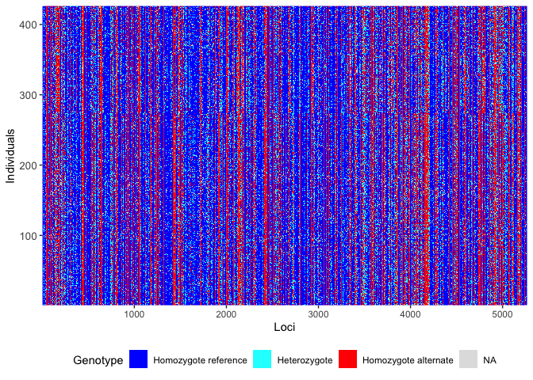

# Remove replicated (clonal) individuals
Sandra Erdmann and Ira Cooke

## Load Libraries

``` r
knitr::opts_chunk$set(echo = TRUE, message = FALSE, warning = FALSE, error = FALSE)
library(dartRverse)
```

    **********************************************
    **** Welcome to dartRverse [Version 1.0.6] ****
    **********************************************

    ── Core dartRverse packages ────────────────────────────────────── dartRverse ──
    ✔ dartR.base 1.1.1     ✔ dartR.data 1.0.8
    ── Installed dartRverse packages   ─────────────────────────────── dartRverse ──
    ✔ dartR.popgen 1.0.0     
    ── Not [yet] installed dartRverse packages ─────────────────────── dartRverse ──
    ✖ dartR.captive        ✖ dartR.sim       
    ✖ dartR.sexlinked      ✖ dartR.spatial   

``` r
library(tidyverse)
```

    ── Attaching core tidyverse packages ──────────────────────── tidyverse 2.0.0 ──
    ✔ forcats   1.0.1     ✔ stringr   1.6.0
    ✔ lubridate 1.9.4     ✔ tibble    3.3.0
    ✔ purrr     1.2.0     ✔ tidyr     1.3.1
    ✔ readr     2.1.5     
    ── Conflicts ────────────────────────────────────────── tidyverse_conflicts() ──
    ✖ dplyr::filter() masks stats::filter()
    ✖ dplyr::lag()    masks stats::lag()
    ℹ Use the conflicted package (<http://conflicted.r-lib.org/>) to force all conflicts to become errors

``` r
library(ggraph)
library(igraph)
```


    Attaching package: 'igraph'

    The following objects are masked from 'package:lubridate':

        %--%, union

    The following objects are masked from 'package:purrr':

        compose, simplify

    The following object is masked from 'package:tidyr':

        crossing

    The following object is masked from 'package:tibble':

        as_data_frame

    The following objects are masked from 'package:dplyr':

        as_data_frame, groups, union

    The following objects are masked from 'package:stats':

        decompose, spectrum

    The following object is masked from 'package:base':

        union

``` r
load("cache/ak.filtered.rdata")
```

## Identify close relatives/replicates

Accurate identification of clones and close relatives relies on
estimates of population allele frequencies. From past studies we can
assume that there is strong population structure dividing two main
populations. We therefore perform an initial structure analysis to
assign individuals to these populations for the purposes of calculating
relatedness statistics.

``` r
gl2structure(ak.filtered, ind.names = NULL, add.columns = NULL, ploidy = 2, export.marker.names = TRUE, outfile = "ak.filtered.str", outpath = "structure", verbose = NULL)
```

Then run structure as follows

``` bash
structure -K 2 -L 5275 -N 465  -m ak.mainparams.txt -i ak.filtered.str -o ak.structure.k2.out
```

Read back the structure results and create tables assigning individuals
to one of the two populations

``` r
samples <- read_table("structure/ak.filtered.samples.txt",col_names = c("ID"))

structure_ak_filtered <- read_table("structure/ak.structure.k2.out.anc.txt",col_names = c("X1", "Label","(%Miss)","C1","C2"),skip = 2) %>% 
  cbind(samples)

# C2 is Maggie, C1 is Palms

maggie_ind <- structure_ak_filtered %>% 
  filter(C2>0.5) %>% pull(ID)
palms_ind <- structure_ak_filtered %>% 
  filter(C1>0.5) %>% pull(ID)

write.table(maggie_ind,file = "relatedness/maggie_ind.txt",row.names = FALSE,col.names = FALSE, quote = FALSE)
write.table(palms_ind,file = "relatedness/palms_ind.txt",row.names = FALSE,col.names = FALSE, quote = FALSE)
```

Next we use the program `vcftools` to calculate relatedness for Maggie
and Palms individuals separately (see scripts in directory
`relatedness`)

``` bash
vcftools --gzvcf ak.filtered.vcf.gz --relatedness2 --keep maggie_ind.txt --out ak.filtered.maggie_ancestry
vcftools --gzvcf ak.filtered.vcf.gz --relatedness2 --keep palms_ind.txt --out ak.filtered.palms_ancestry
```

``` r
palms_rel <- read_tsv("relatedness/ak.filtered.palms_ancestry.relatedness2") %>% 
  filter(INDV1 != INDV2) %>% add_column(pop="palms")

maggie_rel <- read_tsv("relatedness/ak.filtered.maggie_ancestry.relatedness2") %>% 
  filter(INDV1 != INDV2) %>% add_column(pop="maggie")

all_rel <- rbind(palms_rel,maggie_rel)
```

Relatedness numbers don’t conform to ideal expectations. There are a lot
of negative values which is a known consequence of estimating allele
frequencies from a sample, particularly if the sample includes some
family structure or inbreeding. In such cases unrelated individuals are
expected to have a negative relatedness (Wang 2014). Nevertheless we can
see a main peak around 0 which represents the bulk of individuals which
are probably unrelated. Highly related individuals and potential clones
show up as an additional peak above relatedness values around 0.25. In
both plots this peak is quite distinct from the bulk of sample pairs.

``` r
all_rel %>% 
  ggplot(aes(x=RELATEDNESS_PHI)) + geom_histogram(aes(fill=pop),binwidth = 0.05) + scale_y_log10() + facet_wrap(~pop)
```


Next we plot relationships among highly related individuals as a graph.
This is because not all such highly related groups are pairs. Sometimes
there are more than 2 individuals within a clonal cluster. We need to
identify these clusters so that we can pick one representative from each

``` r
rel_connected <- all_rel %>% 
  filter(RELATEDNESS_PHI>0.25)

rel_graph <- graph_from_data_frame(rel_connected)
ggraph(rel_graph) + 
  geom_edge_link() + 
  geom_node_point(color="red") + 
  geom_node_text(aes(label=name),size=1,repel = TRUE)
```


This gives a total of 96 individuals in 32 clusters. In order to pick a
representative from each of these clusters we need to calculate
missingness for all samples which we do using vcftools

``` bash
vcftools --gzvcf ak.filtered.vcf.gz --missing-indv --out ak.filtered
```

``` r
ak.filtered.imiss <- read_tsv("relatedness/ak.filtered.imiss")
```

Joining missingness information with cluster membership allows us to
identify representatives of each cluster and then make a list of all
other individuals which will need to be removed from further analysis

``` r
representative_samples <- data.frame(cluster=components(rel_graph)$membership) %>% 
  rownames_to_column("INDV") %>% 
  left_join(ak.filtered.imiss) %>% 
  group_by(cluster) %>% 
  slice_min(F_MISS,n=1,with_ties = FALSE) %>% 
  pull(INDV)

excluded_samples <- setdiff(rel_connected$INDV1,representative_samples)  

excluded_samples %>% 
  as.data.frame() %>% 
  write_tsv(file = "relatedness/excluded_relatives.tsv",col_names = FALSE)
```

## Create new genlight object with replicates/clones removed

``` r
ak.filtered.nr <- gl.drop.ind(ak.filtered, excluded_samples, recalc = TRUE, mono.rm = TRUE)
```

``` r
nInd(ak.filtered.nr)
```

    [1] 426

``` r
nLoc(ak.filtered.nr)
```

    [1] 5267

``` r
gl.smearplot(ak.filtered.nr)
```

      Processing genlight object with SNP data
    Starting gl.smearplot 


    Completed: gl.smearplot 



## Remove missing loci

A DArT dataset will not have individuals for which the calls are scored
as missing (NA) across all loci, but such individuals may sneak in to
the dataset when loci are deleted. Retaining individual or loci with all
NAs can cause issues for several functions

In this case there are no such individuals

``` r
# Filter for missing loci
ak.pop <-gl.filter.allna(ak.filtered.nr)
```

    Starting gl.filter.allna 
      Identifying and removing loci and individuals scored all 
                    missing (NA)
      Deleting loci that are scored as all missing (NA)
      Deleting individuals that are scored as all missing (NA)
    Completed: gl.filter.allna 

## Inspect filtered file

``` r
nInd(ak.pop)
```

    [1] 426

``` r
nLoc(ak.pop)
```

    [1] 5267

``` r
table(pop(ak.pop))
```


    BRR  EP  GB HaR  HB HFB  JB  KR LPB  MB  MR  PB  SO  WB  WP 
     20  95  28  28  28  19  15  15  34   6  12  18  80  20   8 

``` r
save(ak.filtered.nr, file="cache/ak.filtered.nr.rdata")
```

<div id="refs" class="references csl-bib-body hanging-indent"
entry-spacing="0">

<div id="ref-Wang2014-mm" class="csl-entry">

Wang, J. 2014. “Marker-Based Estimates of Relatedness and Inbreeding
Coefficients: An Assessment of Current Methods.” *J. Evol. Biol.* 27
(3): 518–30.

</div>

</div>
