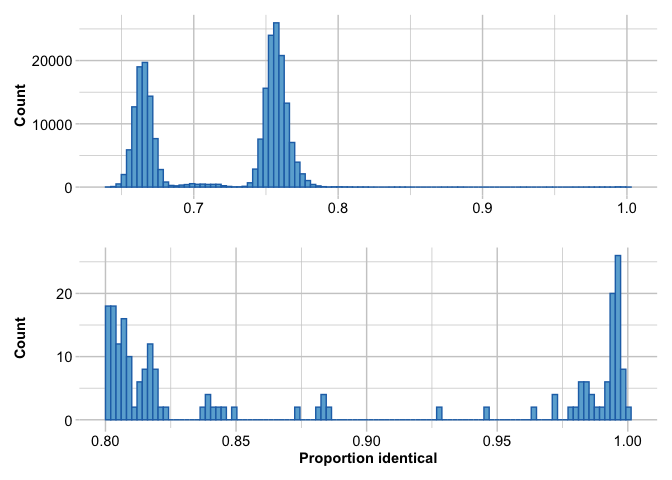
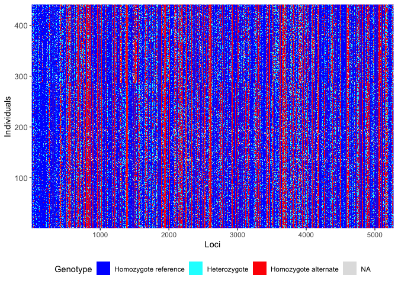

# Remove replicated (clonal) individuals
Sandra Erdmann

# Population Structure

## Load Libraries

``` r
library(ggplot2)      # to plot results
library(ggpubr)       # to use ggarrange and other plotting functions
library(gridExtra)    # to use grid.arrange
library(cowplot)      # to use plot_grid and ggdraw
```


    Attaching package: 'cowplot'

    The following object is masked from 'package:ggpubr':

        get_legend

``` r
library(tidyr)        # general functions
library(dartRverse)
```

    **********************************************
    **** Welcome to dartRverse [Version 1.0.6] ****
    **********************************************

    ── Core dartRverse packages ────────────────────────────────────── dartRverse ──
    ✔ dartR.base 1.0.6     ✔ dartR.data 1.0.8
    ── Installed dartRverse packages   ─────────────────────────────── dartRverse ──
    ✔ dartR.captive 1.0.2     ✔ dartR.sim     0.70 
    ✔ dartR.popgen  1.0.0     ✔ dartR.spatial 1.0.3
    ── Not [yet] installed dartRverse packages ─────────────────────── dartRverse ──
    ✖ dartR.sexlinked      

``` r
load("cache/ak.filtered.rdata")
```

## Identify close relatives/replicates

Identify close relatives with a percentage of 99% similarity in their
genotypes.

From the dartr manual

> Ideally, in a large dataset with related and unrelated individuals and
> several replicated individuals, the first histogram should have four
> “peaks”. The first peak should represent unrelated individuals, the
> second peak should correspond to second-degree relationships (such as
> cousins), the third peak should represent first-degree relationships
> (like parent/offspring and full siblings), and the fourth peak should
> represent replicated individuals.

> In order to ensure that replicated individuals are properly
> identified, it’s important to have a clear separation between the
> third and fourth peaks in the second histogram. This means that there
> should be bins with zero counts between these two peaks.

Note that replicated coral colonies could arise due to asexual
reproduction (fragmentation) or simply because the same colony was
inadvertently sampled twice.

``` r
# Inspect the number of replicates
ak9.filtered.rep <- dartR.base::gl.report.replicates(ak.filtered, perc_geno=0.99)
```

    Starting :: 
     Starting dartR.base 
     Starting gl.report.replicates 



    Completed: :: 
     Completed: dartR.base 
     Completed: gl.report.replicates 

``` r
il <- c("At_11_J20", "A154", "A24", "At_9_J20", "B9", "At_29_J20", "At_8_J20", "At_7_J20", "A99", "At_34_N", "At_4_F", "At_41_J20", "At_58_F20", "At_6_N", "A11", "A25", "A8", "GB_03/03/2022_17", "HB_4", "MR_14/03/2022_12", "MR_14/03/2022_13", "MR_14/03/2022_8", "PB_05/04/22_45", "WB_03/04/2022_14")

# This list is not the same as the list inferred by gl.report.replicates

setdiff(il,ak9.filtered.rep$ind.list.drop)
```

    [1] "A154"             "A24"              "A99"              "GB_03/03/2022_17"

``` r
setdiff(ak9.filtered.rep$ind.list.drop,il)
```

    [1] "A100"             "At_24_J20"        "B7"               "GB_03/03/2022_23"

Drop these 24 individuals: “At_11_J20”, “A154”, “A24”, “At_9_J20”, “B9”,
“At_29_J20”, “At_8_J20”, “At_7_J20”, “A99”, “At_34_N”, “At_4_F”,
“At_41_J20”, “At_58_F20”, “At_6_N”, “A11”, “A25”, “A8”,
“GB_03/03/2022_17” “HB_4”, “MR_14/03/2022_12” “MR_14/03/2022_13”,
“MR_14/03/2022_8”, “PB_05/04/22_45”, “WB_03/04/2022_14”

## Remove replicates

Close relatives (with a percentage of 99% similarity in their genotypes)
were identified using gl.report.replicates and will be removed from this
dataset.

Drop individuals from the replicates function:

``` r
ak.filtered.nr <- gl.drop.ind(ak.filtered, ind.list=c("At_11_J20", "A154", "A24", "At_9_J20", "B9", "At_29_J20", "At_8_J20", "At_7_J20", "A99", "At_34_N", "At_4_F", "At_41_J20", "At_58_F20", "At_6_N", "A11", "A25", "A8", "GB_03/03/2022_17", "HB_4", "MR_14/03/2022_12", "MR_14/03/2022_13", "MR_14/03/2022_8", "PB_05/04/22_45", "WB_03/04/2022_14"))
```

    Starting gl.drop.ind 
      Processing genlight object with SNP data
      Deleting specified individuals
      Warning: Resultant dataset may contain monomorphic loci
      Locus metrics not recalculated
    Completed: gl.drop.ind 

``` r
# Should be
#ak.filtered.nr <- gl.drop.ind(ak.filtered, ind.list=ak9.filtered.rep$ind.list.drop)
```

``` r
# Filter for monomorphs
ak.filtered.nr <- gl.filter.monomorphs(ak.filtered.nr)
```

    Starting gl.filter.monomorphs 
      Processing genlight object with SNP data
      Identifying monomorphic loci
      Removing monomorphic loci and loci with all missing 
                           data
    Completed: gl.filter.monomorphs 

``` r
# Recalculate locus metrics
ak.filtered.nr <- gl.recalc.metrics(ak.filtered.nr)
```

    Starting gl.recalc.metrics 
      Processing genlight object with SNP data
    Starting utils.recalc.avgpic 
      Processing genlight object with SNP data
      Recalculating OneRatioRef, OneRatioSnp, PICRef, PICSnp, AvgPIC
    Completed: utils.recalc.avgpic 
    Starting utils.recalc.callrate 
      Processing genlight object with SNP data
      Recalculating locus metric CallRate
    Completed: utils.recalc.callrate 
    Starting utils.recalc.maf 
      Processing genlight object with SNP data
      Recalculating FreqHoms and FreqHets
    Starting utils.recalc.freqhets 
      Processing genlight object with SNP data
      Recalculating locus metric freqHets
    Completed: utils.recalc.freqhets 
    Starting utils.recalc.freqhomref 
      Processing genlight object with SNP data
      Recalculating locus metric freqHomRef
    Completed: utils.recalc.freqhomref 
    Starting utils.recalc.freqhomsnp 
      Processing genlight object with SNP data
      Recalculating locus metric freqHomSnp
    Completed: utils.recalc.freqhomsnp 
      Recalculating Minor Allele Frequency (MAF)
    Completed: utils.recalc.maf 
      Locus metrics recalculated
    Completed: gl.recalc.metrics 

``` r
nInd(ak.filtered.nr)
```

    [1] 441

``` r
nLoc(ak.filtered.nr)
```

    [1] 5273

``` r
gl.smearplot(ak.filtered.nr)
```

      Processing genlight object with SNP data
    Starting gl.smearplot 



    Completed: gl.smearplot 


## Remove missing loci

A DArT dataset will not have individuals for which the calls are scored
as missing (NA) across all loci, but such individuals may sneak in to
the dataset when loci are deleted. Retaining individual or loci with all
NAs can cause issues for several functions

``` r
# Filter for missing loci
ak.pop <-gl.filter.allna(ak.filtered.nr)
```

    Starting gl.filter.allna 
      Identifying and removing loci and individuals scored all 
                    missing (NA)
      Deleting loci that are scored as all missing (NA)
      Deleting individuals that are scored as all missing (NA)
    Completed: gl.filter.allna 

## Inspect filtered file

``` r
nInd(ak.pop)
```

    [1] 441

``` r
nLoc(ak.pop)
```

    [1] 5273

``` r
table(pop(ak.pop))
```


    BRR  EP  GB HaR  HB HFB  JB  KR LPB  MB  MR  PB  SO  WB  WP 
     20 104  28  28  28  19  15  15  34   6  13  20  83  20   8 

``` r
indNames(ak.pop)
```

      [1] "A1"                "A159"              "A13"              
      [4] "A85"               "A102"              "A113"             
      [7] "A125"              "A138"              "A149"             
     [10] "A160"              "B2"                "B15"              
     [13] "A88"               "A105"              "A114"             
     [16] "A126"              "A139"              "A150"             
     [19] "A161"              "B3"                "A17"              
     [22] "A89"               "A106"              "A116"             
     [25] "A127"              "A140"              "A151"             
     [28] "A164"              "B7"                "A18"              
     [31] "A28"               "A90"               "A107"             
     [34] "A117"              "A130"              "A141"             
     [37] "A152"              "A166"              "B19"              
     [40] "A29"               "A92"               "A108"             
     [43] "A120"              "A132"              "A142"             
     [46] "A153"              "A167"              "B21"              
     [49] "A31"               "A109"              "A122"             
     [52] "A134"              "A145"              "A168"             
     [55] "B10"               "A22"               "A82"              
     [58] "A100"              "A111"              "A123"             
     [61] "A135"              "A146"              "A155"             
     [64] "A169"              "A23"               "A84"              
     [67] "A101"              "A112"              "A136"             
     [70] "A148"              "A156"              "HaR_06/05/2022_12"
     [73] "HaR_06/05/2022_31" "HaR_06/05/2022_40" "MR_14/03/2022_6"  
     [76] "KR_29/03/2022_41"  "KR_29/03/2022_49"  "HaR_06/05/2022_15"
     [79] "HaR_06/05/2022_32" "HaR_06/05/2022_41" "MR_14/03/2022_7"  
     [82] "KR_29/03/2022_30"  "KR_29/03/2022_50"  "HaR_06/05/2022_19"
     [85] "HaR_06/05/2022_33" "HaR_06/05/2022_42" "MR_14/03/2022_37" 
     [88] "MR_14/03/2022_48"  "KR_29/03/2022_31"  "KR_29/03/2022_43" 
     [91] "HaR_06/05/2022_1"  "HaR_06/05/2022_20" "HaR_06/05/2022_34"
     [94] "HaR_06/05/2022_43" "WB_36"             "MR_14/03/2022_9"  
     [97] "KR_29/03/2022_32"  "KR_29/03/2022_44"  "HaR_06/05/2022_7" 
    [100] "HaR_06/05/2022_23" "HaR_06/05/2022_35" "HaR_06/05/2022_44"
    [103] "MR_14/03/2022_1"   "MR_14/03/2022_10"  "KR_29/03/2022_33" 
    [106] "KR_29/03/2022_45"  "HaR_06/05/2022_8"  "HaR_06/05/2022_24"
    [109] "HaR_06/05/2022_36" "HaR_06/05/2022_50" "MR_14/03/2022_3"  
    [112] "MR_14/03/2022_11"  "MR_14/03/2022_41"  "KR_29/03/2022_34" 
    [115] "HaR_06/05/2022_9"  "HaR_06/05/2022_25" "HaR_06/05/2022_37"
    [118] "MR_14/03/2022_4"   "MR_14/03/2022_44"  "KR_29/03/2022_35" 
    [121] "KR_29/03/2022_47"  "HaR_06/05/2022_10" "HaR_06/05/2022_29"
    [124] "HaR_06/05/2022_38" "MR_14/03/2022_5"   "KR_29/03/2022_36" 
    [127] "KR_29/03/2022_48"  "HaR_06/05/2022_11" "At_34_J20"        
    [130] "At_O18"            "At_O48"            "At_47_J20"        
    [133] "At_12_J20"         "At_51_N"           "At_69_N"          
    [136] "At_76_A"           "At_80_A"           "At_35_J20"        
    [139] "At_O62"            "At_O19"            "At_O49"           
    [142] "At_52_J20"         "At_14_J20"         "At_32_N"          
    [145] "At_53_N"           "At_70_N"           "At_39_J20"        
    [148] "At_O20"            "At_O50"            "At_56_J20"        
    [151] "At_165_J20"        "At_38_N"           "At_54_N"          
    [154] "At_33_F"           "At_66_A"           "At_71_A"          
    [157] "At_40_J20"         "At_O78"            "At_O42"           
    [160] "At_O52"            "At_58_J20"         "At_20_J20"        
    [163] "At_170_N"          "At_43_N"           "At_55_N"          
    [166] "At_57_F"           "At_72_A"           "At_O43"           
    [169] "At_O53"            "At_59_J20"         "At_27_J20"        
    [172] "At_O55"            "At_45_N"           "At_O73"           
    [175] "At_62_A"           "At_42_J20"         "At_O44"           
    [178] "At_4_J20"          "At_30_J20"         "At_O56"           
    [181] "At_48_N"           "At_63_N"           "At_O76"           
    [184] "At_79_A"           "At_44_J20"         "At_O16"           
    [187] "At_O45"            "At_5_J20"          "At_157_J20"       
    [190] "At_O57"            "At_49_N"           "At_67_N"          
    [193] "At_65_A"           "At_46_J20"         "At_O17"           
    [196] "At_O47"            "At_6_J20"          "At_158_J20"       
    [199] "At_50_N"           "At_O51"            "At_78_A"          
    [202] "At_D26_3.20"       "At_D34_3.20"       "At_D42_3.20"      
    [205] "At_23_J20"         "At_33_F20"         "At_45_F20"        
    [208] "At_73_F20"         "At_S2_3.20"        "At_S10_3.20"      
    [211] "At_S18_3.20"       "At_D27_3.20"       "At_D35_3.20"      
    [214] "At_D43_3.20"       "At_24_J20"         "At_48_F20"        
    [217] "At_60_F20"         "At_74_F20"         "At_S3_3.20"       
    [220] "At_S11_3.20"       "At_S19_3.20"       "At_D28_3.20"      
    [223] "At_D36_3.20"       "At_D44_3.20"       "At_25_J20"        
    [226] "At_35_N"           "At_49_F20"         "At_61_F20"        
    [229] "At_75_F20"         "At_S4_3.20"        "At_S12_3.20"      
    [232] "At_S20_3.20"       "At_D29_3.20"       "At_D37_3.20"      
    [235] "At_D45_3.20"       "At_36_F20"         "At_51_F20"        
    [238] "At_62_F20"         "At_76_F20"         "At_S5_3.20"       
    [241] "At_S13_3.20"       "At_S21_3.20"       "At_D30_3.20"      
    [244] "At_D38_3.20"       "At_D46_3.20"       "At_154_J20"       
    [247] "At_37_F20"         "At_53_F20"         "At_66_F20"        
    [250] "At_77_F20"         "At_S6_3.20"        "At_S14_3.20"      
    [253] "At_S22_3.20"       "At_D31_3.20"       "At_D39_3.20"      
    [256] "At_D47_3.20"       "At_162_J20"        "At_38_F20"        
    [259] "At_54_F20"         "At_67_F20"         "At_78_F20"        
    [262] "At_S7_3.20"        "At_S15_3.20"       "At_S23_3.20"      
    [265] "At_16_F"           "At_D32_3.20"       "At_D40_3.20"      
    [268] "At_163_J20"        "At_41_F20"         "At_55_F20"        
    [271] "At_71_F20"         "At_80_F20"         "At_S8_3.20"       
    [274] "At_S16_3.20"       "At_S24_3.20"       "At_17_J20"        
    [277] "At_D33_3.20"       "At_D41_3.20"       "At_31_F20"        
    [280] "At_43_F20"         "At_57_F20"         "At_72_F20"        
    [283] "At_S1_3.20"        "At_S9_3.20"        "At_S17_3.20"      
    [286] "At_S25_3.20"       "HB_27/11/21_10"    "HB_27/11/21_18"   
    [289] "HB_27/11/21_26"    "PB_25/11/21_09"    "PB_25/11/21_32"   
    [292] "PB_05/04/22_47"    "WB_03/04/2022_26"  "WB_03/04/2022_38" 
    [295] "HB_27/11/21_11"    "HB_27/11/21_19"    "HB_27/11/21_28"   
    [298] "PB_25/11/21_11"    "PB_05/04/22_48"    "WB_03/04/2022_16" 
    [301] "WB_03/04/2022_27"  "HB_27/11/21_12"    "HB_27/11/21_20"   
    [304] "PB_25/11/21_12"    "PB_05/04/22_41"    "PB_05/04/22_49"   
    [307] "WB_03/04/2022_20"  "WB_03/04/2022_30"  "HB_27/11/21_13"   
    [310] "HB_27/11/21_21"    "PB_05/04/22_42"    "PB_05/04/22_50"   
    [313] "WB_03/04/2022_21"  "WB_03/04/2022_31"  "HB_27/11/21_14"   
    [316] "HB_27/11/21_22"    "PB_25/11/21_04"    "PB_05/04/22_43"   
    [319] "WB_03/04/2022_3"   "WB_03/04/2022_22"  "WB_03/04/2022_32" 
    [322] "HB_27/11/21_15"    "HB_27/11/21_23"    "PB_25/11/21_06"   
    [325] "PB_25/11/21_26"    "PB_05/04/22_44"    "WB_03/04/2022_8"  
    [328] "WB_03/04/2022_23"  "WB_03/04/2022_35"  "HB_27/11/21_16"   
    [331] "HB_27/11/21_24"    "PB_25/11/21_07"    "PB_25/11/21_28"   
    [334] "WB_03/04/2022_11"  "WB_03/04/2022_24"  "HB_27/11/21_17"   
    [337] "HB_27/11/21_25"    "PB_25/11/21_08"    "PB_25/11/21_30"   
    [340] "PB_05/04/22_46"    "WB_03/04/2022_13"  "WB_03/04/2022_25" 
    [343] "WB_03/04/2022_37"  "GB_03/03/2022_1"   "GB_03/03/2022_10" 
    [346] "GB_03/03/2022_18"  "GB_03/03/2022_28"  "GB_03/03/2022_2"  
    [349] "GB_03/03/2022_11"  "GB_03/03/2022_19"  "GB_03/03/2022_29" 
    [352] "GB_03/03/2022_3"   "GB_03/03/2022_12"  "GB_03/03/2022_20" 
    [355] "GB_03/03/2022_30"  "GB_03/03/2022_4"   "GB_03/03/2022_13" 
    [358] "GB_03/03/2022_21"  "GB_03/03/2022_31"  "GB_03/03/2022_5"  
    [361] "GB_03/03/2022_14"  "GB_03/03/2022_22"  "GB_03/03/2022_32" 
    [364] "GB_03/03/2022_6"   "GB_03/03/2022_15"  "GB_03/03/2022_23" 
    [367] "GB_03/03/2022_7"   "GB_03/03/2022_16"  "GB_03/03/2022_26" 
    [370] "GB_03/03/2022_8"   "GB_03/03/2022_27"  "HB_1"             
    [373] "JB_50"             "BRR_27"            "BRR_42"           
    [376] "HB_9"              "HFB_7"             "HFB_16"           
    [379] "HFB_24"            "MB_24"             "JB_38"            
    [382] "HB_2"              "BRR_1"             "BRR_28"           
    [385] "BRR_43"            "HB_10"             "HFB_8"            
    [388] "HFB_17"            "HFB_25"            "JB_13"            
    [391] "HB_3"              "BRR_4"             "BRR_31"           
    [394] "BRR_44"            "HB_11"             "HFB_9"            
    [397] "HFB_18"            "MB_1"              "JB_14"            
    [400] "JB_42"             "BRR_5"             "BRR_36"           
    [403] "BRR_46"            "HFB_10"            "HFB_19"           
    [406] "JB_18"             "JB_43"             "HB_5"             
    [409] "BRR_9"             "BRR_38"            "BRR_47"           
    [412] "HFB_11"            "MB_5"              "JB_3"             
    [415] "JB_20"             "JB_44"             "HB_6"             
    [418] "BRR_10"            "BRR_39"            "BRR_48"           
    [421] "HFB_4"             "HFB_12"            "MB_6"             
    [424] "MB_20"             "JB_4"              "JB_45"            
    [427] "HB_7"              "BRR_13"            "BRR_40"           
    [430] "HFB_5"             "HFB_13"            "HFB_22"           
    [433] "JB_46"             "HB_8"              "BRR_41"           
    [436] "HFB_6"             "HFB_14"            "HFB_23"           
    [439] "MB_22"             "JB_11"             "JB_49"            

``` r
save(ak.pop, file="ak.pop.rdata")
```
