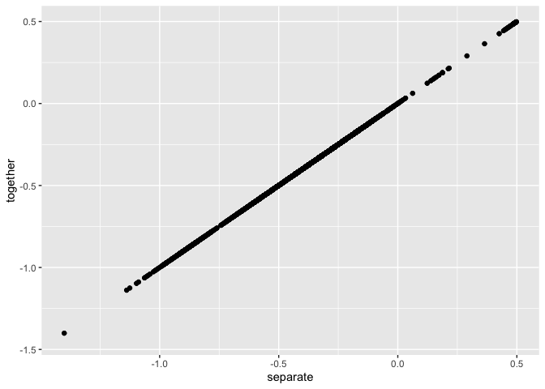
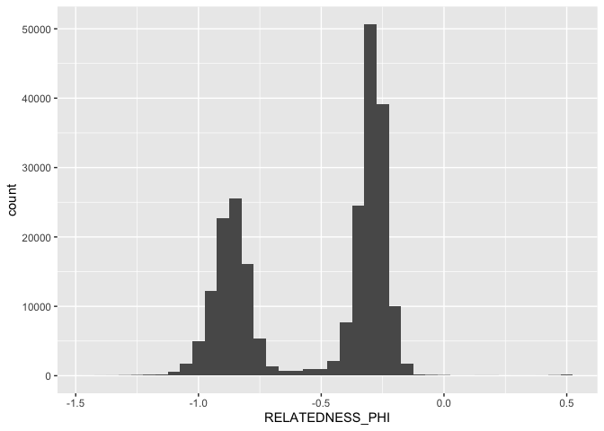
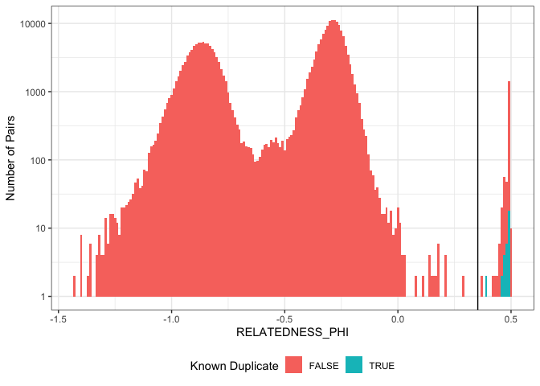
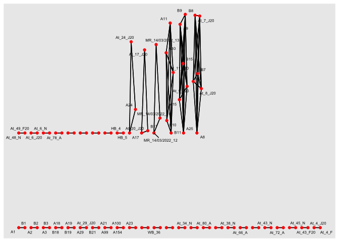

# Remove replicated (clonal) individuals
Sandra Erdmann and Ira Cooke

## Load Libraries

## Identify replicate samples

When sampling corals it is common to obtain a small number of samples
from the same genotype. This can happen through a few mechanisms. One is
colony fragmentation whereby a colony regrows from broken fragments. The
other is accidental resampling of the same colony which is possible in
our dataset since we visited some sites multiple times. When sampling in
the Palms colonies were tagged, however resampling the same coral is
possible if a tag was lost.

Our main goal here is to identify such replicated colonies. Accurate
identification of clones and close relatives can be adversely affected
by population structure, especially when using relatedness estimators
that depend on population allele frequency. To mitigate this issue we
used the `--relatedness2` option in vcftools which computes equation 9
in (Manichaikul et al. 2010). This estimator should be robust to
population structure because it does not depend on population-wide
allele frequency calculations.

As a sanity check on this assumption we calculated relatedness using two
approaches and compared them. This confirmed that subsetting the data by
population makes no difference to the relatedness2 calculation so we
used the simplest approach (not creating population subsets) for our
paper.

##### Summary of approaches

First approach. Use `structure` to divide samples into two populations
before calculating relatedness. Second approach. Simply calculate
relatedness on the entire dataset.

The second approach shown here is what was used in the paper.

### First Approach (not used in the paper)

Perform an initial structure analysis to assign individuals to one of
two populations for the purposes of calculating relatedness statistics.

Then run structure as follows

``` bash
structure -K 2 -L 5275 -N 465  -m ak.mainparams.txt -i ak.filtered.str -o ak.structure.k2.out
```

Read back the structure results and create tables assigning individuals
to one of the two populations

Next we use the program `vcftools` to calculate relatedness for Maggie
and Palms individuals separately (see scripts in directory
`relatedness`)

``` bash
vcftools --gzvcf ak.filtered.vcf.gz --relatedness2 --keep maggie_ind.txt --out ak.filtered.maggie_ancestry
vcftools --gzvcf ak.filtered.vcf.gz --relatedness2 --keep palms_ind.txt --out ak.filtered.palms_ancestry
```

### Second Approach

Simply calculate relatedness on the entire dataset. If the relatedness
statistic is allele-frequency independent as we expect these should give
nearly identical values. A slight difference is expected due to slightly
different numbers of SNPs between datasets which arises

``` bash
vcftools --gzvcf ak_r1.pop.nm.ind.vcf.gz --relatedness2 --out ak.filtered.all
```

Check relatedness agreement between datasets where pops are separated
and where everything is together. This confirms that the values are
identical. Therefore we will proceed with the second approach.



## Final calculation including known replicates

Now that we know that population substructure has no effect we
calculated relatedness on our entire dataset including the 16
individuals known to have been duplicated.

``` bash
vcftools --gzvcf ak_r1.pop.nm.ind.vcf.gz --relatedness2 --out ak_r1.filtered.all
```

A histogram of relatedness reveals four peaks. One at about -1 which is
probably due to cross population pairs (extremely unrelated), another
just below 0 which is probably unrelated individuals within population
and then another peak at around 0.2 (family members) and then 0.5
(clones/replicates).



Highly related individuals only form a tiny fraction of the dataset so
to see them we need to show the data on a log scale. This shows that the
vast majority of pairs with high relatedness have values between 0.35
and 0.5 which is the expected range for clones or duplicates. Of these
most have phi\>0.4 and there is only one borderline pair at 0.36.

This also confirms that all 16 known duplicate pairs are flagged as
duplicates via their relatedness phi values.



Next we plot relationships among duplicates as a graph. This is because
not all such highly related groups are pairs. Sometimes there are more
than 2 individuals within a clonal cluster. We need to identify these
clusters so that we can pick one representative from each



This gives a total of 166 individuals in 40 clusters. In order to pick a
representative from each of these clusters we need to calculate
missingness for all samples which we do using vcftools

``` bash
vcftools --gzvcf ak_r1.pop.nm.ind.vcf.gz --missing-indv --out ak_r1.filtered
```

Joining missingness information with cluster membership allows us to
identify representatives of each cluster and then make a list of all
other individuals which will need to be removed from further analysis

We also make a separate list of individuals representing close kin that
we might want to remove from specific analyses. These are used later to
test the impact of inclusion/exclusion of related individuals on Ne
estimates

    # A tibble: 6 × 3
      site_pair                       location_match n_pairs
      <chr>                           <lgl>            <int>
    1 Geoffrey Bay - Picnic Bay       FALSE                6
    2 Geoffrey Bay - Geoffrey Bay     TRUE                 2
    3 Middle Reef - Picnic Bay        FALSE                2
    4 East Pelorus - South Orpheus    FALSE                1
    5 Geoffrey Bay - Huntingfield Bay FALSE                1
    6 Picnic Bay - Picnic Bay         TRUE                 1

These close kin are not spread evenly across the sampling design; 11 of
the 13 pairs fall entirely within the South Yunbenun sites (Geoffrey
Bay, Picnic Bay and Middle Reef). Though not visible in this table some
individuals are involved in multiple pairings. Only 8 individuals need
to be removed to eliminate all close-kin relationships. Of these 7 are
from PB / Geoffrey Bay and 1 is from South Orpheus.

## Create new genlight object with replicates/clones removed

    [1] 427

    [1] 5309

## Remove missing loci (no effect)

A DArT dataset will not have individuals for which the calls are scored
as missing (NA) across all loci, but such individuals may sneak in to
the dataset when loci are deleted. Retaining individual or loci with all
NAs can cause issues for several functions

In this case there are no such individuals

    Starting gl.filter.allna 
      Identifying and removing loci and individuals scored all 
                    missing (NA)
      Deleting loci that are scored as all missing (NA)
      Deleting individuals that are scored as all missing (NA)
    Completed: gl.filter.allna 

## Inspect filtered file

    [1] 427

    [1] 5309


    BRR  EP  GB HaR  HB HFB  JB  KR LPB  MB  MR  PB  SO  WB  WP 
     20  95  28  28  28  19  15  15  34   6  12  18  81  20   8 

<div id="refs" class="references csl-bib-body hanging-indent">

<div id="ref-Manichaikul2010-ch" class="csl-entry">

Manichaikul, Ani, Josyf C Mychaleckyj, Stephen S Rich, Kathy Daly,
Michèle Sale, and Wei-Min Chen. 2010. “Robust Relationship Inference in
Genome-Wide Association Studies.” *Bioinformatics* 26 (22): 2867–73.

</div>

</div>
