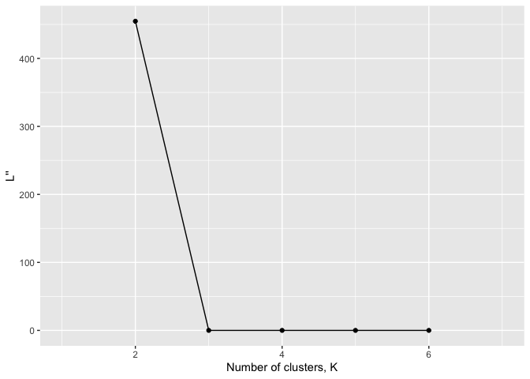
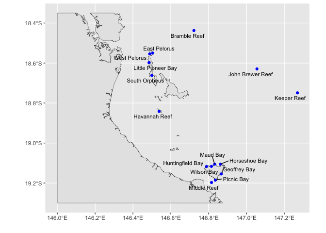
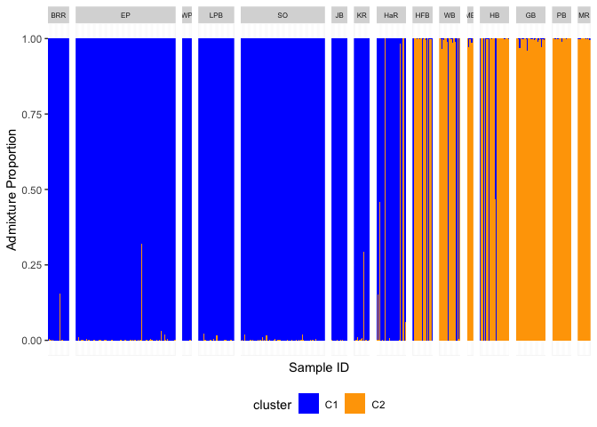
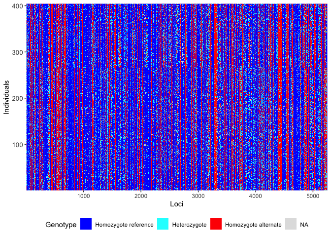
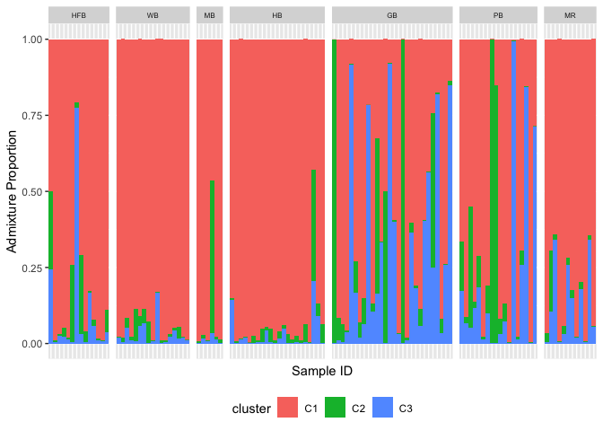

# 3 Population structure
Sandra Erdmann

## Load Libraries

``` r
knitr::opts_chunk$set(echo = TRUE, message = FALSE, warning = FALSE, error = FALSE)

library(tidyverse)
```

    ── Attaching core tidyverse packages ──────────────────────── tidyverse 2.0.0 ──
    ✔ dplyr     1.1.4     ✔ readr     2.1.5
    ✔ forcats   1.0.0     ✔ stringr   1.5.2
    ✔ ggplot2   3.5.2     ✔ tibble    3.3.0
    ✔ lubridate 1.9.4     ✔ tidyr     1.3.1
    ✔ purrr     1.1.0     
    ── Conflicts ────────────────────────────────────────── tidyverse_conflicts() ──
    ✖ dplyr::filter() masks stats::filter()
    ✖ dplyr::lag()    masks stats::lag()
    ℹ Use the conflicted package (<http://conflicted.r-lib.org/>) to force all conflicts to become errors

``` r
library(dartRverse)
```

    **********************************************
    **** Welcome to dartRverse [Version 1.0.6] ****
    **********************************************
    ── Core dartRverse packages ────────────────────────────────────── dartRverse ──
    ✔ dartR.base 1.0.6     ✔ dartR.data 1.0.8── Installed dartRverse packages   ─────────────────────────────── dartRverse ──
    ✔ dartR.captive 1.0.2     ✔ dartR.sim     0.70 
    ✔ dartR.popgen  1.0.0     ✔ dartR.spatial 1.0.3── Not [yet] installed dartRverse packages ─────────────────────── dartRverse ──
    ✖ dartR.sexlinked      

``` r
library(ggpubr)
library(sf)
```

    Linking to GEOS 3.13.0, GDAL 3.8.5, PROJ 9.5.1; sf_use_s2() is TRUE

``` r
library(ozmaps)
source("constants.R")

options(readr.show_col_types = FALSE)
```

``` r
load("cache/ak.filtered.nr.rdata")
```

## Convert to structure

Convert `ak.filtered.nr` to structure format to run externally with
structure program

``` r
gl2structure(ak.filtered.nr, ind.names = NULL, add.columns = NULL, ploidy = 2, export.marker.names = TRUE, outfile = "ak.filtered.nr.str", outpath = "structure", verbose = NULL)
```

``` r
nInd(ak.filtered.nr)
```

    [1] 427

``` r
nLoc(ak.filtered.nr)
```

    [1] 5266

Structure was then run for K = 1, 2, 3 and 4. Each run used 20000 MCMC
iterations with 10000 additional as burn-in. Full parameter files can be
found in `structure`

Determining the appropriate value of K is tricky. The structure manual
recommends care is taken, and that the lowest biologically sensible
value is used. A more objective method of [Evanno
2005](https://app.paperpile.com/view/plain/?id=8d8f1080-2416-4bb5-97a5-504b82a919d7)
involves taking the second derivative of the log Likelihood. This method
suggests that K=2 is optimal.

``` r
llpaths <- list.files("structure","k_vs_lik.txt",recursive = TRUE,full.names = TRUE)
reps <- llpaths %>% str_extract("([0-9]+)")

read_loglik <- function(path,n){
  read_table(path,col_names = c("k","logLik"))  %>%  
    mutate(Ldash = logLik - lag(logLik,1)) %>% 
    mutate(deltaL = lead(Ldash) - Ldash) %>% 
    add_column(rep=n)
}


lldata <- map2(llpaths,reps,read_loglik) %>% 
  list_rbind()

lldata %>% 
  group_by(k) %>% 
  summarise(deltaK = mean(abs(deltaL))/var(logLik)) %>% 
  ggplot(aes(x=k,y=deltaK)) + 
    geom_point() + geom_line() + xlab("Number of clusters, K") + ylab("L''")
```



## Admixture plot for K=2

Read assignment probabilities for individuals from the run with K=2.

``` r
# Load csv with data from run # 12 in the structure analysis
run12_samples <- read_table("structure/ak.filtered.nr.samples.txt",col_names = c("ID"))

run12 <-  read_table("structure/ak.structure.nr.k2.out.anc.txt",col_names = c("X1", "Label","(%Miss)","C1","C2"),skip = 2) %>% 
  cbind(run12_samples) %>% 
  select(ID,C1,C2) %>% # Select only useful columns
  pivot_longer(-ID,names_to = "cluster",values_to = "p") # Put assignment probabilities into a single column
```

Join structure data with sample metadata

``` r
metadata <- read_csv("ind_metrics_SNP2.csv") %>% 
  mutate(ID = case_when(
    id=="20" ~ "WB_36",
    .default = id
  )) %>% 
  select(-id)

run12_meta <- run12 %>% 
  left_join(metadata,by="ID")
```

In order to make sense of population structure it is useful to visualise
sampling locations on a map

``` r
sites_data <- run12_meta %>% 
  group_by(pop,lat,lon) %>% 
  summarise(n_samples = n()/2) %>% 
  mutate(name = location_names[pop])
```

``` r
ggplot() + 
  geom_sf(data = gbr_ft_cropped %>% filter(LEVEL_1=="Island")) +
  geom_sf(data = gbr_coast_cropped) +
  geom_sf(data = sites_sf,color="blue") + 
  ggrepel::geom_text_repel(data = sites_sf, mapping = aes(label=name, geometry=geometry), stat = "sf_coordinates",size=3) + 
  xlab("") + ylab("")
```



From this plot we can devise a rough north-south ordering for our
locations. This will help when plotting admixture results

``` r
location_order <- 1:15
names(location_order) <- c("BRR","EP","WP","LPB","SO","JB","KR","HaR","HFB","WB","MB","HB","GB","PB","MR")
```

Create a stacked barplot to show admixture proportions

``` r
run12_meta %>% 
  mutate(pop_order = location_order[pop]) %>% 
  ggplot(aes(x = ID, y = p)) +
  scale_fill_manual(values = cluster_colors) +
  geom_col(aes(fill=cluster),position="stack", stat = "identity",width = 1,linewidth=0) +
  facet_grid(cols=vars(reorder(pop,pop_order)),scales = "free", space = "free") +
  theme(axis.text.x = element_blank(), axis.ticks.x = element_blank(), legend.position = "bottom") + 
  theme(strip.text = element_text(size=6)) +
  xlab("Sample ID") + ylab("Admixture Proportion")
```



``` r
ggsave("figures/admixture_all.png",width = 3200,height = 800,units = "px")
```

For a more detailed investigation into single bays, we generate
individual plots for each location and save into `figures`.

``` r
# Assign a certain colour to the clusters, so that cluster1 is consistently blue and cluster2 orange
cluster_colors <- c("orange", "blue")

admix_plot_pop <- function(popdata,suffix="12",cluster_colors=c("orange", "blue")){
  # popdata will be a named vector with length 1.  We can get the name code and use this to look up the title
  code <- names(popdata)
  title <- location_names[code]
  
  p <- ggplot(popdata[[1]], aes(x = ID, y = p, fill = cluster)) +
  geom_bar(position="stack", stat = "identity") +
  scale_fill_manual(values = cluster_colors) +
   theme_classic() +
  theme(axis.text.x = element_text(angle = 90)) +
  font("x.text", size = 8) +
    labs(y = "admixture proportions") +
    ggtitle(title)
  
  path <- paste("figures/",code,suffix,".png",sep="")
  ggsave(path,p,width = 1600,height = 800, units = "px")
  p
}

# Use lmap to iterate over all pops and run the plotting function on each
admix_plots_by_pop <- run12_meta %>% 
  split(run12_meta$pop) %>% 
  lmap(admix_plot_pop)
```

# Fine-scale population structure for Magnetic Island

## Remove migrants and highly admixed individuals

For fine scale structure at Magnetic Island migrants and highly admixed
individuals from adjacent reefs will be removed to create a subset only
for the Magnetic Island population called ak.pop.nm.mag. This is because
those individuals are likely to distort any estimates of location
population structure (ie due to restricted gene flow) by introducing a
different process (admixture with a highly diverged population).

On this basis we want to keep individuals within the Magnetic Island
locations (ie “HFB”,“WB”,“MB”,“HB”,“GB”,“PB”,“MR” ) and where the
proportion of the opposing cluster (ie C1) is more than 5%.

``` r
maggie_admixed_and_migrants <- run12_meta %>% 
  filter(pop %in% maggie_sites) %>% 
  filter(cluster=="C1") %>% 
  filter(p>0.05) %>% 
  pull(ID)

# And do the same for adjacent reef populations
adjacent_admixed_and_migrants <- run12_meta %>% 
  filter(!(pop %in% maggie_sites)) %>% 
  filter(cluster=="C2") %>% 
  filter(p>0.05) %>% 
  pull(ID)
```

``` r
# Remove migrant and admixed individuals across the entire dataset
ak.pop.nm <- gl.drop.ind(ak.filtered.nr, ind.list=c(maggie_admixed_and_migrants,adjacent_admixed_and_migrants))
```

    Starting gl.drop.ind 
      Processing genlight object with SNP data
      Deleting specified individuals
      Warning: Resultant dataset may contain monomorphic loci
      Locus metrics not recalculated
    Completed: gl.drop.ind 

``` r
# Filter for monomorphs
ak.pop.nm <- gl.filter.monomorphs(ak.pop.nm)
```

    Starting gl.filter.monomorphs 
      Processing genlight object with SNP data
      Identifying monomorphic loci
      Removing monomorphic loci and loci with all missing 
                           data
    Completed: gl.filter.monomorphs 

``` r
# Recalculate locus metrics
ak.pop.nm <- gl.recalc.metrics(ak.pop.nm)
```

    Starting gl.recalc.metrics 
      Processing genlight object with SNP data
    Starting utils.recalc.avgpic 
      Processing genlight object with SNP data
      Recalculating OneRatioRef, OneRatioSnp, PICRef, PICSnp, AvgPIC
    Completed: utils.recalc.avgpic 
    Starting utils.recalc.callrate 
      Processing genlight object with SNP data
      Recalculating locus metric CallRate
    Completed: utils.recalc.callrate 
    Starting utils.recalc.maf 
      Processing genlight object with SNP data
      Recalculating FreqHoms and FreqHets
    Starting utils.recalc.freqhets 
      Processing genlight object with SNP data
      Recalculating locus metric freqHets
    Completed: utils.recalc.freqhets 
    Starting utils.recalc.freqhomref 
      Processing genlight object with SNP data
      Recalculating locus metric freqHomRef
    Completed: utils.recalc.freqhomref 
    Starting utils.recalc.freqhomsnp 
      Processing genlight object with SNP data
      Recalculating locus metric freqHomSnp
    Completed: utils.recalc.freqhomsnp 
      Recalculating Minor Allele Frequency (MAF)
    Completed: utils.recalc.maf 
      Locus metrics recalculated
    Completed: gl.recalc.metrics 

## Remove missing loci

A DArT dataset will not have individuals for which the calls are scored
all as missing (NA) across all loci, but such individuals may sneak in
to the dataset when loci are deleted. Retaining individual or loci with
all NAs can cause issues for several functions

``` r
# Filter for missing loci
ak.pop.nm <- gl.filter.allna(ak.pop.nm)
```

    Starting gl.filter.allna 
      Identifying and removing loci and individuals scored all 
                    missing (NA)
      Deleting loci that are scored as all missing (NA)
      Deleting individuals that are scored as all missing (NA)
    Completed: gl.filter.allna 

``` r
nInd(ak.pop.nm)
```

    [1] 404

``` r
nLoc(ak.pop.nm)
```

    [1] 5251

``` r
gl.smearplot(ak.pop.nm)
```

      Processing genlight object with SNP data
    Starting gl.smearplot 


    Completed: gl.smearplot 



``` r
save(ak.pop.nm, file="cache/ak.pop.nm.rdata")
```

## Keep only Magnetic Island subpopulations

``` r
indNames(ak.pop.nm)
```

      [1] "A1"                "A159"              "A13"              
      [4] "A24"               "A85"               "A102"             
      [7] "A113"              "A125"              "A138"             
     [10] "A149"              "A160"              "B2"               
     [13] "B15"               "A88"               "A105"             
     [16] "A114"              "A126"              "A139"             
     [19] "A150"              "A161"              "B3"               
     [22] "A89"               "A106"              "A116"             
     [25] "A127"              "A140"              "A151"             
     [28] "A164"              "B7"                "A18"              
     [31] "A28"               "A90"               "A107"             
     [34] "A117"              "A130"              "A141"             
     [37] "A152"              "A166"              "B19"              
     [40] "A29"               "A92"               "A108"             
     [43] "A120"              "A132"              "A142"             
     [46] "A153"              "A167"              "B21"              
     [49] "A99"               "A109"              "A122"             
     [52] "A134"              "A145"              "A168"             
     [55] "B10"               "A22"               "A82"              
     [58] "A100"              "A111"              "A123"             
     [61] "A135"              "A146"              "A155"             
     [64] "A169"              "A84"               "A101"             
     [67] "A112"              "A136"              "A148"             
     [70] "A156"              "HaR_06/05/2022_31" "HaR_06/05/2022_40"
     [73] "MR_14/03/2022_6"   "KR_29/03/2022_41"  "KR_29/03/2022_49" 
     [76] "HaR_06/05/2022_15" "HaR_06/05/2022_32" "HaR_06/05/2022_41"
     [79] "MR_14/03/2022_7"   "KR_29/03/2022_30"  "KR_29/03/2022_50" 
     [82] "HaR_06/05/2022_19" "HaR_06/05/2022_33" "HaR_06/05/2022_42"
     [85] "MR_14/03/2022_37"  "MR_14/03/2022_48"  "KR_29/03/2022_31" 
     [88] "KR_29/03/2022_43"  "HaR_06/05/2022_1"  "HaR_06/05/2022_20"
     [91] "HaR_06/05/2022_34" "WB_36"             "MR_14/03/2022_9"  
     [94] "KR_29/03/2022_32"  "HaR_06/05/2022_23" "HaR_06/05/2022_35"
     [97] "HaR_06/05/2022_44" "MR_14/03/2022_1"   "MR_14/03/2022_10" 
    [100] "KR_29/03/2022_33"  "KR_29/03/2022_45"  "HaR_06/05/2022_8" 
    [103] "HaR_06/05/2022_36" "HaR_06/05/2022_50" "MR_14/03/2022_3"  
    [106] "MR_14/03/2022_11"  "MR_14/03/2022_41"  "KR_29/03/2022_34" 
    [109] "HaR_06/05/2022_25" "HaR_06/05/2022_37" "MR_14/03/2022_44" 
    [112] "KR_29/03/2022_35"  "KR_29/03/2022_47"  "HaR_06/05/2022_29"
    [115] "HaR_06/05/2022_38" "MR_14/03/2022_5"   "KR_29/03/2022_36" 
    [118] "KR_29/03/2022_48"  "HaR_06/05/2022_11" "At_34_J20"        
    [121] "At_O18"            "At_O48"            "At_47_J20"        
    [124] "At_12_J20"         "At_51_N"           "At_69_N"          
    [127] "At_76_A"           "At_35_J20"         "At_O62"           
    [130] "At_O19"            "At_O49"            "At_52_J20"        
    [133] "At_14_J20"         "At_32_N"           "At_53_N"          
    [136] "At_70_N"           "At_39_J20"         "At_O20"           
    [139] "At_O50"            "At_56_J20"         "At_165_J20"       
    [142] "At_54_N"           "At_33_F"           "At_71_A"          
    [145] "At_40_J20"         "At_O78"            "At_O42"           
    [148] "At_O52"            "At_58_J20"         "At_170_N"         
    [151] "At_55_N"           "At_57_F"           "At_O43"           
    [154] "At_O53"            "At_59_J20"         "At_27_J20"        
    [157] "At_O55"            "At_O73"            "At_62_A"          
    [160] "At_42_J20"         "At_O44"            "At_4_J20"         
    [163] "At_30_J20"         "At_O56"            "At_63_N"          
    [166] "At_O76"            "At_79_A"           "At_44_J20"        
    [169] "At_O16"            "At_O45"            "At_5_J20"         
    [172] "At_157_J20"        "At_O57"            "At_49_N"          
    [175] "At_67_N"           "At_65_A"           "At_46_J20"        
    [178] "At_O17"            "At_O47"            "At_6_J20"         
    [181] "At_158_J20"        "At_50_N"           "At_O51"           
    [184] "At_D26_3.20"       "At_D34_3.20"       "At_D42_3.20"      
    [187] "At_23_J20"         "At_33_F20"         "At_45_F20"        
    [190] "At_73_F20"         "At_S2_3.20"        "At_S10_3.20"      
    [193] "At_S18_3.20"       "At_D27_3.20"       "At_D35_3.20"      
    [196] "At_D43_3.20"       "At_48_F20"         "At_60_F20"        
    [199] "At_74_F20"         "At_S3_3.20"        "At_S11_3.20"      
    [202] "At_S19_3.20"       "At_D28_3.20"       "At_D36_3.20"      
    [205] "At_D44_3.20"       "At_25_J20"         "At_35_N"          
    [208] "At_49_F20"         "At_61_F20"         "At_75_F20"        
    [211] "At_S4_3.20"        "At_S12_3.20"       "At_S20_3.20"      
    [214] "At_D29_3.20"       "At_D37_3.20"       "At_D45_3.20"      
    [217] "At_36_F20"         "At_51_F20"         "At_62_F20"        
    [220] "At_76_F20"         "At_S5_3.20"        "At_S13_3.20"      
    [223] "At_S21_3.20"       "At_D30_3.20"       "At_D38_3.20"      
    [226] "At_D46_3.20"       "At_154_J20"        "At_37_F20"        
    [229] "At_53_F20"         "At_66_F20"         "At_77_F20"        
    [232] "At_S6_3.20"        "At_S14_3.20"       "At_S22_3.20"      
    [235] "At_D31_3.20"       "At_D39_3.20"       "At_D47_3.20"      
    [238] "At_162_J20"        "At_38_F20"         "At_54_F20"        
    [241] "At_67_F20"         "At_78_F20"         "At_S7_3.20"       
    [244] "At_S15_3.20"       "At_S23_3.20"       "At_16_F"          
    [247] "At_D32_3.20"       "At_D40_3.20"       "At_163_J20"       
    [250] "At_41_F20"         "At_55_F20"         "At_71_F20"        
    [253] "At_80_F20"         "At_S8_3.20"        "At_S16_3.20"      
    [256] "At_S24_3.20"       "At_17_J20"         "At_D41_3.20"      
    [259] "At_31_F20"         "At_43_F20"         "At_57_F20"        
    [262] "At_72_F20"         "At_S1_3.20"        "At_S9_3.20"       
    [265] "At_S17_3.20"       "At_S25_3.20"       "HB_27/11/21_10"   
    [268] "HB_27/11/21_18"    "HB_27/11/21_26"    "PB_25/11/21_09"   
    [271] "PB_25/11/21_32"    "PB_05/04/22_47"    "WB_03/04/2022_26" 
    [274] "WB_03/04/2022_38"  "HB_27/11/21_19"    "HB_27/11/21_28"   
    [277] "PB_25/11/21_11"    "PB_05/04/22_48"    "WB_03/04/2022_16" 
    [280] "WB_03/04/2022_27"  "HB_27/11/21_12"    "PB_25/11/21_12"   
    [283] "PB_05/04/22_41"    "PB_05/04/22_49"    "WB_03/04/2022_20" 
    [286] "WB_03/04/2022_30"  "HB_27/11/21_13"    "PB_05/04/22_42"   
    [289] "PB_05/04/22_50"    "WB_03/04/2022_21"  "WB_03/04/2022_31" 
    [292] "HB_27/11/21_22"    "PB_25/11/21_04"    "PB_05/04/22_43"   
    [295] "WB_03/04/2022_3"   "WB_03/04/2022_22"  "WB_03/04/2022_32" 
    [298] "HB_27/11/21_15"    "HB_27/11/21_23"    "PB_25/11/21_06"   
    [301] "PB_25/11/21_26"    "WB_03/04/2022_23"  "WB_03/04/2022_35" 
    [304] "HB_27/11/21_16"    "HB_27/11/21_24"    "PB_25/11/21_28"   
    [307] "WB_03/04/2022_11"  "WB_03/04/2022_24"  "HB_27/11/21_17"   
    [310] "HB_27/11/21_25"    "PB_25/11/21_08"    "PB_25/11/21_30"   
    [313] "PB_05/04/22_46"    "WB_03/04/2022_13"  "GB_03/03/2022_1"  
    [316] "GB_03/03/2022_10"  "GB_03/03/2022_18"  "GB_03/03/2022_28" 
    [319] "GB_03/03/2022_2"   "GB_03/03/2022_11"  "GB_03/03/2022_19" 
    [322] "GB_03/03/2022_29"  "GB_03/03/2022_3"   "GB_03/03/2022_12" 
    [325] "GB_03/03/2022_20"  "GB_03/03/2022_30"  "GB_03/03/2022_4"  
    [328] "GB_03/03/2022_13"  "GB_03/03/2022_21"  "GB_03/03/2022_31" 
    [331] "GB_03/03/2022_5"   "GB_03/03/2022_14"  "GB_03/03/2022_22" 
    [334] "GB_03/03/2022_32"  "GB_03/03/2022_6"   "GB_03/03/2022_15" 
    [337] "GB_03/03/2022_7"   "GB_03/03/2022_16"  "GB_03/03/2022_26" 
    [340] "GB_03/03/2022_8"   "GB_03/03/2022_17"  "GB_03/03/2022_27" 
    [343] "JB_50"             "BRR_27"            "BRR_42"           
    [346] "HB_9"              "HFB_7"             "HFB_16"           
    [349] "HFB_24"            "MB_24"             "JB_38"            
    [352] "BRR_1"             "BRR_28"            "BRR_43"           
    [355] "HB_10"             "HFB_8"             "HFB_17"           
    [358] "HFB_25"            "JB_13"             "HB_3"             
    [361] "BRR_4"             "BRR_31"            "BRR_44"           
    [364] "HB_11"             "HFB_18"            "MB_1"             
    [367] "JB_14"             "JB_42"             "BRR_5"            
    [370] "BRR_36"            "BRR_46"            "HFB_19"           
    [373] "JB_18"             "JB_43"             "HB_5"             
    [376] "BRR_9"             "BRR_38"            "BRR_47"           
    [379] "HFB_11"            "MB_5"              "JB_3"             
    [382] "JB_20"             "JB_44"             "HB_6"             
    [385] "BRR_10"            "BRR_39"            "BRR_48"           
    [388] "HFB_12"            "MB_6"              "MB_20"            
    [391] "JB_4"              "JB_45"             "HB_7"             
    [394] "BRR_13"            "BRR_40"            "HFB_5"            
    [397] "HFB_13"            "JB_46"             "HB_8"             
    [400] "HFB_14"            "HFB_23"            "MB_22"            
    [403] "JB_11"             "JB_49"            

``` r
# Keep only subpopulations from Magnetic Island for fine structure analysis
ak.pop.nm.mag <- gl.keep.pop(ak.pop.nm, pop.list = list("GB", "HB", "HFB", "MB", "MR", "PB", "WB"))
```

    Starting gl.keep.pop 
      Processing genlight object with SNP data
      Checking for presence of nominated populations
      Retaining only populations GB, HB, HFB, MB, MR, PB, WB 
      Locus metrics not recalculated
    Completed: gl.keep.pop 

``` r
save(ak.pop.nm.mag, file="cache/ak.pop.nm.mag.rdata")
```

``` r
nInd(ak.pop.nm.mag)
```

    [1] 117

``` r
nLoc(ak.pop.nm.mag)
```

    [1] 5251

## Convert to structure

Convert ak.pop.nm.mag to structure format to run externally with
structure program

``` r
gl2structure(ak.pop.nm.mag, ind.names = NULL, add.columns = NULL, ploidy = 2, export.marker.names = TRUE, outfile = "ak.pop.mag.nm.str", outpath = "structure", verbose = NULL)
```

    Starting gl2structure 
      Processing genlight object with SNP data
      Structure file saved as: structure/ak.pop.mag.nm.str 
    Completed: gl2structure 

    NULL

``` r
nInd(ak.pop.nm.mag)
```

    [1] 117

``` r
nLoc(ak.pop.nm.mag)
```

    [1] 5251

## Admixture plot for ak.pop.nm.mag

Calculating BIC for each model as before we see that K=1 is the most
preferred model. Nevertheless, we check K=2 just in case this shows any
indication of structure related to bays or north/south distinction on
Magnetic Island.

``` r
llpaths_mag <- list.files("structure","k_vs_lik_mag.txt",recursive = TRUE,full.names = TRUE)
reps_mag <- llpaths_mag %>% str_extract("([0-9]+)")

# read_loglik <- function(path,n){
#   read_table(path,col_names = c("k","logLik"))  %>%  
#     mutate(Ldash = logLik - lag(logLik,1)) %>% 
#     mutate(deltaL = lead(Ldash) - Ldash) %>% 
#     add_column(rep=n)
# }


lldata_mag <- map2(llpaths_mag,reps_mag,read_loglik) %>% 
  list_rbind()

lldata_mag %>% 
  group_by(k) %>% 
  summarise(deltaK = mean(abs(deltaL))/var(logLik)) %>% 
  ggplot(aes(x=k,y=deltaK)) + 
    geom_point() + geom_line() + xlab("Number of clusters, K") + ylab("L''")
```


### Load csv

``` r
samples10 <- read_table("structure/ak.pop.mag.nm.samples.txt",col_names = c("ID"))

run10 <- read_table("structure/ak.pop.mag.nm.k3.out.anc.txt",col_names = c("X1", "Label","(%Miss)","C1","C2","C3"),skip = 2) %>% 
  cbind(samples10) %>% 
  select(ID,starts_with("C")) %>% # Select only useful columns
  pivot_longer(-ID,names_to = "cluster",values_to = "p") %>% 
  left_join(metadata,by="ID")
```

For a first glimpse, create a barplot that shows the bays on the x-axis,
admixture proportion on y-axis and all clusters stacked.

``` r
run10 %>% 
  mutate(pop_order = location_order[pop]) %>% 
  ggplot(aes(x = ID, y = p)) +
  geom_col(aes(fill=cluster),position="stack", stat = "identity",width = 1,linewidth=0) +
  facet_grid(cols=vars(reorder(pop,pop_order)),scales = "free", space = "free") +
  theme(axis.text.x = element_blank(), axis.ticks.x = element_blank(), legend.position = "bottom") + 
  theme(strip.text = element_text(size=6)) +
  xlab("Sample ID") + ylab("Admixture Proportion")
```



``` r
ggsave("figures/admixture_all.png",width = 3200,height = 800,units = "px")
```

Plots for individual bays are saved into the figures folder

``` r
# Use lmap to iterate over all pops and run the plotting function on each
admix_plots_by_pop10 <- run10 %>% 
  split(run10$pop) %>% 
  lmap(admix_plot_pop,"10",cluster_colors = c(cluster_colors,"cyan","purple"))
```
