# 3 Population structure
Sandra Erdmann and Ira Cooke

For population structure we begin by loading the filtered data with
redundant individuals removed.

``` r
load("cache/ak.filtered.nr.rdata")
```

# Analysis of broadscale structure using the full dataset

We begin by examining the full filtered dataset, including data from
both Magnetic Island and adjacent reefs. The data is first converted to
structure format to run externally with structure program.

``` r
gl2structure(ak.filtered.nr, ind.names = NULL, add.columns = NULL, ploidy = 2, export.marker.names = TRUE, outfile = "ak.filtered.nr.str", outpath = "structure", verbose = NULL)
```

Structure was then run for K = 1-7. Each run used 20000 MCMC iterations
with 10000 additional as burn-in. Full parameter files can be found in
the `structure` folder

Determining the appropriate value of K is tricky. The structure manual
recommends a procedure based on finding the maximum likelihood value of
K but also notes that care must be taken with this approach and
especially cautions against selecting high values of K without a
realistic biological explanation.

We employed the more objective method developed by (Evanno, Regnaut, and
Goudet 2005) which involves taking the second derivative of the log
Likelihood to calculate a statistic which they refer to as $\Delta K$.
This method shows a clear result, with the maximum value of $\Delta K$
achieved for $K=2$.

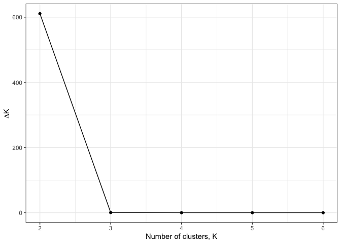

## Admixture plot for K=2

To construct an admixture plot for K=2 we read assignment probabilities
from the structure outputs.

``` r
# Load csv with data from run # 1 in the structure analysis
run12_samples <- read_table("structure/ak.filtered.nr.samples.txt",col_names = c("ID"))

run12 <-  read_table("structure/nr.1/ak.structure.nr.k2.out.anc.txt",col_names = c("X1", "Label","(%Miss)","C1","C2","blank"),skip = 2) %>% 
  select(-blank) %>% 
  cbind(run12_samples) %>% 
  select(ID,C1,C2) %>% # Select only useful columns
  pivot_longer(-ID,names_to = "cluster",values_to = "p") # Put assignment probabilities into a single column
```

We then join structure data with sample metadata

``` r
metadata <- read_csv("ind_metrics_SNP2.csv") %>% 
  mutate(ID = case_when(
    id=="20" ~ "WB_36",
    .default = id
  )) %>% 
  select(-id)
save(metadata,file = "cache/metadata.rdata")


run12_meta <- run12 %>% 
  left_join(metadata,by="ID")
```

In order to make sense of population structure it is useful to visualise
sampling locations on a map.

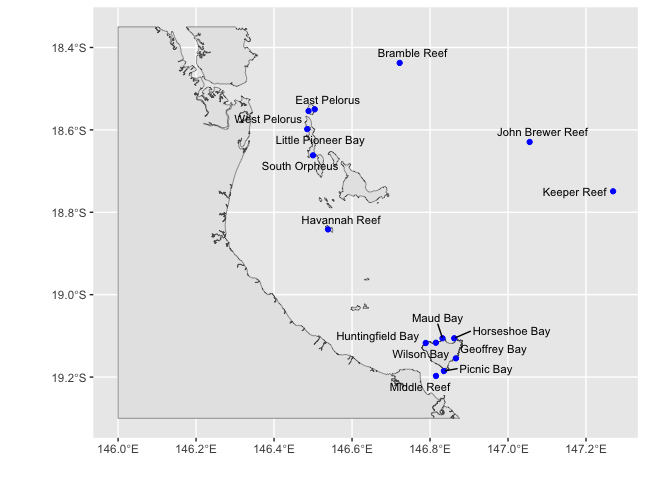

From this plot we can devise a rough north-south ordering for our
locations while also ordering samples within Magnetic Island clockwise
around the Island. We use this when plotting admixture results

``` r
location_order <- 1:15
names(location_order) <- c("BRR","EP","WP","LPB","SO","JB","KR","HaR","HFB","WB","MB","HB","GB","PB","MR")
```

Create a stacked barplot to show admixture proportions

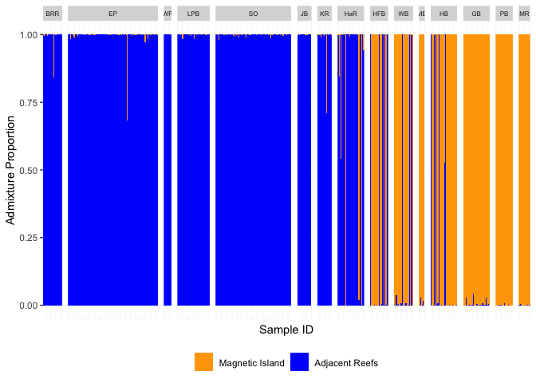

For a more detailed investigation into single bays, we generated
individual plots for each location and save into `figures`.

This is the dominant population structure evident in our dataset and is
easily visible in a PCA (calculated using `gl.pcoa`). Note that there is
some additional variation along PC2, however this comprises a much lower
proportion of genetic variation than PC1.

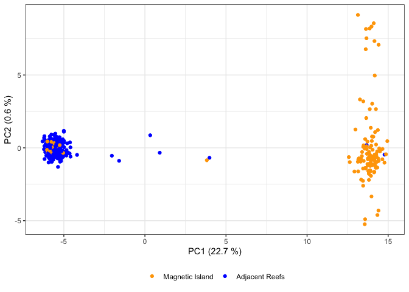

# Removing migrants and highly admixed individuals

To investigate potential fine-scale population structure at Magnetic
Island and adjacent reefs we removed migrants and highly admixed
individuals (recent hybrids). Removal of these individuals was performed
for all further population structure and genetic diversity analysis for
the following reasons.

1.  Migrants (genetic origin different from geographic sampling
    location) were removed because the geographic location of parental
    origin of these individuals is unknown. Their alleles reflect
    population genetic processes at their parent reef and not the reef
    they were sampled on. If grouped with their geographic location
    these individuals will bias analyses by introducing Wahlund effects.

2.  Highly admixed individuals representing likely recent hybrids were
    removed. Although these individuals might represent the initial
    stages of gene flow between populations there is a strong
    possibility that such initial stages of gene flow (F1 hybrids and
    early backcrosses) are subject to processes that play a much
    reduced-role in longer-term gene flow. In particular such early
    hybrids may have reduced fertility, so including them in our
    analyses could lead to over-estimates of gene flow between
    populations.

3.  The overall number of highly admixed individuals is too small to
    justify a separate analysis of hybridisation processes in its own
    right.

4.  Fine-scale population structure within Magnetic Island and within
    adjacent reefs is likely to reflect recent processes (last 10kya)
    whereas the genetic distinction between Magnetic Island and adjacent
    reefs has been shown to be ancient (\>500kya). Identification of the
    (likely more subtle) genetic signatures of these recent processes
    could be swamped by false signal arising from inclusion of migrants
    and/or recent hybrids.

Based on the admixture results with K=2 and geographical location we
consider “HFB”,“WB”,“MB”,“HB”,“GB”,“PB”,“MR” to represent Magnetic
Island all other locations to be adjacent reefs.

We therefore flag for removal, any individuals within the Magnetic
Island locations (ie “HFB”,“WB”,“MB”,“HB”,“GB”,“PB”,“MR” ) where the
proportion of the opposing cluster (ie C1) is more than 5%, and
vice-versa for adjacent reef locations.

Note that with this threshold of 5% we are only removing a total of 4
recent hybrids (admix~0.3-0.5) spread across 4 locations, three recent
backcrosses (admix 0.15-0.3) and one higher level backcross (0.05-0.15).
These individuals are found at 5 reefs, of which only one HB is on
Magnetic Island. Interestingly Havannah Reef, the closest to Magnetic
Island, contained the largest number of putative recent hybrids (3) of
any reef.

A summary table of putative backcross types based on admixture
proportions is shown below (F1 (0.3-0.5), F2 (0.15=0.3), F2+ (0.05-0.15)

    # A tibble: 7 × 3
    # Groups:   pop [5]
      pop   backcross_type     n
      <chr> <chr>          <int>
    1 BRR   F2                 1
    2 EP    F1                 1
    3 HB    F1                 1
    4 HaR   F1                 1
    5 HaR   F2                 1
    6 HaR   F2+                1
    7 KR    F2                 1

In addition to these 7 highly admixed individuals we found a further 16
migrants (13 Maggie, 3 in Adjacent). In total we removed 9 individuals
from adjacent reefs and 14 from Magnetic Island.

## Summary of admixture

If we look at the minor admixture fraction for all individuals we find
that

1.  Most individuals have no detectable admixture at all
2.  Among those with detectable admixture the vast majority have an
    extremely small (\<5% minor fraction)

Fraction of individuals with no admixture

| cluster |   n |  fraction |
|:--------|----:|----------:|
| C1      | 207 | 0.6764706 |
| C2      |  68 | 0.5666667 |

Fraction of individuals with background (\<5%) admixture

| cluster |   n |  fraction |
|:--------|----:|----------:|
| C1      |  92 | 0.3006536 |
| C2      |  52 | 0.4333333 |

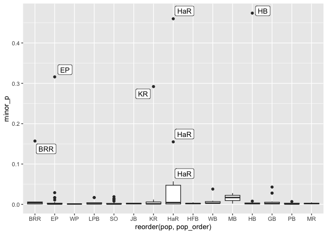

## Filtering for HWE

The resulting filtered dataset (with these individuals removed) is
almost ready for analysis, however, now that we have sorted individuals
into the major genetic populations we can perform filtering of loci on
Hardy Weinberg Equilibrium (HWE). Our goal with this filter is to remove
loci at which sequencing artefacts have introduced severe bias, in
particular for DaRT data we are concerned about null alleles. These
occur when a mutation occurs at the enzyme cut site, often resulting in
failure to call heterozygotes. Since these should produce quite severe
departures from HWE we use a fairly stringent p-value threshold
(p\<1e-6) and only remove loci that pass this. See (Waples 2015) for a
discussion of the use of HW filters to remove null alleles.

## Final filtered dataset

This step removes 1149 loci, leaving 4107 loci and 403 individuals
remaining in our dataset.

# Fine-scale population structure

To examine patterns of population structure in further detail we begin
by calculating pairwise Fst between all locations.

This very clearly recapitulates the strong structure already evident at
the broadscale between Magnetic Island and adjacent populations as
evidenced in this heatmap

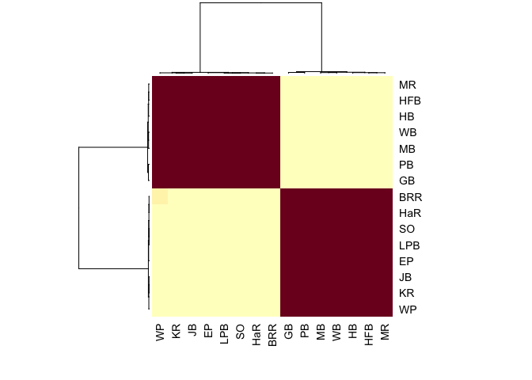

Quantitatively we see that Fst values between Magnetic Island and
adjacent are much higher (~0.3) than between sites within the same
broad-scale population grouping (ie within Maggie or within adjacent).
We can also see that Fst values between maggie bays are broadly spread
between -0.005 and 0.01 whereas Fst values between adjacent sites are
smaller with a narrow spread.

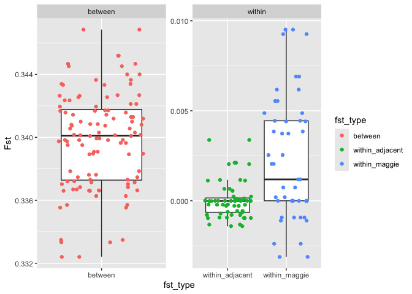

# Isolation by distance

Next we analyse the spread of Fst values within populations to see if it
is driven by a pattern of isolation by distance. To this we used
distances between sites via “sea” representing the shortest path between
sites without crossing land. These were measured manually using Google
Earth Pro.

There is no sense looking at distances between adjacent and maggie since
these will be driven by ancient divergence and therefore not indicative
of isolation-by-distance. The plots below are therefore focussed on
within adjacent and within maggie comparisons. For adjacent reefs there
is very clearly no relationship despite quite large distances in some
cases. In contrast, at maggie there does seem to be a weak positive
trend of higher Fst with greater distances and this is driven largely by
comparisons between Northern and Southern bays.

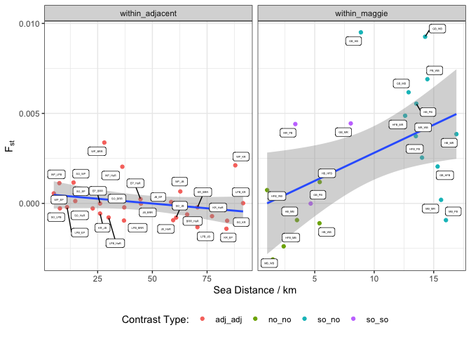

## Mantel Tests

Mantel Tests confirm that the relationship in Adjacent is
non-significant, however, for Magnetic Island it is significant (p ~
0.04). We can see from the plot that this significant relationship is
largely driven by low Fst within north-north and south-south comparisons
vs high Fst in north-south comparisons.

``` r
maggie_seadist.matrix <- as.dist(sea_dist_fullmatrix[maggie_sites,maggie_sites])
maggie_fst.matrix <- as.dist(full_matrix[maggie_sites,maggie_sites])
mantel.randtest(maggie_seadist.matrix,maggie_fst.matrix, nrepet = 10000)
```

    Monte-Carlo test
    Call: mantel.randtest(m1 = maggie_seadist.matrix, m2 = maggie_fst.matrix, 
        nrepet = 10000)

    Observation: 0.4767402 

    Based on 10000 replicates
    Simulated p-value: 0.03479652 
    Alternative hypothesis: greater 

         Std.Obs  Expectation     Variance 
     2.355822679 -0.004322923  0.041698360 

``` r
adjacent_sites <- setdiff(location_codes,maggie_sites)
adjacent_seadist.matrix <- as.dist(sea_dist_fullmatrix[adjacent_sites,adjacent_sites])
adjacent_fst.matrix <- as.dist(full_matrix[adjacent_sites,adjacent_sites])

mantel.randtest(adjacent_seadist.matrix,adjacent_fst.matrix)
```

    Monte-Carlo test
    Call: mantel.randtest(m1 = adjacent_seadist.matrix, m2 = adjacent_fst.matrix)

    Observation: -0.2638688 

    Based on 999 replicates
    Simulated p-value: 0.888 
    Alternative hypothesis: greater 

         Std.Obs  Expectation     Variance 
    -1.076046612  0.004158066  0.062043220 

# Fine Scale Structure within adjacent and within Magnetic Island

First we subset data for each location, including only relevant sites.

Then we convert both subsetted datasets to structure format to run
externally with structure program. For both datasets we performed 20
replicate STRUCTURE runs, each with 20000 steps and 10000 burnin.
Generating 20 replicates allows us to calculate the $\Delta K$ statistic
of (Evanno, Regnaut, and Goudet 2005).

The plot of $\Delta K$ for Magnetic Island reveals a clear preference
for K=3 at that location. For the adjacent locations, we see very little
change and a gradual increase as K increases. Noting that in this method
it is not possible to include K=1 in the test our decision on the choice
of $K$ must also be informed by other factors such as PCA.

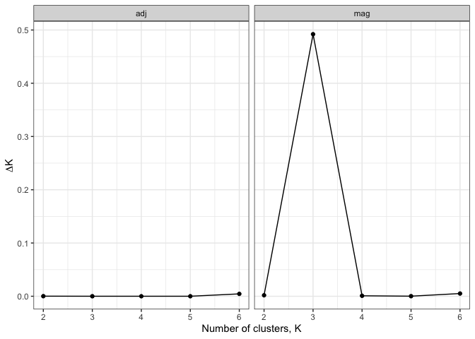

#### Fine structure within adjacent

For the adjacent population we begin with a PCA which shows no structure
at all. This, combined with the lack of a clear peak in the Evanno plot
suggests that K=1 is most appropriate.

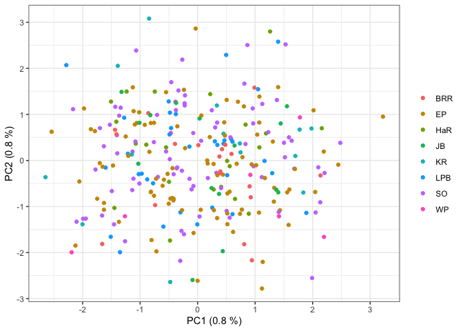

These individuals might represent members of a third major population
cluster for this species. Our adjacent cluster is likely to correspond
to `Cluster 1a` identified by (Matias et al. 2022) based on its
location. These outlying individuals might be from a another genetic
cluster (eg `Cluster 1b`) or potentially close relatives that escaped
our filters for this.

Removing these individuals and rerunning PCA reveals a complete absence
of additional structure

### Fine Scale Structure at Magnetic Island

A barplot based on a structure analysis with K=3 shows that one cluster
(C1) is dominant in all bays except Picnic Bay and Goeffrey Bay. The
other two clusters (C2, and C3) are largely concentrated in Picnic Bay
and Geoffrey Bay but are present in rougly equal numbers in both those
bays.

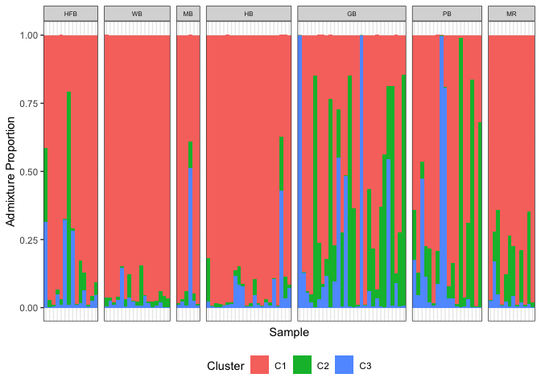

The results of admixture are also reflected in a PCA.

When samples are annotated with their dominant cluster we can see that
the three apparent groupings in PCA do indeed correspond with groupings
identified by structure.

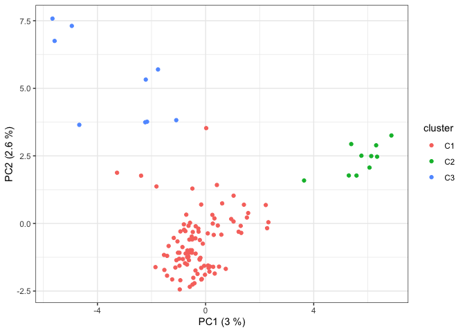

Now plotting by location we can see that the largest cluster (C1) is
comprised of samples from all bays, however, the two smaller clusters
(C3, and C2) are primarily made up of individuals from southern bays,
Picnic Bay and Geoffrey Bay with a small number of individuals from
Middle Reef. Nevertheless, neither C2 or C3 clusters is specifically
associated with a particular bay (both clusters are found in PB and GB).

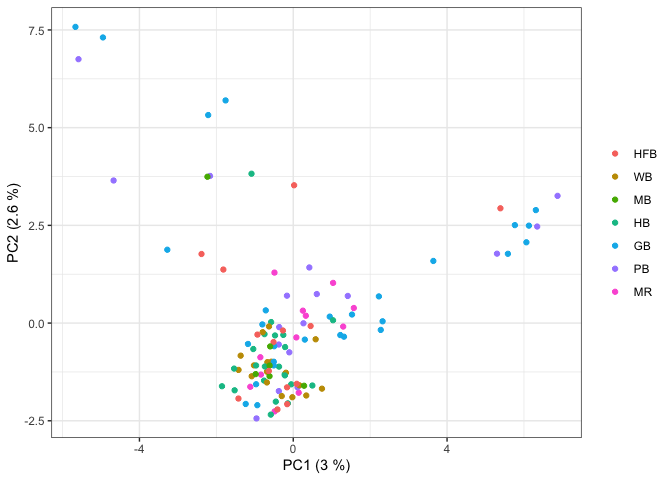

If we color the plot by Island side (North = HFB, WB, MB, HB; South =
GB, PB, MR) we can more clearly see that clusters C2 and C3 are
dominated by Southern bays. Noting that the percentages of variation
explained by this PCA are fairly low (5.6% in total) it is possible that
subtle population structure in southern bays could be due to a factors
such as highly variable reproductive success between colonies or between
years, or simply due to inbreeding itself.

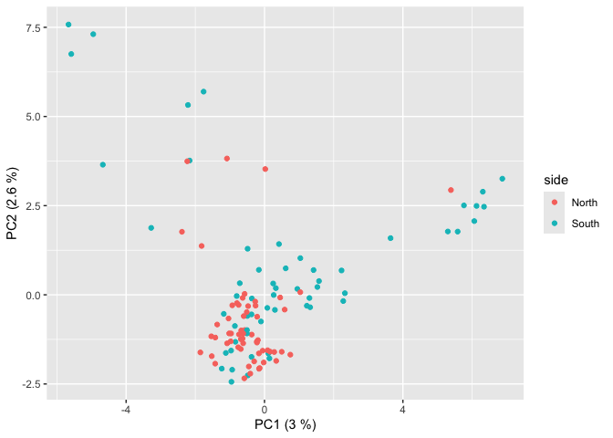

## North-South division at Magnetic Island

Population structuring at Magnetic Island is relatively subtle. Although
a 3-cluster model provides the best fit the three clusters do not seem
to correspond to biologically meaningful ancestral populations. This
subtle structure might be being driven by differences in genetic
diversity between Northern and Southern bays. Our reasoning is as
follows;

1.  Firstly we note that a plot of overall population structure
    (including adjacent reefs) clearly shows much higher numbers of
    migrants in northern bays that southern ones. This raises the
    possibility that admixture with adjacent reefs might alter genetic
    diversity in Northern bays.

2.  Secondly, a PCA and admixture analysis of Magnetic Island bays
    reveals the Northern bays as a single genetic cluster, whereas
    Southern bays appear structured. This structure within Southern bays
    does not correspond to geography but might instead be driven by low
    effective population size.

As we will see later in [05.ne_estimates](05.ne_estimates.md) the Ne in
southern bays at Magnetic Island is very low. If Ne is low we expect to
see a more pronounced effect of non-random mating or reproductive
success in structuring allele frequencies. As corals are mass spawners
it is possible that the reefs at GB and PB, with their very small Ne
could be dominated by progeny from a small number of highly successful
individuals. This might explain the apparent structure visible in the
PCA and admixture analyses. Moreover, simulated dispersal results
(Figure 5 in the paper) indicate that larval dispersal can readily occur
between PB and GB which would explain why genetic clusters in PCA are
present in both locations.

<div id="refs" class="references csl-bib-body hanging-indent"
entry-spacing="0">

<div id="ref-Evanno2005-mt" class="csl-entry">

Evanno, G, S Regnaut, and J Goudet. 2005. “Detecting the Number of
Clusters of Individuals Using the Software STRUCTURE: A Simulation
Study.” *Mol. Ecol.* 14 (8): 2611–20.

</div>

<div id="ref-Matias2022-uz" class="csl-entry">

Matias, Ambrocio Melvin A, Iva Popovic, Joshua A Thia, Ira R Cooke,
Gergely Torda, Vimoksalehi Lukoschek, Line K Bay, Sun W Kim, and Cynthia
Riginos. 2022. “Cryptic Diversity and Spatial Genetic Variation in the
Coral *Acropora Tenuis* and Its Endosymbionts Across the Great Barrier
Reef.” *Evol. Appl.*, July.

</div>

<div id="ref-Waples2015-yc" class="csl-entry">

Waples, Robin S. 2015. “Testing for Hardy-Weinberg Proportions: Have We
Lost the Plot?” *J. Hered.* 106 (1): 1–19.

</div>

</div>
