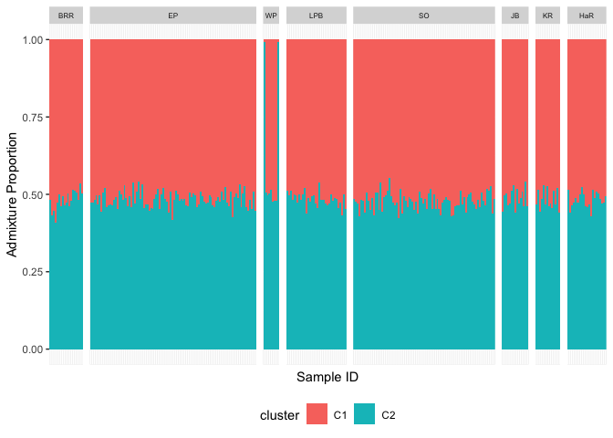
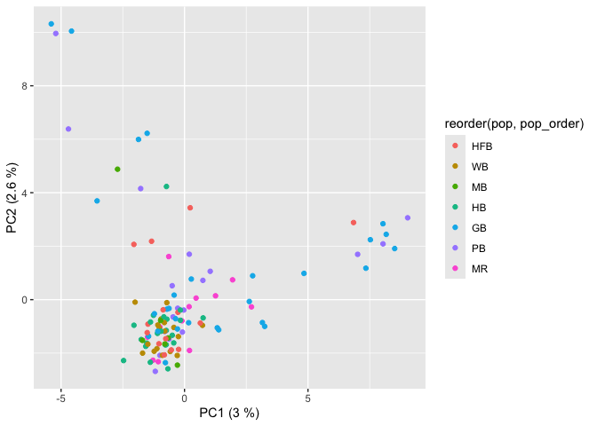

# 3 Population structure
Sandra Erdmann and Ira Cooke

For population structure we begin by loading the filtered data with
redundant individuals removed.

``` r
load("cache/ak.filtered.nr.rdata")
```

# Analysis of broadscale structure using the full dataset

We begin by examining the full filtered dataset, including data from
both Magnetic Island and adjacent reefs. The data is first converted to
structure format to run externally with structure program.

``` r
gl2structure(ak.filtered.nr, ind.names = NULL, add.columns = NULL, ploidy = 2, export.marker.names = TRUE, outfile = "ak.filtered.nr.str", outpath = "structure", verbose = NULL)
```

Structure was then run for K = 1, 2, 3 and 4. Each run used 20000 MCMC
iterations with 10000 additional as burn-in. Full parameter files can be
found in the `structure` folder

Determining the appropriate value of K is tricky. The structure manual
recommends a procedure based on finding the maximum likelihood value of
K but also notes that care must be taken with this approach and
especially cautions against selecting high values of K without a
realistic biological explanation.

We employed the more objective method developed by [Evanno
2005](doi.org/10.1111/j.1365-294X.2005.02553.x) which involves taking
the second derivative of the log Likelihood to calculate a statistic
which they refer to as $\Delta K$. This method shows a very clear
result, with the maximum value of $\Delta K$ achieved for $K=2$.


## Admixture plot for K=2

To construct an admixture plot for K=2 we read assignment probabilities
from the structure outputs.

``` r
# Load csv with data from run # 12 in the structure analysis
run12_samples <- read_table("structure/ak.filtered.nr.samples.txt",col_names = c("ID"))

run12 <-  read_table("structure/ak.structure.nr.k2.out.anc.txt",col_names = c("X1", "Label","(%Miss)","C1","C2"),skip = 2) %>% 
  cbind(run12_samples) %>% 
  select(ID,C1,C2) %>% # Select only useful columns
  pivot_longer(-ID,names_to = "cluster",values_to = "p") # Put assignment probabilities into a single column
```

We then join structure data with sample metadata

``` r
metadata <- read_csv("ind_metrics_SNP2.csv") %>% 
  mutate(ID = case_when(
    id=="20" ~ "WB_36",
    .default = id
  )) %>% 
  select(-id)
save(metadata,file = "cache/metadata.rdata")


run12_meta <- run12 %>% 
  left_join(metadata,by="ID")
```

In order to make sense of population structure it is useful to visualise
sampling locations on a map.


From this plot we can devise a rough north-south ordering for our
locations while also ordering samples within Magnetic Island clockwise
around the Island. We use this when plotting admixture results

``` r
location_order <- 1:15
names(location_order) <- c("BRR","EP","WP","LPB","SO","JB","KR","HaR","HFB","WB","MB","HB","GB","PB","MR")
```

Create a stacked barplot to show admixture proportions


For a more detailed investigation into single bays, we generated
individual plots for each location and save into `figures`.

This is the dominant population structure evident in our dataset and is
easily visible in a PCoA. Note that there is some additional variation
along PC2, however this comprises a much lower proportion of genetic
variation than PC1.


# Removing migrants and highly admixed individuals

To investigate potential fine-scale population structure at Magnetic
Island and adjacent reefs we removed migrants and highly admixed
individuals (recent hybrids). Removal of these individuals was performed
for all further population structure and genetic diversity analysis for
the following reasons.

1.  Migrants (genetic origin different from geographic sampling
    location) were removed because the geographic location of parental
    origin of these individuals is unknown. Their alleles reflect
    population genetic processes at their parent reef and not the reef
    they were sampled on.

2.  Highly admixed individuals representing likely recent hybrids were
    removed. Although these individuals might represent the initial
    stages of gene flow between populations there is a strong
    possibility that such initial stages of gene flow (F1 hybrids and
    early backcrosses) are subject to processes that play a much
    reduced-role in longer-term gene flow. In particular such early
    hybrids may have reduced fertility, so including them in our
    analyses could lead to over-estimates of gene flow between
    populations.

3.  The overall number of highly admixed individuals is too small to
    justify a separate analysis of hybridisation processes in its own
    right.

4.  Fine-scale population structure within Magnetic Island and within
    adjacent reefs is likely to reflect recent processes (last 10kya)
    whereas the genetic distinction between Magnetic Island and adjacent
    reefs has been shown to be ancient (\>500kya). Identification of the
    (likely more subtle) genetic signatures of these recent processes
    could be swamped by false signal arising from inclusion of migrants
    and/or recent hybrids.

Based on the admixture results with K=2 and geographical location we
consider “HFB”,“WB”,“MB”,“HB”,“GB”,“PB”,“MR” to represent Magnetic
Island all other locations to be adjacent reefs.

We therefore flag for removal, any individuals within the Magnetic
Island locations (ie “HFB”,“WB”,“MB”,“HB”,“GB”,“PB”,“MR” ) where the
proportion of the opposing cluster (ie C1) is more than 5%, and
vice-versa for adjacent reef locations.

Note that with this threshold of 5% we are only removing a total of 4
recent hybrids (admix~0.3-0.5) spread across 4 locations, three recent
backcrosses (admix 0.15-0.3) and one higher level backcross (0.05-0.15).
These individuals are found at 5 reefs, of which only one HB is on
Magnetic Island. Interestingly Havannah Reef, the closest to Magnetic
Island, contained the largest number of putative recent hybrids (3) of
any reef.

A summary table of putative backcross types based on admixture
proportions is shown below (F1 (0.3-0.5), F2 (0.15=0.3), F2+ (0.05-0.15)

    # A tibble: 7 × 3
    # Groups:   pop [5]
      pop   backcross_type     n
      <chr> <chr>          <int>
    1 BRR   F2                 1
    2 EP    F1                 1
    3 HB    F1                 1
    4 HaR   F1                 1
    5 HaR   F2                 1
    6 HaR   F2+                1
    7 KR    F2                 1

In addition to these 7 highly admixed individuals we found a further 17
migrants. In total we removed 9 individuals from adjacent reefs and 14
from Magnetic Island.

The resulting filtered dataset (with these individuals removed) is saved
as `ak.pop.nm`.

# Fine-scale population structure

To examine patterns of population structure in further detail we begin
by calculating pairwise Fst between all locations.

This very clearly recapitulates the strong structure already evident at
the broadscale between Magnetic Island and adjacent populations as
evidenced in this heatmap


Quantitatively we see that Fst values between Magnetic Island and
adjacent are much higher (~0.3) than between sites within the same
broad-scale population grouping (ie within Maggie or within adjacent).
We can also see that Fst values between maggie bays are broadly spread
between -0.005 and 0.01 whereas Fst values between adjacent sites seem
to show two groupings. This suggests that there might be some fine-scale
structure within the adjacent sites.


A closer look at those elevated Fst comparisons within adjacent reveals
that they all caused by slight divergence of WP from other adjacent
sites.

    # A tibble: 14 × 7
       pop1  pop2      Fst cluster1 cluster2 fst_type        comp_type
       <chr> <chr>   <dbl> <chr>    <chr>    <chr>           <chr>    
     1 SO    WP    0.00767 adjacent adjacent within_adjacent within   
     2 WP    SO    0.00767 adjacent adjacent within_adjacent within   
     3 WP    LPB   0.00803 adjacent adjacent within_adjacent within   
     4 WP    HaR   0.00951 adjacent adjacent within_adjacent within   
     5 WP    KR    0.00745 adjacent adjacent within_adjacent within   
     6 WP    EP    0.00728 adjacent adjacent within_adjacent within   
     7 WP    JB    0.00972 adjacent adjacent within_adjacent within   
     8 WP    BRR   0.0115  adjacent adjacent within_adjacent within   
     9 LPB   WP    0.00803 adjacent adjacent within_adjacent within   
    10 HaR   WP    0.00951 adjacent adjacent within_adjacent within   
    11 KR    WP    0.00745 adjacent adjacent within_adjacent within   
    12 EP    WP    0.00728 adjacent adjacent within_adjacent within   
    13 JB    WP    0.00972 adjacent adjacent within_adjacent within   
    14 BRR   WP    0.0115  adjacent adjacent within_adjacent within   

## Fine Scale Structure within adjacent and within Magnetic Island

First we subset data for each location, including only relevant sites.

Then we convert both subsetted datasets to structure format to run
externally with structure program. For both datasets we performed 20
replicate STRUCTURE runs, each with 20000 steps and 10000 burnin.
Generating 20 replicates allows us to calculate the $\Delta K$ statistic
of Evanno et al.

The plot of $\Delta K$ for Magnetic Island reveals a clear preference
for K=3 at that location but showed a more complex picture for the
adjacent locations, where we see elevated values for K=2 and K=5. Noting
that in this method it is not possible to include K=1 in the test our
decision on the choice of $K$ must also be informed by other factors
such as PCA.


#### Fine structure within adjacent

For the adjacent population we begin by examining the admixture result
with $K=2$ since this is the lowest $K$ with an elevated $\Delta K$
value. This reveals a model driven by just two individuals from WP
representing the blue cluster, while all other individuals are putative
F1 hybrids between an unknown population and these WP individuals. This
is not biologically realistic and suggests that the two WP individuals
are outliers.



This can also be seen in a PCA which shows the two WP individuals as
outliers.


These individuals might represent members of a third major population
cluster for this species. According to Matias et al our adjacent cluster
is likely to be XX based on location but individials from other clusters
(XX) may be present.

Removing these individuals and rerunning PCA reveals a complete absence
of additional structure

### Fine Scale Structure at Magnetic Island

### Load csv

For a first glimpse, create a barplot that shows the bays on the x-axis,
admixture proportion on y-axis and all clusters stacked.


Plots for individual bays are saved into the figures folder

Lets use a PCA now to try and understand our result of 3 clusters and
see if that matches what we see using a different visualisation
technique.

When samples are annotated with their dominant cluster we can see that
the three apparent groupings in PCA do indeed correspond with groupings
identified by structure.


Now plotting by location we can see that the largest cluster (C1) is
comprised of samples from all bays, however, the two smaller clusters
(C3, and C2) are primarily made up of individuals from Picnic Bay and
Geoffrey Bay. Beyond this there is no apparent geographic pattern to
genetic structure within the Magnetic Island population.


