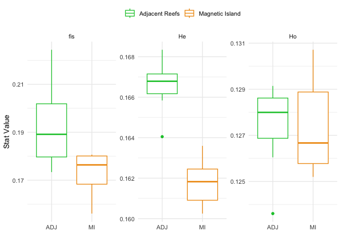
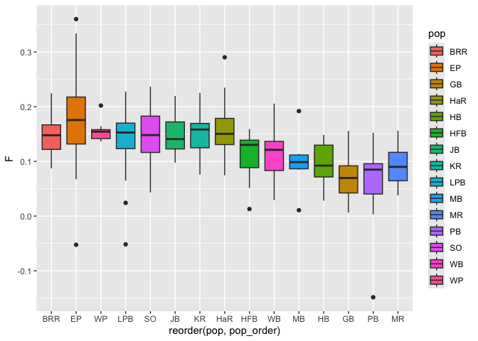

# 4 Genetic Diversity
Sandra Erdmann

# Genetic Diversity

As a starting point for genetic diversity analyses we use the same
filtered set of loci as was used for final population structure
analyses. Specifically;

- These have already been filtered to ensure that they are as reliable
  as possible while being mindful to avoid filters that would distort
  allele frequencies and hence bias genetic diversity estimates. This
  includes the HWE filter

- Individuals with admixture proportions that would indicate that they
  are migrants between MI and “other” populations have been removed.
  This is because these these individuals have uncertain origins (ie
  parents likely from a different reef to where they were found).

- Highly admixed individuals (admixture proportion \> 5%) between the
  two major lineages in this study (ie Maggie vs surrounding reefs) have
  been excluded. See note in the section on population structure about
  this threshold and the relatively small number of individuals it
  excludes.

- Individuals that are likely genetic clones or close relatives have
  been removed as these are undesirable in pretty much all analyses.

The starting data satisfying all these criteria is called `ak.pop.nm` as
was created in the `03.population_structure` script

``` r
# Loads ak.pop.nm
load("cache/ak.pop.nm.rdata")
```

## Population groupings

To facilitate diversity statistics we use population groupings following
both known genetic structure and geography. Datasets reflecting these
groupings are;

| Dataset Name    | Grouping                                                  |
|-----------------|-----------------------------------------------------------|
| `ak.pop.nm`     | All sites grouped separately                              |
| `ak.gen.no.so`  | Magnetic Island grouped into North and South              |
| `ak.gen.mi.adj` | All sites grouped into Magnetic Island and Adjacent Reefs |

``` r
# Creation of the `ak.gen.no.so` dataset

if (!file.exists("cache/ak.gen.no.so.rdata")) {
  # Merge subpopulations from north Magnetic Island into one population
  ak.gen.no.so <- gl.merge.pop(ak.pop.nm, old=c("HB", "HFB", "MB", "WB"), new='no')
  # Using this merged dataset, merge also subpopulations from south Magnetic Island into one population. 
  ak.gen.no.so <- gl.merge.pop(ak.gen.no.so, old=c("GB", "MR", "PB"), new='so')
  ak.gen.no.so <- gl.merge.pop(ak.gen.no.so, old=c("SO", "LPB", "EP", "WP", "HaR","BRR", "JB", "KR"), new='ADJ')
  ak.gen.no.so <- gl.filter.monomorphs(ak.gen.no.so)
  ak.gen.no.so <- gl.recalc.metrics(ak.gen.no.so)
  save(ak.gen.no.so,file = "cache/ak.gen.no.so.rdata")
} else {
  load("cache/ak.gen.no.so.rdata")
}
```

``` r
if (!file.exists("cache/ak.gen.mi.adj.rdata")){
  ak.gen.mi.adj <- gl.merge.pop(ak.pop.nm, old=c("GB", "HB", "HFB", "MB", "MR", "PB", "WB"), new='MI')
  ak.gen.mi.adj <- gl.merge.pop(ak.gen.mi.adj, old=c("SO", "LPB", "EP", "WP", "HaR","BRR", "JB", "KR"), new='ADJ')
  ak.gen.mi.adj <- gl.filter.monomorphs(ak.gen.mi.adj)
  ak.gen.mi.adj <- gl.recalc.metrics(ak.gen.mi.adj)
  save(ak.gen.mi.adj,file = "cache/ak.gen.mi.adj.rdata")
  write_rds(ak.gen.mi.adj,file = "basic_stats/ak.gen.mi.adj.rds")
} else {
  load("cache/ak.gen.mi.adj.rdata")
}
```

## Convert to hierfstat format

``` r
# Convert genlight objects to genind format
ak.pop.nm.hfstat <- gl2gi(ak.pop.nm) %>% genind2hierfstat()
ak.gen.no.so.hfstat <- gl2gi(ak.gen.no.so)  %>% genind2hierfstat() 
ak.gen.mi.adj.hfstat <- gl2gi(ak.gen.mi.adj) %>% genind2hierfstat()
write_rds(list(ak.pop.nm.hfstat,ak.gen.no.so.hfstat,ak.gen.mi.adj.hfstat),"basic_stats/hfstat.rds")
```

# Measures of Genetic Diversity as EBVs

Genetic Diversity is one of four EBVs (Essential Biodiversity Variables)
proposed by (Hoban et al. 2022). It is composed of richness and
evenness. Here, we calculate Allelic Richness (Ar) as a measure of
richness and expected heterozygosity (He) as a measure of evenness.

## Allelic richness

Our data comprise a set of biallelic SNPs which means that the maximum
number of alleles at any locus is 2. Allelic richness for the entire
dataset with no subdivisions should be exactly 2 since every SNP must
have exactly 2 alleles in order to be included. Values of AR less than 2
come from the fact that some alleles will be missing when a subsample is
made from the whole. The larger the sample the higher the value of AR so
the `allelic.richness` function from hierfstat is used here. This
calculates a rarefied value (accounting for differences in sample size
between populations).

``` r
# Calculate allelic richness
ar <- allelic.richness(ak.pop.nm.hfstat)
ar.no.so <- allelic.richness(ak.gen.no.so.hfstat)
ar.mi.adj <- allelic.richness(ak.gen.mi.adj.hfstat)
```

``` r
load("cache/sites_data.rdata")
```

``` r
summarise_pops <- function(coltable){
  coltable %>% 
  colMeans(na.rm = TRUE) %>% 
  as.data.frame() %>% 
  rownames_to_column("pop") %>% 
  left_join(sites_data)
}
```

Since Ar is heavily impacted by sample size we avoid super small samples
on individual reefs and report population groupings such as “Adjacent
Reefs”, North and South Maggie.

``` r
ar_means <- (ar.no.so$Ar %>% 
  colMeans(na.rm = TRUE))
data.frame(pop=names(ar_means),Ar = ar_means) %>% knitr::kable()
```

|     | pop |       Ar |
|:----|:----|---------:|
| ADJ | ADJ | 1.721986 |
| so  | so  | 1.591493 |
| no  | no  | 1.589323 |

To formally test whether Ar is higher at adjacent than at Magnetic
Island we use a permutation test. Here this is implemented by randomly
reassigning individuals to populations. To perform this shuffling we ran
1000 iterations with an R script
[basic_stats/run_permute.R](run_permute.R) to perform each iteration.

``` r
if ( file.exists("cache/perm_data.rds")){
# This reads all permutation data. Including for basic stats below
  perm_data <- list.files("basic_stats/perms/",pattern = ".rds",full.names = TRUE) %>% 
    map(read_rds)
  write_rds(perm_data,"cache/perm_data.rds")
} else {
  perm_data <- read_rds("cache/perm_data.rds")
}
```

``` r
m_vs_adj_actual_value <- ar.mi.adj$Ar %>% colMeans(na.rm = TRUE) %>% diff()
mi_adj_ar <- perm_data %>% map(~ colMeans(.x$adj.mi$Ar$Ar)) %>% 
  bind_rows() %>% 
  mutate(diff = abs(MI-ADJ)) 

p_mi_adj_ar <- (mi_adj_ar %>% 
  filter(abs(diff)>abs(m_vs_adj_actual_value)) %>% nrow())/1000
```

``` r
no_vs_so_actual_value <- (ar.no.so$Ar %>% colMeans(na.rm = TRUE))[c("no","so")] %>% diff()
no_so_adj_ar <- perm_data %>% map(~ colMeans(.x$no.so$Ar$Ar)) %>% 
  bind_rows() %>% 
  mutate(no_vs_so = abs(no-so)) %>% 
  mutate(diff = abs(no-so))

p_no_so_ar <- (no_so_adj_ar %>% 
  filter(diff>no_vs_so_actual_value) %>% nrow())/1000
```

This test reveals that the difference between MI and adjacent is highly
significant (p\<0.001) but for the contrast between north and south
magnetic Island it is not.

``` r
data.frame(contrast = c("MI vs ADJ","NO vs SO"), "Ar Diff" = c(m_vs_adj_actual_value,no_vs_so_actual_value), "p-value"=c(p_mi_adj_ar,p_no_so_ar)) %>% knitr::kable()
```

|     | contrast  |    Ar.Diff | p.value |
|:----|:----------|-----------:|--------:|
| MI  | MI vs ADJ | -0.1530392 |   0.000 |
| so  | NO vs SO  |  0.0021697 |   0.689 |

## Heterozygosity

Next we used the `basic.stats` function in `hierfstat` to calculate
expected heterozygosity (He, also called Hs), observed heterozygosity
(Ho) and Fis. `He/Hs` is a measure of genetic evenness. `Fis` is a
measure of heterozygote deficiency. We see that all populations show a
background level of `Fis`

``` r
basic_stats <- basic.stats(ak.pop.nm.hfstat)
basic_stats_adj.no.so <- basic.stats(ak.gen.no.so.hfstat)
basic_stats_adj.mi <- basic.stats(ak.gen.mi.adj.hfstat)
```

``` r
# Assemble all stats into a table averaged by column
assemble_basic_stats <- function(bs){
  ho.stats <- bs$Ho %>% 
    summarise_pops() %>% 
    dplyr::rename(Ho = ".") 

  he.stats <- bs$Hs %>% 
    summarise_pops() %>% 
    dplyr::rename(He = ".") 

  fis.stats <- bs$Fis %>% 
    summarise_pops() %>% 
    dplyr::rename(fis = ".") 

  ho.stats %>% 
    left_join(he.stats) %>% 
    left_join(fis.stats) %>% 
    pivot_longer(all_of(c("He","Ho","fis")), names_to = "stat", values_to = "stat_value")
}

# Gives aggregated values for three main population groupings
allhet.stats_noso <- assemble_basic_stats(basic_stats_adj.no.so) %>% 
  select(no_so_group = pop,stat,stat_value_agg = stat_value)

# Collects aggregated and subdivided values together
allhet.stats <- assemble_basic_stats(basic_stats) %>% 
  mutate(no_so_group = case_when(
    pop_group == "ADJ" ~ "ADJ",
    pop %in% c("PB","GB","MR") ~ "so",
    .default = "no"
  )) %>% left_join(allhet.stats_noso)
```

First plot all stats subdivided by reef

``` r
allhet.stats %>% 
  ggplot(aes(x=reorder(pop,pop_order),y=stat_value)) + 
  geom_point(aes(color=pop_group)) + 
  facet_wrap(~stat, scales="free", ncol=1) +
  geom_point(aes(color=pop_group)) + 
  scale_color_manual(values = pop_colors, labels = pop_names) +
  labs(
    x="Reef",
    y="Stat Value"
  ) +
  theme_minimal() +
  theme(legend.position = "top", legend.title = element_blank()) 
```



Alternatively we can present this as a boxplot

``` r
allhet.stats %>% 
  ggplot(aes(x=no_so_group,y=stat_value)) + 
  geom_boxplot(aes(color=no_so_group)) + 
  geom_point(aes(y=stat_value_agg)) +
  facet_wrap(~stat, scales = "free") +
#  scale_color_manual(values = pop_colors, labels = pop_names) +
  labs(
    x="",
    y="Stat Value"
  ) +
  theme_minimal() +
  theme(legend.position = "top", legend.title = element_blank()) 
```



Permutation tests were also used to calculate significance of
differences for these statistics. This is done on aggregated data,
grouped into ADJ, NO and SO. Note the somewhat unexpected result that
the smaller populations at Magnetic Island show slightly higher
heterozygosity and lower Fis than the larger Adjacent population. Note
that this effect is numerically very small, and likely reflects expected
heterozygote excess in small populations due to differences in allele
frequencies between sexes as a result of binomial sampling error. This
effect applies equally to self-incompatible hermaphroditic species
(Balloux 2004) such as Acroporid corals and forms the basis of the
heterozygote excess method for calculating Ne (Luikart and Cornuet 1999)

``` r
test_basic_stat <- function(stat){
  actual_values <- basic_stats_adj.mi[[stat]] %>% colMeans(na.rm = TRUE)
  
  mi_adj <- perm_data %>% map(~ colMeans(.x[["adj.mi"]][["basic_stats"]][[stat]])) %>% 
    bind_rows() %>% 
    mutate(diff = abs(MI-ADJ)) 

  p_mi_adj <- (mi_adj %>% 
    filter(abs(diff)>abs(diff(actual_values))) %>% nrow())/1000  
  data.frame(stat,values=paste(actual_values, collapse = ";"),diff = diff(actual_values), "p"=p_mi_adj)
}

test_basic_stat_noso <- function(stat){
  actual_values <- basic_stats_adj.no.so[[stat]] %>% colMeans(na.rm = TRUE)
  
  data_withdiffs <- perm_data %>% map(~ colMeans(.x[["no.so"]][["basic_stats"]][[stat]],na.rm = TRUE)) %>% 
    bind_rows() %>% 
    mutate(adj_no = abs(ADJ-no), adj_so = abs(ADJ-so),no_so = abs(no-so)) 

  pval_adj_no <- (data_withdiffs %>% 
    filter(abs(adj_no)>abs(diff(actual_values[c("ADJ","no")]))) %>% nrow())/1000  

  pval_adj_so <- (data_withdiffs %>% 
    filter(abs(adj_so)>abs(diff(actual_values[c("ADJ","so")]))) %>% nrow())/1000

  pval_no_so <- (data_withdiffs %>% 
    filter(abs(no_so)>abs(diff(actual_values[c("no","so")]))) %>% nrow())/1000
  
  data.frame(stat,contrast = c("adj_no","adj_so","no_so"), "p"=c(pval_adj_no,pval_adj_so,pval_no_so))
}

p_values <- map(c("Hs","Ho","Fis"),test_basic_stat_noso) %>% 
  bind_rows() %>% 
  pivot_wider(names_from = stat,values_from = p)
knitr::kable(p_values)
```

| contrast |    Hs |    Ho |   Fis |
|:---------|------:|------:|------:|
| adj_no   | 0.275 | 0.000 | 0.000 |
| adj_so   | 0.122 | 0.000 | 0.000 |
| no_so    | 0.692 | 0.006 | 0.518 |

``` r
allhet.stats_noso %>% knitr::kable()
```

| no_so_group | stat | stat_value_agg |
|:------------|:-----|---------------:|
| ADJ         | He   |      0.1373096 |
| ADJ         | Ho   |      0.1182736 |
| ADJ         | fis  |      0.1523597 |
| so          | He   |      0.1435567 |
| so          | Ho   |      0.1265418 |
| so          | fis  |      0.1200260 |
| no          | He   |      0.1415252 |
| no          | Ho   |      0.1225699 |
| no          | fis  |      0.1250687 |

## Fixed allelic differences/Private alleles

If we look at private alleles and fixed differences between all pairs of
reefs we see that the number of private alleles strongly reflects the
sample size. We also see a few examples of fixed differences (alternate
alleles fixed in different populations) particularly betwen WP and
Magnetic Island reefs.

``` r
pa_ak.gen <-dartR::gl.report.pa(ak.pop.nm)
```

    Starting :: 
     Starting dartR 
     Starting gl.report.pa 
      Processing genlight object with SNP data
        p1 p2 pop1 pop2 N1 N2 fixed priv1 priv2 Chao1 Chao2 totalpriv   AFD
    1    1  2  BRR   EP 19 94     0    61   978     0     1      1039 0.033
    2    1  3  BRR   GB 19 28     8   991   769     0     4      1760 0.166
    3    1  4  BRR  HaR 19 22     0   385   453     0     0       838 0.039
    4    1  5  BRR   HB 19 22     6  1037   737     0     4      1774 0.168
    5    1  6  BRR  HFB 19 14    12  1175   665     0     0      1840 0.168
    6    1  7  BRR   JB 19 15     0   507   387     0     2       894 0.043
    7    1  8  BRR   KR 19 14     0   556   392     0     2       948 0.044
    8    1  9  BRR  LPB 19 34     0   242   609     0     0       851 0.036
    9    1 10  BRR   MB 19  6    18  1472   526     0     0      1998 0.170
    10   1 11  BRR   MR 19 12    10  1213   648     0     0      1861 0.170
    11   1 12  BRR   PB 19 18     9  1099   718     0     1      1817 0.168
    12   1 13  BRR   SO 19 80     0    68   898     0     1       966 0.033
    13   1 14  BRR   WB 19 17    11  1098   678     0     0      1776 0.168
    14   1 15  BRR   WP 19  8     0   864   205     0     0      1069 0.053
    15   2  3   EP   GB 94 28     5  1469   330     1     4      1799 0.164
    16   2  4   EP  HaR 94 22     0   916    67     1     0       983 0.031
    17   2  5   EP   HB 94 22     4  1542   325     1     4      1867 0.166
    18   2  6   EP  HFB 94 14     5  1707   280     1     0      1987 0.166
    19   2  7   EP   JB 94 15     0  1105    68     1     2      1173 0.037
    20   2  8   EP   KR 94 14     0  1151    70     1     2      1221 0.037
    21   2  9   EP  LPB 94 34     0   647    97     1     0       744 0.027
    22   2 10   EP   MB 94  6     9  2079   217     1     0      2296 0.169
    23   2 11   EP   MR 94 12     5  1763   281     1     0      2044 0.168
    24   2 12   EP   PB 94 18     5  1616   318     1     1      1934 0.166
    25   2 13   EP   SO 94 80     0   290   203     1     1       493 0.021
    26   2 14   EP   WB 94 17     5  1634   297     1     0      1931 0.166
    27   2 15   EP   WP 94  8     0  1598    22     1     0      1620 0.048
    28   3  4   GB  HaR 28 22    10   727  1017     4     0      1744 0.166
    29   3  5   GB   HB 28 22     0   347   269     4     4       616 0.041
    30   3  6   GB  HFB 28 14     0   454   166     4     0       620 0.041
    31   3  7   GB   JB 28 15     9   835   937     4     2      1772 0.167
    32   3  8   GB   KR 28 14     6   846   904     4     2      1750 0.167
    33   3  9   GB  LPB 28 34     5   585  1174     4     0      1759 0.165
    34   3 10   GB   MB 28  6     0   815    91     4     0       906 0.055
    35   3 11   GB   MR 28 12     0   504   161     4     0       665 0.044
    36   3 12   GB   PB 28 18     0   363   204     4     1       567 0.036
    37   3 13   GB   SO 28 80     4   369  1421     4     1      1790 0.164
    38   3 14   GB   WB 28 17     0   418   220     4     0       638 0.043
    39   3 15   GB   WP 28  8    12  1095   658     4     0      1753 0.169
    40   4  5  HaR   HB 22 22     7  1078   710     0     4      1788 0.168
    41   4  6  HaR  HFB 22 14    13  1205   627     0     0      1832 0.168
    42   4  7  HaR   JB 22 15     0   567   379     0     2       946 0.042
    43   4  8  HaR   KR 22 14     0   589   357     0     2       946 0.044
    44   4  9  HaR  LPB 22 34     0   257   556     0     0       813 0.035
    45   4 10  HaR   MB 22  6    23  1508   494     0     0      2002 0.171
    46   4 11  HaR   MR 22 12    15  1258   625     0     0      1883 0.170
    47   4 12  HaR   PB 22 18    10  1129   680     0     1      1809 0.167
    48   4 13  HaR   SO 22 80     0    74   836     0     1       910 0.032
    49   4 14  HaR   WB 22 17    14  1151   663     0     0      1814 0.168
    50   4 15  HaR   WP 22  8     0   933   206     0     0      1139 0.053
    51   5  6   HB  HFB 22 14     0   394   184     4     0       578 0.041
    52   5  7   HB   JB 22 15     9   809   989     4     2      1798 0.169
    53   5  8   HB   KR 22 14     5   828   964     4     2      1792 0.169
    54   5  9   HB  LPB 22 34     6   575  1242     4     0      1817 0.167
    55   5 10   HB   MB 22  6     0   759   113     4     0       872 0.053
    56   5 11   HB   MR 22 12     0   448   183     4     0       631 0.044
    57   5 12   HB   PB 22 18     0   331   250     4     1       581 0.042
    58   5 13   HB   SO 22 80     5   357  1487     4     1      1844 0.166
    59   5 14   HB   WB 22 17     0   346   226     4     0       572 0.038
    60   5 15   HB   WP 22  8    12  1073   714     4     0      1787 0.171
    61   6  7  HFB   JB 14 15    13   732  1122     0     2      1854 0.168
    62   6  8  HFB   KR 14 14    11   753  1099     0     2      1852 0.169
    63   6  9  HFB  LPB 14 34    11   511  1388     0     0      1899 0.167
    64   6 10  HFB   MB 14  6     0   570   134     0     0       704 0.055
    65   6 11  HFB   MR 14 12     0   325   270     0     0       595 0.048
    66   6 12  HFB   PB 14 18     0   237   366     0     1       603 0.043
    67   6 13  HFB   SO 14 80     7   319  1659     0     1      1978 0.166
    68   6 14  HFB   WB 14 17     0   243   333     0     0       576 0.043
    69   6 15  HFB   WP 14  8    23   967   818     0     0      1785 0.171
    70   7  8   JB   KR 15 14     0   506   462     2     2       968 0.047
    71   7  9   JB  LPB 15 34     0   226   713     2     0       939 0.039
    72   7 10   JB   MB 15  6    23  1389   563     2     0      1952 0.170
    73   7 11   JB   MR 15 12    14  1147   702     2     0      1849 0.170
    74   7 12   JB   PB 15 18    13  1042   781     2     1      1823 0.168
    75   7 13   JB   SO 15 80     0    69  1019     2     1      1088 0.036
    76   7 14   JB   WB 15 17    13  1057   757     2     0      1814 0.168
    77   7 15   JB   WP 15  8     0   805   266     2     0      1071 0.054
    78   8  9   KR  LPB 14 34     0   223   754     2     0       977 0.041
    79   8 10   KR   MB 14  6    20  1367   585     2     0      1952 0.172
    80   8 11   KR   MR 14 12    10  1125   724     2     0      1849 0.171
    81   8 12   KR   PB 14 18     9  1014   797     2     1      1811 0.169
    82   8 13   KR   SO 14 80     0    79  1073     2     1      1152 0.038
    83   8 14   KR   WB 14 17     8  1035   779     2     0      1814 0.169
    84   8 15   KR   WP 14  8     0   796   301     2     0      1097 0.056
    85   9 10  LPB   MB 34  6    16  1706   393     0     0      2099 0.169
    86   9 11  LPB   MR 34 12    10  1431   499     0     0      1930 0.168
    87   9 12  LPB   PB 34 18     8  1305   557     0     1      1862 0.166
    88   9 13  LPB   SO 34 80     0   121   584     0     1       705 0.027
    89   9 14  LPB   WB 34 17     9  1323   536     0     0      1859 0.167
    90   9 15  LPB   WP 34  8     0  1130   104     0     0      1234 0.050
    91  10 11   MB   MR  6 12     0   171   552     0     0       723 0.057
    92  10 12   MB   PB  6 18     0   115   680     0     1       795 0.054
    93  10 13   MB   SO  6 80     9   256  2031     0     1      2287 0.169
    94  10 14   MB   WB  6 17     0   127   653     0     0       780 0.054
    95  10 15   MB   WP  6  8    30   737  1024     0     0      1761 0.172
    96  11 12   MR   PB 12 18     0   199   383     0     1       582 0.046
    97  11 13   MR   SO 12 80     8   308  1703     0     1      2011 0.168
    98  11 14   MR   WB 12 17     0   238   383     0     0       621 0.047
    99  11 15   MR   WP 12  8    21   930   836     0     0      1766 0.172
    100 12 13   PB   SO 18 80     7   351  1562     1     1      1913 0.166
    101 12 14   PB   WB 18 17     0   331   292     1     0       623 0.044
    102 12 15   PB   WP 18  8    15  1027   749     1     0      1776 0.170
    103 13 14   SO   WB 80 17     7  1573   323     1     0      1896 0.166
    104 13 15   SO   WP 80  8     0  1520    31     1     0      1551 0.049
    105 14 15   WB   WP 17  8    20   993   754     0     0      1747 0.170
      Table of private alleles and fixed differences returned
    Completed: :: 
     Completed: dartR 
     Completed: gl.report.pa 

When running this on amalgamated populations we now see no fixed
differences between MI and ADJ but plenty of private alleles.
Interestingly if we break up MI into no and so there are 2 loci fixed
between no and ADJ.

``` r
pa_ak.gen.mi <- gl.report.pa(ak.gen.mi.adj)
```

    Starting gl.report.pa 
      Processing genlight object with SNP data
      p1 p2 pop1 pop2  N1  N2 fixed priv1 priv2 Chao1 Chao2 totalpriv   AFD asym
    1  1  2  ADJ   MI 286 117     0  1168   259     4     8      1427 0.163   NA
      asym.sig
    1       NA
      Table of private alleles and fixed differences returned
    Completed: gl.report.pa 

``` r
pa_ak.gen.no.so <- gl.report.pa(ak.gen.no.so)
```

    Starting gl.report.pa 
      Processing genlight object with SNP data
      p1 p2 pop1 pop2  N1 N2 fixed priv1 priv2 Chao1 Chao2 totalpriv   AFD asym
    1  1  2  ADJ   so 286 58     0  1402   217     4     6      1619 0.163   NA
    2  1  3  ADJ   no 286 59     2  1380   193     4     2      1573 0.164   NA
    3  2  3   so   no  58 59     0   278   276     6     2       554 0.028   NA
      asym.sig
    1       NA
    2       NA
    3       NA
      Table of private alleles and fixed differences returned
    Completed: gl.report.pa 

# 

<div id="refs" class="references csl-bib-body hanging-indent"
entry-spacing="0">

<div id="ref-Balloux2004-yn" class="csl-entry">

Balloux, François. 2004. “Heterozygote Excess in Small Populations and
the Heterozygote-Excess Effective Population Size.” *Evolution* 58 (9):
1891–1900.

</div>

<div id="ref-Hoban2022-ek" class="csl-entry">

Hoban, Sean, Frederick I Archer, Laura D Bertola, Jason G Bragg, Martin
F Breed, Michael W Bruford, Melinda A Coleman, et al. 2022. “Global
Genetic Diversity Status and Trends: Towards a Suite of Essential
Biodiversity Variables (EBVs) for Genetic Composition.” *Biol. Rev.
Camb. Philos. Soc.* 97 (4): 1511–38.

</div>

<div id="ref-Luikart1999-yh" class="csl-entry">

Luikart, G, and J M Cornuet. 1999. “Estimating the Effective Number of
Breeders from Heterozygote Excess in Progeny.” *Genetics* 151 (3):
1211–16.

</div>

</div>
