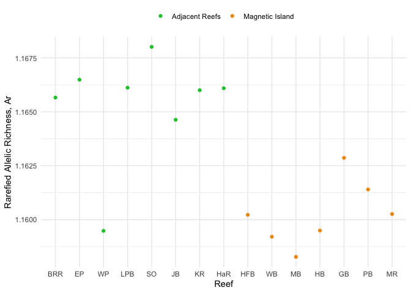
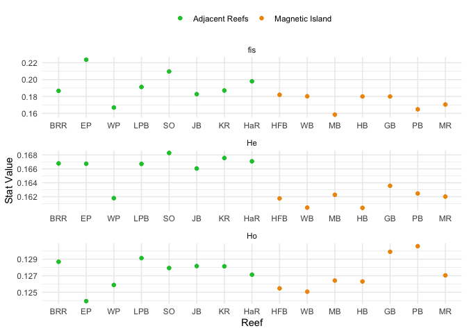
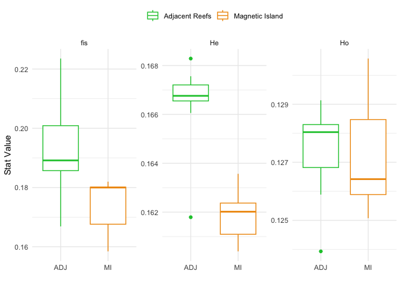

# 4 Genetic Diversity
Sandra Erdmann

# Genetic Diversity

As a starting point for genetic diversity analyses we use the same
filtered set of loci as was used for population structure analyses.
Specifically;

- Filtered loci are the same because these have already been filtered to
  ensure that they are as reliable as possible while being mindful to
  avoid filters that would distort allele frequencies and hence bias
  genetic diversity estimates.

- Individuals with admixture proportions that would indicate that they
  are migrants between MI and “other” populations have been removed.
  This is because these these individuals have uncertain origins (ie
  parents likely from a different reef to where they were found).

- Highly admixed individuals (admixture proportion \> 5%) between the
  two major lineages in this study (ie Maggie vs surrounding reefs) have
  been excluded. See note in the section on population structure about
  this threshold and the relatively small number of individuals it
  excludes.

- Individuals that are likely genetic clones or close relatives have
  been removed as these are undesirable in pretty much all analyses.

The starting data satisfying all these criteria is called `ak.pop.nm` as
was created in the `03.population_structure` script

``` r
# Loads ak.pop.nm
load("cache/ak.pop.nm.rdata")
```

## Population groupings

To facilitate diversity statistics we use population groupings following
both known genetic structure and geography. Datasets reflecting these
groupings are;

| Dataset Name    | Grouping                                                  |
|-----------------|-----------------------------------------------------------|
| `ak.pop.nm`     | All sites grouped separately                              |
| `ak.gen.no.so`  | Magnetic Island grouped into North and South              |
| `ak.gen.mi.adj` | All sites grouped into Magnetic Island and Adjacent Reefs |

``` r
# Creation of the `ak.gen.no.so` dataset

if (!file.exists("cache/ak.gen.no.so.rdata")) {
  # Merge subpopulations from north Magnetic Island into one population
  ak.gen.no.so <- gl.merge.pop(ak.pop.nm, old=c("HB", "HFB", "MB", "WB"), new='no')
  # Using this merged dataset, merge also subpopulations from south Magnetic Island into one population. 
  ak.gen.no.so <- gl.merge.pop(ak.gen.no.so, old=c("GB", "MR", "PB"), new='so')
  ak.gen.no.so <- gl.filter.monomorphs(ak.gen.no.so)
  ak.gen.no.so <- gl.recalc.metrics(ak.gen.no.so)
  save(ak.gen.no.so,file = "cache/ak.gen.no.so.rdata")
} else {
  load("cache/ak.gen.no.so.rdata")
}
```

``` r
if (!file.exists("cache/ak.gen.mi.adj.rdata")){
  ak.gen.mi.adj <- gl.merge.pop(ak.pop.nm, old=c("GB", "HB", "HFB", "MB", "MR", "PB", "WB"), new='MI')
  ak.gen.mi.adj <- gl.merge.pop(ak.gen.mi.adj, old=c("SO", "LPB", "EP", "WP", "HaR","BRR", "JB", "KR"), new='ADJ')
  ak.gen.mi.adj <- gl.filter.monomorphs(ak.gen.mi.adj)
  ak.gen.mi.adj <- gl.recalc.metrics(ak.gen.mi.adj)
  save(ak.gen.mi.adj, file="cache/ak.gen.mi.adj.rdata")
} else {
  load("cache/ak.gen.mi.adj.rdata")
}
```

## Convert to hierfstat format

``` r
# Convert genlight objects to genind format
ak.pop.nm.hfstat <- gl2gi(ak.pop.nm) %>% genind2hierfstat()
ak.gen.no.so.hfstat <- gl2gi(ak.gen.no.so)  %>% genind2hierfstat() 
ak.gen.mi.adj.hfstat <- gl2gi(ak.gen.mi.adj) %>% genind2hierfstat()
```

## Allelic richness

Our data comprise a set of biallelic SNPs which means that the maximum
number of alleles at any locus is 2. Allelic richness for the entire
dataset with no subdivisions should be exactly 2 since every SNP must
have exactly 2 alleles in order to be included. Values of AR less than 2
come from the fact that some alleles will be missing when a subsample is
made from the whole. The larger the sample the higher the value of AR so
the `allelic.richness` function from hierfstat is used here. This
calculates a rarefied value (accounting for sample size).

``` r
# Calculate allelic richness
ar <- allelic.richness(ak.pop.nm.hfstat)
ar.no.so <- allelic.richness(ak.gen.no.so.hfstat)
ar.mi.adj <- allelic.richness(ak.gen.mi.adj.hfstat)
```

``` r
load("cache/sites_data.rdata")
```

The plot below shows Ar statistics calculated by-reef. This clearly
shows that values from Adjacent reefs (with the exception of West
Pelorus) have consistently higher values than bays at Magnetic Island.
This is notable because Ar declines rapidly is response to a reduction
in population size.

``` r
summarise_pops <- function(coltable){
  coltable %>% 
  colMeans(na.rm = TRUE) %>% 
  as.data.frame() %>% 
  rownames_to_column("pop") %>% 
  left_join(sites_data)
}
```

``` r
# Show summary of Ar statistics
ar$Ar %>% 
  summarise_pops() %>% 
  dplyr::rename(Ar = ".") %>% 
  ggplot(aes(x=reorder(pop,pop_order),y=Ar)) + 
  geom_point(aes(color=pop_group)) + 
  scale_color_manual(values = pop_colors, labels = pop_names) +
  labs(
    x="Reef",
    y="Rarefied Allelic Richness, Ar"
  ) +
  theme_minimal() +
  theme(legend.title = element_blank(), legend.position = "top")
```



When we aggregate reefs into population groupings such as “Adjacent
Reefs”, and North/South Maggie we get higher Ar values because the
rarefaction correction is based on the smallest unit.

Calculating Ar for North/South Maggie suggests that Ar might actually be
higher in the South but the difference is very small.

``` r
(ar.no.so$Ar %>% 
  colMeans(na.rm = TRUE))[c("so","no")]
```

          so       no 
    1.364712 1.360296 

And for the dataset where Adjacent and Maggie are grouped we
recapitulate the broad result that Adjacent Reefs have higher Ar than
Magnetic Island, this time the difference is substantial.

If we wanted to formally test whether Ar is higher at adjacent than at
Magnetic Island we could use a permutation test.

``` r
ar.mi.adj$Ar %>% 
  colMeans(na.rm = TRUE)
```

         ADJ       MI 
    1.848211 1.698563 

## Heterozygosity

Calculate heterozygosity-related stats

``` r
basic_stats <- basic.stats(ak.pop.nm.hfstat)
```

``` r
# Assemble all stats into a table averaged by column
ho.stats <- basic_stats$Ho %>% 
  summarise_pops() %>% 
  dplyr::rename(Ho = ".") 

he.stats <- basic_stats$Hs %>% 
  summarise_pops() %>% 
  dplyr::rename(He = ".") 

fis.stats <- basic_stats$Fis %>% 
  summarise_pops() %>% 
  dplyr::rename(fis = ".") 

allhet.stats <- ho.stats %>% 
  left_join(he.stats) %>% 
  left_join(fis.stats) %>% 
  pivot_longer(all_of(c("He","Ho","fis")), names_to = "stat", values_to = "stat_value")
```

``` r
allhet.stats %>% 
  ggplot(aes(x=reorder(pop,pop_order),y=stat_value)) + 
  geom_point(aes(color=pop_group)) + 
  facet_wrap(~stat, scales="free", ncol=1) +
  geom_point(aes(color=pop_group)) + 
  scale_color_manual(values = pop_colors, labels = pop_names) +
  labs(
    x="Reef",
    y="Stat Value"
  ) +
  theme_minimal() +
  theme(legend.position = "top", legend.title = element_blank()) 
```



Alternatively we can present this as a boxplot

``` r
allhet.stats %>% 
  ggplot(aes(x=pop_group,y=stat_value)) + 
  geom_boxplot(aes(color=pop_group)) + 
  facet_wrap(~stat, scales = "free") +
  scale_color_manual(values = pop_colors, labels = pop_names) +
  labs(
    x="",
    y="Stat Value"
  ) +
  theme_minimal() +
  theme(legend.position = "top", legend.title = element_blank()) 
```



## Fixed allelic differences/Private alleles

If we look at private alleles and fixed differences between all pairs of
reefs we see that the number of private alleles strongly reflects the
sample size. We also see a few examples of fixed differences (alternate
alleles fixed in different populations) but since sample sizes are small
this could be heavily influenced by this.

``` r
pa_ak.gen <-dartR::gl.report.pa(ak.pop.nm)
```

    Starting :: 
     Starting dartR 
     Starting gl.report.pa 
      Processing genlight object with SNP data
        p1 p2 pop1 pop2 N1 N2 fixed priv1 priv2 Chao1 Chao2 totalpriv   AFD
    1    1  2  BRR   EP 19 94     0    67  1086     0    17      1153 0.040
    2    1  3  BRR   GB 19 28     8  1249   879     0     2      2128 0.183
    3    1  4  BRR  HaR 19 22     0   446   534     0     0       980 0.048
    4    1  5  BRR   HB 19 22     6  1320   847     0    18      2167 0.187
    5    1  6  BRR  HFB 19 14    13  1491   783     0     2      2274 0.186
    6    1  7  BRR   JB 19 15     0   613   426     0     2      1039 0.052
    7    1  8  BRR   KR 19 14     0   657   431     0     2      1088 0.053
    8    1  9  BRR  LPB 19 34     0   276   683     0     4       959 0.043
    9    1 10  BRR   MB 19  6    21  1901   612     0     0      2513 0.189
    10   1 11  BRR   MR 19 12    11  1541   755     0     2      2296 0.188
    11   1 12  BRR   PB 19 18     9  1398   824     0     4      2222 0.186
    12   1 13  BRR   SO 19 80     0    73   996     0    18      1069 0.040
    13   1 14  BRR   WB 19 17    12  1407   789     0     0      2196 0.187
    14   1 15  BRR   WP 19  9     0  1044   244     0     0      1288 0.066
    15   2  3   EP   GB 94 28     5  1751   362    17     2      2113 0.180
    16   2  4   EP  HaR 94 22     0  1006    75    17     0      1081 0.037
    17   2  5   EP   HB 94 22     4  1854   362    17    18      2216 0.184
    18   2  6   EP  HFB 94 14     6  2052   325    17     2      2377 0.183
    19   2  7   EP   JB 94 15     0  1275    69    17     2      1344 0.044
    20   2  8   EP   KR 94 14     0  1313    68    17     2      1381 0.044
    21   2  9   EP  LPB 94 34     0   717   105    17     4       822 0.031
    22   2 10   EP   MB 94  6    11  2558   249    17     0      2807 0.188
    23   2 11   EP   MR 94 12     7  2118   313    17     2      2431 0.186
    24   2 12   EP   PB 94 18     6  1948   355    17     4      2303 0.183
    25   2 13   EP   SO 94 80     0   306   210    17    18       516 0.024
    26   2 14   EP   WB 94 17     7  1976   339    17     0      2315 0.184
    27   2 15   EP   WP 94  9     0  1843    24    17     0      1867 0.059
    28   3  4   GB  HaR 28 22    10   826  1284     2     0      2110 0.183
    29   3  5   GB   HB 28 22     0   423   320     2    18       743 0.047
    30   3  6   GB  HFB 28 14     0   545   207     2     2       752 0.047
    31   3  7   GB   JB 28 15     9   977  1160     2     2      2137 0.184
    32   3  8   GB   KR 28 14     6   996  1140     2     2      2136 0.184
    33   3  9   GB  LPB 28 34     5   667  1444     2     4      2111 0.181
    34   3 10   GB   MB 28  6     0  1043   123     2     0      1166 0.065
    35   3 11   GB   MR 28 12     0   618   202     2     2       820 0.050
    36   3 12   GB   PB 28 18     0   452   248     2     4       700 0.042
    37   3 13   GB   SO 28 80     4   410  1703     2    18      2113 0.181
    38   3 14   GB   WB 28 17     0   522   274     2     0       796 0.050
    39   3 15   GB   WP 28  9    15  1311   881     2     0      2192 0.189
    40   4  5  HaR   HB 22 22     8  1369   808     0    18      2177 0.186
    41   4  6  HaR  HFB 22 14    14  1540   744     0     2      2284 0.186
    42   4  7  HaR   JB 22 15     0   689   414     0     2      1103 0.051
    43   4  8  HaR   KR 22 14     0   709   395     0     2      1104 0.052
    44   4  9  HaR  LPB 22 34     0   302   621     0     4       923 0.042
    45   4 10  HaR   MB 22  6    26  1958   580     0     0      2538 0.189
    46   4 11  HaR   MR 22 12    17  1598   724     0     2      2322 0.188
    47   4 12  HaR   PB 22 18    11  1444   782     0     4      2226 0.185
    48   4 13  HaR   SO 22 80     0    85   920     0    18      1005 0.038
    49   4 14  HaR   WB 22 17    16  1476   770     0     0      2246 0.187
    50   4 15  HaR   WP 22  9     0  1120   232     0     0      1352 0.065
    51   5  6   HB  HFB 22 14     0   467   232    18     2       699 0.047
    52   5  7   HB   JB 22 15     9   948  1234    18     2      2182 0.187
    53   5  8   HB   KR 22 14     5   973  1220    18     2      2193 0.188
    54   5  9   HB  LPB 22 34     6   657  1537    18     4      2194 0.185
    55   5 10   HB   MB 22  6     0   968   151    18     0      1119 0.062
    56   5 11   HB   MR 22 12     0   549   236    18     2       785 0.050
    57   5 12   HB   PB 22 18     0   415   314    18     4       729 0.048
    58   5 13   HB   SO 22 80     5   401  1797    18    18      2198 0.184
    59   5 14   HB   WB 22 17     0   424   279    18     0       703 0.044
    60   5 15   HB   WP 22  9    16  1278   951    18     0      2229 0.192
    61   6  7  HFB   JB 14 15    14   886  1407     2     2      2293 0.187
    62   6  8  HFB   KR 14 14    12   908  1390     2     2      2298 0.187
    63   6  9  HFB  LPB 14 34    12   602  1717     2     4      2319 0.184
    64   6 10  HFB   MB 14  6     0   756   174     2     0       930 0.064
    65   6 11  HFB   MR 14 12     0   409   331     2     2       740 0.055
    66   6 12  HFB   PB 14 18     0   304   438     2     4       742 0.050
    67   6 13  HFB   SO 14 80     7   370  2001     2    18      2371 0.184
    68   6 14  HFB   WB 14 17     0   313   403     2     0       716 0.050
    69   6 15  HFB   WP 14  9    28  1172  1080     2     0      2252 0.191
    70   7  8   JB   KR 15 14     0   593   554     2     2      1147 0.056
    71   7  9   JB  LPB 15 34     0   247   841     2     4      1088 0.047
    72   7 10   JB   MB 15  6    27  1781   679     2     0      2460 0.189
    73   7 11   JB   MR 15 12    16  1439   840     2     2      2279 0.189
    74   7 12   JB   PB 15 18    14  1308   921     2     4      2229 0.186
    75   7 13   JB   SO 15 80     0    74  1184     2    18      1258 0.044
    76   7 14   JB   WB 15 17    15  1330   899     2     0      2229 0.188
    77   7 15   JB   WP 15  9     0   947   334     2     0      1281 0.067
    78   8  9   KR  LPB 14 34     0   244   877     2     4      1121 0.049
    79   8 10   KR   MB 14  6    22  1770   706     2     0      2476 0.191
    80   8 11   KR   MR 14 12    11  1424   864     2     2      2288 0.190
    81   8 12   KR   PB 14 18     9  1294   946     2     4      2240 0.187
    82   8 13   KR   SO 14 80     0    79  1228     2    18      1307 0.045
    83   8 14   KR   WB 14 17     9  1313   921     2     0      2234 0.189
    84   8 15   KR   WP 14  9     0   949   375     2     0      1324 0.068
    85   9 10  LPB   MB 34  6    18  2164   467     4     0      2631 0.188
    86   9 11  LPB   MR 34 12    12  1771   578     4     2      2349 0.186
    87   9 12  LPB   PB 34 18     9  1621   640     4     4      2261 0.184
    88   9 13  LPB   SO 34 80     0   127   643     4    18       770 0.032
    89   9 14  LPB   WB 34 17    11  1643   618     4     0      2261 0.185
    90   9 15  LPB   WP 34  9     0  1331   124     4     0      1455 0.061
    91  10 11   MB   MR  6 12     0   223   727     0     2       950 0.066
    92  10 12   MB   PB  6 18     0   165   881     0     4      1046 0.064
    93  10 13   MB   SO  6 80    10   295  2508     0    18      2803 0.188
    94  10 14   MB   WB  6 17     0   170   842     0     0      1012 0.063
    95  10 15   MB   WP  6  9    40   896  1386     0     0      2282 0.194
    96  11 12   MR   PB 12 18     0   246   458     2     4       704 0.053
    97  11 13   MR   SO 12 80     9   350  2059     2    18      2409 0.186
    98  11 14   MR   WB 12 17     0   316   484     2     0       800 0.054
    99  11 15   MR   WP 12  9    28  1122  1108     2     0      2230 0.193
    100 12 13   PB   SO 18 80     8   399  1896     4    18      2295 0.184
    101 12 14   PB   WB 18 17     0   403   359     4     0       762 0.051
    102 12 15   PB   WP 18  9    19  1235  1009     4     0      2244 0.191
    103 13 14   SO   WB 80 17     9  1915   374    18     0      2289 0.185
    104 13 15   SO   WP 80  9     0  1758    35    18     0      1793 0.059
    105 14 15   WB   WP 17  9    25  1202  1020     0     0      2222 0.192
      Table of private alleles and fixed differences returned
    Completed: :: 
     Completed: dartR 
     Completed: gl.report.pa 

``` r
#gl.report.pa(ak.gen)       # if you run this without naming it, you get a graph of connections
```

When running this on amalgamated populations we now see no fixed
differences as expected. Such fixed differences were not found in prior
papers (eg Cooke et al). The numbers of private alleles again reflect
sample sizes and the strong differences in allele frequencies between
these populations.

``` r
pa_ak.gen.mi <- gl.report.pa(ak.gen.mi.adj)
```

    Starting gl.report.pa 
      Processing genlight object with SNP data
      p1 p2 pop1 pop2  N1  N2 fixed priv1 priv2 Chao1 Chao2 totalpriv  AFD asym
    1  1  2  ADJ   MI 287 117     0  1332   285    20    15      1617 0.18   NA
      asym.sig
    1       NA
      Table of private alleles and fixed differences returned
    Completed: gl.report.pa 
