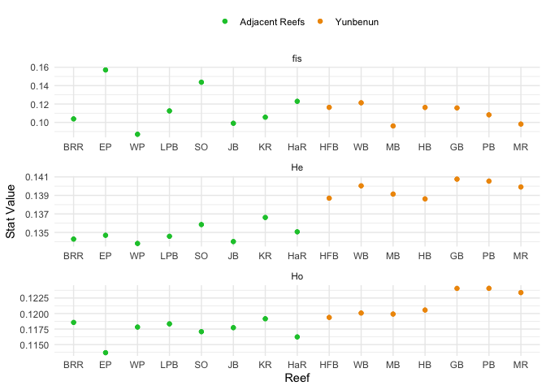
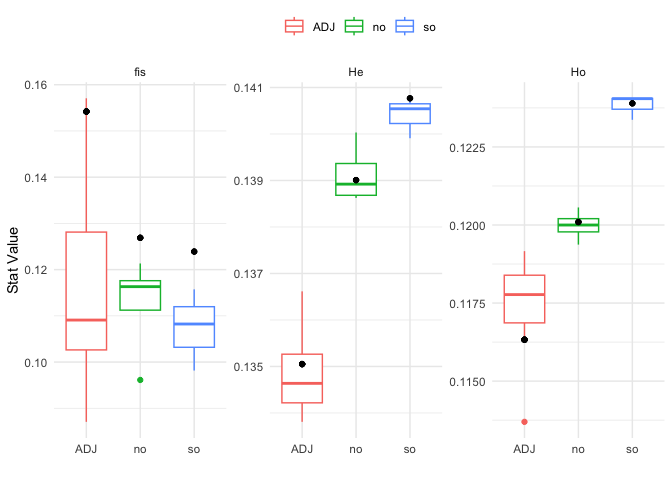

# 4 Genetic Diversity
Sandra Erdmann

# Genetic Diversity

As a starting point for genetic diversity analyses we use the same
filtered set of loci as was used for final population structure
analyses. Specifically;

- These have already been filtered to ensure that they are as reliable
  as possible while being mindful to avoid filters that would distort
  allele frequencies and hence bias genetic diversity estimates. This
  includes the HWE filter

- Individuals with admixture proportions that would indicate that they
  are migrants between MI and “other” populations have been removed.
  This is because these these individuals have uncertain origins (ie
  parents likely from a different reef to where they were found).

- Highly admixed individuals (admixture proportion \> 5%) between the
  two major lineages in this study (ie Maggie vs surrounding reefs) have
  been excluded. See note in the section on population structure about
  this threshold and the relatively small number of individuals it
  excludes.

- Individuals that are likely genetic clones or replicates have been
  removed as these are undesirable in pretty much all analyses.

The starting data satisfying all these criteria is called `ak.pop.nm` as
was created in the `03.population_structure` script

``` r
# Loads ak.pop.nm
load("cache/ak.pop.nm.rdata")
```

## Population groupings

To facilitate diversity statistics we use population groupings following
both known genetic structure and geography. Datasets reflecting these
groupings are;

| Dataset Name    | Grouping                                                  |
|-----------------|-----------------------------------------------------------|
| `ak.pop.nm`     | All sites grouped separately                              |
| `ak.gen.no.so`  | Magnetic Island grouped into North and South              |
| `ak.gen.mi.adj` | All sites grouped into Magnetic Island and Adjacent Reefs |

``` r
# Creation of the `ak.gen.no.so` dataset

if (!file.exists("cache/ak.gen.no.so.rdata")) {
  # Merge subpopulations from north Magnetic Island into one population
  ak.gen.no.so <- gl.merge.pop(ak.pop.nm, old=c("HB", "HFB", "MB", "WB"), new='no')
  # Using this merged dataset, merge also subpopulations from south Magnetic Island into one population. 
  ak.gen.no.so <- gl.merge.pop(ak.gen.no.so, old=c("GB", "MR", "PB"), new='so')
  ak.gen.no.so <- gl.merge.pop(ak.gen.no.so, old=c("SO", "LPB", "EP", "WP", "HaR","BRR", "JB", "KR"), new='ADJ')
  ak.gen.no.so <- gl.filter.monomorphs(ak.gen.no.so)
  ak.gen.no.so <- gl.recalc.metrics(ak.gen.no.so)
  save(ak.gen.no.so,file = "cache/ak.gen.no.so.rdata")
} else {
  load("cache/ak.gen.no.so.rdata")
}
```

``` r
if (!file.exists("cache/ak.gen.mi.adj.rdata")){
  ak.gen.mi.adj <- gl.merge.pop(ak.pop.nm, old=c("GB", "HB", "HFB", "MB", "MR", "PB", "WB"), new='MI')
  ak.gen.mi.adj <- gl.merge.pop(ak.gen.mi.adj, old=c("SO", "LPB", "EP", "WP", "HaR","BRR", "JB", "KR"), new='ADJ')
  ak.gen.mi.adj <- gl.filter.monomorphs(ak.gen.mi.adj)
  ak.gen.mi.adj <- gl.recalc.metrics(ak.gen.mi.adj)
  save(ak.gen.mi.adj,file = "cache/ak.gen.mi.adj.rdata")
  write_rds(ak.gen.mi.adj,file = "basic_stats/ak.gen.mi.adj.rds")
} else {
  load("cache/ak.gen.mi.adj.rdata")
}
```

## Convert to hierfstat format

``` r
# Convert genlight objects to genind format
ak.pop.nm.hfstat <- gl2gi(ak.pop.nm) %>% genind2hierfstat()
ak.gen.no.so.hfstat <- gl2gi(ak.gen.no.so)  %>% genind2hierfstat() 
ak.gen.mi.adj.hfstat <- gl2gi(ak.gen.mi.adj) %>% genind2hierfstat()
write_rds(list(ak.pop.nm.hfstat,ak.gen.no.so.hfstat,ak.gen.mi.adj.hfstat),"basic_stats/hfstat.rds")
```

# Measures of Genetic Diversity as EBVs

Genetic Diversity is one of four EBVs (Essential Biodiversity Variables)
proposed by (Hoban et al. 2022). It is composed of richness and
evenness. Here, we calculate Allelic Richness (Ar) as a measure of
richness and expected heterozygosity (He) as a measure of evenness.

## Allelic richness

Our data comprise a set of biallelic SNPs which means that the maximum
number of alleles at any locus is 2. Allelic richness for the entire
dataset with no subdivisions should be exactly 2 since every SNP must
have exactly 2 alleles in order to be included. Values of AR less than 2
come from the fact that some alleles will be missing when a subsample is
made from the whole. The larger the sample the higher the value of AR so
the `allelic.richness` function from hierfstat is used here. This
calculates a rarefied value (accounting for differences in sample size
between populations).

``` r
# Calculate allelic richness
ar <- allelic.richness(ak.pop.nm.hfstat)
ar.no.so <- allelic.richness(ak.gen.no.so.hfstat)
ar.mi.adj <- allelic.richness(ak.gen.mi.adj.hfstat)
```

``` r
load("cache/sites_data.rdata")
```

``` r
summarise_pops <- function(coltable){
  coltable %>% 
  colMeans(na.rm = TRUE) %>% 
  as.data.frame() %>% 
  rownames_to_column("pop") %>% 
  left_join(sites_data)
}
```

Since Ar is heavily impacted by sample size we avoid super small samples
on individual reefs and report population groupings such as “Adjacent
Reefs”, North and South Maggie.

``` r
ar_means <- (ar.no.so$Ar %>% 
  colMeans(na.rm = TRUE))
data.frame(pop=names(ar_means),Ar = ar_means) %>% knitr::kable()
```

|     | pop |       Ar |
|:----|:----|---------:|
| ADJ | ADJ | 1.652174 |
| so  | so  | 1.546186 |
| no  | no  | 1.543059 |

To formally test whether Ar is higher at adjacent than at Magnetic
Island we use a permutation test. Here this is implemented by randomly
reassigning individuals to populations. To perform this shuffling we ran
1000 iterations with an R script
[basic_stats/run_permute.R](run_permute.R) to perform each iteration.

``` r
if ( file.exists("cache/perm_data.rds")){
# This reads all permutation data. Including for basic stats below
  perm_data <- list.files("basic_stats/perms/",pattern = ".rds",full.names = TRUE) %>% 
    map(read_rds)
  write_rds(perm_data,"cache/perm_data.rds")
} else {
  perm_data <- read_rds("cache/perm_data.rds")
}
```

``` r
m_vs_adj_actual_value <- ar.mi.adj$Ar %>% colMeans(na.rm = TRUE) %>% diff()

mi_adj_ar <- perm_data %>% map(~ colMeans(.x$adj.mi$Ar$Ar)) %>% 
  bind_rows() %>% 
  mutate(diff = abs(MI-ADJ)) 

p_mi_adj_ar <- (mi_adj_ar %>% 
  filter(abs(diff)>abs(m_vs_adj_actual_value)) %>% nrow())/1000
```

``` r
no_vs_so_actual_value <- (ar.no.so$Ar %>% colMeans(na.rm = TRUE))[c("no","so")] %>% diff()
no_so_adj_ar <- perm_data %>% map(~ colMeans(.x$no.so$Ar$Ar)) %>% 
  bind_rows() %>% 
  mutate(no_vs_so = abs(no-so)) %>% 
  mutate(diff = abs(no-so))

p_no_so_ar <- (no_so_adj_ar %>% 
  filter(diff>no_vs_so_actual_value) %>% nrow())/1000
```

This test reveals that the difference between MI and adjacent is highly
significant (p\<0.001) but for the contrast between north and south
magnetic Island it is not.

``` r
data.frame(contrast = c("MI vs ADJ","NO vs SO"), "Ar Diff" = c(m_vs_adj_actual_value,no_vs_so_actual_value), "p-value"=c(p_mi_adj_ar,p_no_so_ar)) %>% knitr::kable()
```

|     | contrast  |    Ar.Diff | p.value |
|:----|:----------|-----------:|--------:|
| MI  | MI vs ADJ | -0.1431219 |   0.000 |
| so  | NO vs SO  |  0.0031274 |   0.462 |

## Heterozygosity

Next we used the `basic.stats` function in `hierfstat` to calculate
expected heterozygosity (He, also called Hs), observed heterozygosity
(Ho) and Fis. `He/Hs` is a measure of genetic evenness. `Fis` is a
measure of heterozygote deficiency. We see that all populations show a
background level of `Fis`

``` r
basic_stats <- basic.stats(ak.pop.nm.hfstat)
basic_stats_adj.no.so <- basic.stats(ak.gen.no.so.hfstat)
basic_stats_adj.mi <- basic.stats(ak.gen.mi.adj.hfstat)
```

``` r
# Assemble all stats into a table averaged by column
assemble_basic_stats <- function(bs){
  ho.stats <- bs$Ho %>% 
    summarise_pops() %>% 
    dplyr::rename(Ho = ".") 

  he.stats <- bs$Hs %>% 
    summarise_pops() %>% 
    dplyr::rename(He = ".") 

  fis.stats <- bs$Fis %>% 
    summarise_pops() %>% 
    dplyr::rename(fis = ".") 

  ho.stats %>% 
    left_join(he.stats) %>% 
    left_join(fis.stats) %>% 
    pivot_longer(all_of(c("He","Ho","fis")), names_to = "stat", values_to = "stat_value")
}

# Gives aggregated values for three main population groupings
allhet.stats_noso <- assemble_basic_stats(basic_stats_adj.no.so) %>% 
  select(no_so_group = pop,stat,stat_value_agg = stat_value)

# Collects aggregated and subdivided values together
allhet.stats <- assemble_basic_stats(basic_stats) %>% 
  mutate(no_so_group = case_when(
    pop_group == "ADJ" ~ "ADJ",
    pop %in% c("PB","GB","MR") ~ "so",
    .default = "no"
  )) %>% left_join(allhet.stats_noso)
```

First plot all stats subdivided by reef

``` r
allhet.stats %>% 
  ggplot(aes(x=reorder(pop,pop_order),y=stat_value)) + 
  geom_point(aes(color=pop_group)) + 
  facet_wrap(~stat, scales="free", ncol=1) +
  geom_point(aes(color=pop_group)) + 
  scale_color_manual(values = pop_colors, labels = pop_names) +
  labs(
    x="Reef",
    y="Stat Value"
  ) +
  theme_minimal() +
  theme(legend.position = "top", legend.title = element_blank()) 
```



Alternatively we can present this as a boxplot

``` r
allhet.stats %>% 
  ggplot(aes(x=no_so_group,y=stat_value)) + 
  geom_boxplot(aes(color=no_so_group)) + 
  geom_point(aes(y=stat_value_agg)) +
  facet_wrap(~stat, scales = "free") +
#  scale_color_manual(values = pop_colors, labels = pop_names) +
  labs(
    x="",
    y="Stat Value"
  ) +
  theme_minimal() +
  theme(legend.position = "top", legend.title = element_blank()) 
```



Permutation tests were also used to calculate significance of
differences for these statistics. This is done on aggregated data,
grouped into ADJ, NO and SO. Note the somewhat unexpected result that
the smaller populations at Magnetic Island show slightly higher observed
heterozygosity (Ho) and lower Fis than the larger Adjacent population.
Note that this effect is numerically very small, and likely reflects
heterozygote excess expected in small populations due to differences in
allele frequencies between sexes as a result of binomial sampling error.
This effect applies equally to self-incompatible hermaphroditic species
(Balloux 2004) such as Acroporid corals and forms the basis of the
heterozygote excess method for calculating Ne (Luikart and Cornuet 1999)

``` r
test_basic_stat <- function(stat){
  actual_values <- basic_stats_adj.mi[[stat]] %>% colMeans(na.rm = TRUE)
  
  mi_adj <- perm_data %>% map(~ colMeans(.x[["adj.mi"]][["basic_stats"]][[stat]])) %>% 
    bind_rows() %>% 
    mutate(diff = abs(MI-ADJ)) 

  p_mi_adj <- (mi_adj %>% 
    filter(abs(diff)>abs(diff(actual_values))) %>% nrow())/1000  
  data.frame(stat,values=paste(actual_values, collapse = ";"),diff = diff(actual_values), "p"=p_mi_adj)
}

test_basic_stat_noso <- function(stat){
  actual_values <- basic_stats_adj.no.so[[stat]] %>% colMeans(na.rm = TRUE)
  
  data_withdiffs <- perm_data %>% map(~ colMeans(.x[["no.so"]][["basic_stats"]][[stat]],na.rm = TRUE)) %>% 
    bind_rows() %>% 
    mutate(adj_no = abs(ADJ-no), adj_so = abs(ADJ-so),no_so = abs(no-so)) 

  pval_adj_no <- (data_withdiffs %>% 
    filter(abs(adj_no)>abs(diff(actual_values[c("ADJ","no")]))) %>% nrow())/1000  

  pval_adj_so <- (data_withdiffs %>% 
    filter(abs(adj_so)>abs(diff(actual_values[c("ADJ","so")]))) %>% nrow())/1000

  pval_no_so <- (data_withdiffs %>% 
    filter(abs(no_so)>abs(diff(actual_values[c("no","so")]))) %>% nrow())/1000
  
  data.frame(stat,contrast = c("adj_no","adj_so","no_so"), "p"=c(pval_adj_no,pval_adj_so,pval_no_so))
}

p_values <- map(c("Hs","Ho","Fis"),test_basic_stat_noso) %>% 
  bind_rows() %>% 
  pivot_wider(names_from = stat,values_from = p)
knitr::kable(p_values)
```

| contrast |    Hs |    Ho |   Fis |
|:---------|------:|------:|------:|
| adj_no   | 0.379 | 0.001 | 0.012 |
| adj_so   | 0.174 | 0.000 | 0.006 |
| no_so    | 0.737 | 0.007 | 0.772 |

``` r
allhet.stats_noso %>% knitr::kable()
```

| no_so_group | stat | stat_value_agg |
|:------------|:-----|---------------:|
| ADJ         | He   |      0.1350517 |
| ADJ         | Ho   |      0.1163246 |
| ADJ         | fis  |      0.1541970 |
| so          | He   |      0.1407675 |
| so          | Ho   |      0.1238963 |
| so          | fis  |      0.1239044 |
| no          | He   |      0.1390088 |
| no          | Ho   |      0.1200954 |
| no          | fis  |      0.1268788 |

## Fixed allelic differences/Private alleles

If we look at private alleles and fixed differences between all pairs of
reefs we see that the number of private alleles strongly reflects the
sample size. We also see a few examples of fixed differences (alternate
alleles fixed in different populations) particularly betwen WP and
Magnetic Island reefs.

``` r
pa_ak.gen <-dartR::gl.report.pa(ak.pop.nm)
```

    Starting :: 
     Starting dartR 
     Starting gl.report.pa 
      Processing genlight object with SNP data
        p1 p2 pop1 pop2 N1 N2 fixed priv1 priv2 Chao1 Chao2 totalpriv   AFD
    1    1  2  BRR   EP 19 94     0    61   976     0    12      1037 0.033
    2    1  3  BRR   GB 19 28     9   998   751     0     4      1749 0.163
    3    1  4  BRR  HaR 19 22     0   394   463     0     0       857 0.039
    4    1  5  BRR   HB 19 22     6  1057   729     0    18      1786 0.166
    5    1  6  BRR  HFB 19 14    12  1176   665     0     0      1841 0.165
    6    1  7  BRR   JB 19 15     0   529   386     0     0       915 0.043
    7    1  8  BRR   KR 19 14     0   564   389     0     2       953 0.044
    8    1  9  BRR  LPB 19 34     0   246   608     0     2       854 0.036
    9    1 10  BRR   MB 19  6    17  1470   511     0     0      1981 0.167
    10   1 11  BRR   MR 19 12    10  1217   641     0     2      1858 0.167
    11   1 12  BRR   PB 19 18     9  1106   706     0     2      1812 0.165
    12   1 13  BRR   SO 19 81     0    72   916     0    24       988 0.033
    13   1 14  BRR   WB 19 17    11  1111   678     0     0      1789 0.165
    14   1 15  BRR   WP 19  8     0   874   211     0     0      1085 0.053
    15   2  3   EP   GB 94 28     5  1481   319    12     4      1800 0.161
    16   2  4   EP  HaR 94 22     0   916    70    12     0       986 0.031
    17   2  5   EP   HB 94 22     4  1561   318    12    18      1879 0.164
    18   2  6   EP  HFB 94 14     5  1706   280    12     0      1986 0.163
    19   2  7   EP   JB 94 15     0  1131    73    12     0      1204 0.037
    20   2  8   EP   KR 94 14     0  1157    67    12     2      1224 0.037
    21   2  9   EP  LPB 94 34     0   649    96    12     2       745 0.026
    22   2 10   EP   MB 94  6     8  2083   209    12     0      2292 0.166
    23   2 11   EP   MR 94 12     5  1762   271    12     2      2033 0.165
    24   2 12   EP   PB 94 18     5  1625   310    12     2      1935 0.163
    25   2 13   EP   SO 94 81     0   287   216    12    24       503 0.020
    26   2 14   EP   WB 94 17     5  1643   295    12     0      1938 0.163
    27   2 15   EP   WP 94  8     0  1603    25    12     0      1628 0.047
    28   3  4   GB  HaR 28 22    11   719  1035     4     0      1754 0.163
    29   3  5   GB   HB 28 22     0   343   262     4    18       605 0.040
    30   3  6   GB  HFB 28 14     0   433   169     4     0       602 0.040
    31   3  7   GB   JB 28 15    10   821   925     4     0      1746 0.163
    32   3  8   GB   KR 28 14     6   832   904     4     2      1736 0.164
    33   3  9   GB  LPB 28 34     6   577  1186     4     2      1763 0.162
    34   3 10   GB   MB 28  6     0   804    92     4     0       896 0.055
    35   3 11   GB   MR 28 12     0   495   166     4     2       661 0.043
    36   3 12   GB   PB 28 18     0   366   213     4     2       579 0.036
    37   3 13   GB   SO 28 81     4   358  1449     4    24      1807 0.161
    38   3 14   GB   WB 28 17     0   409   223     4     0       632 0.042
    39   3 15   GB   WP 28  8    13  1080   664     4     0      1744 0.166
    40   4  5  HaR   HB 22 22     7  1103   706     0    18      1809 0.166
    41   4  6  HaR  HFB 22 14    13  1217   637     0     0      1854 0.165
    42   4  7  HaR   JB 22 15     0   588   376     0     0       964 0.042
    43   4  8  HaR   KR 22 14     0   600   356     0     2       956 0.043
    44   4  9  HaR  LPB 22 34     0   263   556     0     2       819 0.035
    45   4 10  HaR   MB 22  6    22  1516   488     0     0      2004 0.168
    46   4 11  HaR   MR 22 12    15  1270   625     0     2      1895 0.167
    47   4 12  HaR   PB 22 18    10  1146   677     0     2      1823 0.164
    48   4 13  HaR   SO 22 81     0    81   856     0    24       937 0.032
    49   4 14  HaR   WB 22 17    14  1170   668     0     0      1838 0.165
    50   4 15  HaR   WP 22  8     0   942   210     0     0      1152 0.052
    51   5  6   HB  HFB 22 14     0   374   191    18     0       565 0.040
    52   5  7   HB   JB 22 15     9   803   988    18     0      1791 0.166
    53   5  8   HB   KR 22 14     5   819   972    18     2      1791 0.167
    54   5  9   HB  LPB 22 34     6   572  1262    18     2      1834 0.165
    55   5 10   HB   MB 22  6     0   745   114    18     0       859 0.053
    56   5 11   HB   MR 22 12     0   436   188    18     2       624 0.044
    57   5 12   HB   PB 22 18     0   330   258    18     2       588 0.041
    58   5 13   HB   SO 22 81     5   352  1524    18    24      1876 0.164
    59   5 14   HB   WB 22 17     0   334   229    18     0       563 0.037
    60   5 15   HB   WP 22  8    12  1063   728    18     0      1791 0.169
    61   6  7  HFB   JB 14 15    12   740  1108     0     0      1848 0.166
    62   6  8  HFB   KR 14 14    10   755  1091     0     2      1846 0.167
    63   6  9  HFB  LPB 14 34    11   519  1392     0     2      1911 0.164
    64   6 10  HFB   MB 14  6     0   584   136     0     0       720 0.055
    65   6 11  HFB   MR 14 12     0   335   270     0     2       605 0.048
    66   6 12  HFB   PB 14 18     0   242   353     0     2       595 0.043
    67   6 13  HFB   SO 14 81     7   314  1669     0    24      1983 0.163
    68   6 14  HFB   WB 14 17     0   245   323     0     0       568 0.042
    69   6 15  HFB   WP 14  8    22   965   813     0     0      1778 0.168
    70   7  8   JB   KR 15 14     0   501   469     0     2       970 0.047
    71   7  9   JB  LPB 15 34     0   223   728     0     2       951 0.039
    72   7 10   JB   MB 15  6    22  1369   553     0     0      1922 0.167
    73   7 11   JB   MR 15 12    13  1129   696     0     2      1825 0.167
    74   7 12   JB   PB 15 18    13  1034   777     0     2      1811 0.165
    75   7 13   JB   SO 15 81     0    73  1060     0    24      1133 0.036
    76   7 14   JB   WB 15 17    13  1049   759     0     0      1808 0.165
    77   7 15   JB   WP 15  8     0   796   276     0     0      1072 0.054
    78   8  9   KR  LPB 14 34     0   217   754     2     2       971 0.041
    79   8 10   KR   MB 14  6    19  1357   573     2     0      1930 0.169
    80   8 11   KR   MR 14 12     9  1116   715     2     2      1831 0.168
    81   8 12   KR   PB 14 18     9  1013   788     2     2      1801 0.167
    82   8 13   KR   SO 14 81     0    79  1098     2    24      1177 0.038
    83   8 14   KR   WB 14 17     8  1037   779     2     0      1816 0.167
    84   8 15   KR   WP 14  8     0   788   300     2     0      1088 0.055
    85   9 10  LPB   MB 34  6    16  1708   387     2     0      2095 0.166
    86   9 11  LPB   MR 34 12    10  1434   496     2     2      1930 0.166
    87   9 12  LPB   PB 34 18     8  1314   552     2     2      1866 0.164
    88   9 13  LPB   SO 34 81     0   110   592     2    24       702 0.027
    89   9 14  LPB   WB 34 17     9  1333   538     2     0      1871 0.164
    90   9 15  LPB   WP 34  8     0  1133   108     2     0      1241 0.049
    91  10 11   MB   MR  6 12     0   166   549     0     2       715 0.056
    92  10 12   MB   PB  6 18     0   122   681     0     2       803 0.053
    93  10 13   MB   SO  6 81     9   250  2053     0    24      2303 0.166
    94  10 14   MB   WB  6 17     0   126   652     0     0       778 0.053
    95  10 15   MB   WP  6  8    29   720  1016     0     0      1736 0.169
    96  11 12   MR   PB 12 18     0   203   379     2     2       582 0.046
    97  11 13   MR   SO 12 81     8   297  1717     2    24      2014 0.165
    98  11 14   MR   WB 12 17     0   238   381     2     0       619 0.046
    99  11 15   MR   WP 12  8    21   915   828     2     0      1743 0.169
    100 12 13   PB   SO 18 81     7   343  1587     2    24      1930 0.163
    101 12 14   PB   WB 18 17     0   326   293     2     0       619 0.044
    102 12 15   PB   WP 18  8    16  1012   749     2     0      1761 0.168
    103 13 14   SO   WB 81 17     7  1605   328    24     0      1933 0.163
    104 13 15   SO   WP 81  8     0  1539    32    24     0      1571 0.048
    105 14 15   WB   WP 17  8    20   991   761     0     0      1752 0.167
      Table of private alleles and fixed differences returned
    Completed: :: 
     Completed: dartR 
     Completed: gl.report.pa 

When running this on amalgamated populations we now see no fixed
differences between MI and ADJ but plenty of private alleles.
Interestingly if we break up MI into no and so there are 2 loci fixed
between no and ADJ.

``` r
pa_ak.gen.mi <- gl.report.pa(ak.gen.mi.adj)
```

    Starting gl.report.pa 
      Processing genlight object with SNP data
      p1 p2 pop1 pop2  N1  N2 fixed priv1 priv2 Chao1 Chao2 totalpriv  AFD asym
    1  1  2  ADJ   MI 287 117     0  1195   256    18    15      1451 0.16   NA
      asym.sig
    1       NA
      Table of private alleles and fixed differences returned
    Completed: gl.report.pa 

``` r
pa_ak.gen.no.so <- gl.report.pa(ak.gen.no.so)
```

    Starting gl.report.pa 
      Processing genlight object with SNP data
      p1 p2 pop1 pop2  N1 N2 fixed priv1 priv2 Chao1 Chao2 totalpriv   AFD asym
    1  1  2  ADJ   so 287 58     0  1423   210    18    14      1633 0.160   NA
    2  1  3  ADJ   no 287 59     2  1408   193    18     4      1601 0.161   NA
    3  2  3   so   no  58 59     0   276   274    14     4       550 0.027   NA
      asym.sig
    1       NA
    2       NA
    3       NA
      Table of private alleles and fixed differences returned
    Completed: gl.report.pa 

# 

<div id="refs" class="references csl-bib-body hanging-indent">

<div id="ref-Balloux2004-yn" class="csl-entry">

Balloux, François. 2004. “Heterozygote Excess in Small Populations and
the Heterozygote-Excess Effective Population Size.” *Evolution* 58 (9):
1891–900.

</div>

<div id="ref-Hoban2022-ek" class="csl-entry">

Hoban, Sean, Frederick I Archer, Laura D Bertola, et al. 2022. “Global
Genetic Diversity Status and Trends: Towards a Suite of Essential
Biodiversity Variables (EBVs) for Genetic Composition.” *Biol. Rev.
Camb. Philos. Soc.* 97 (4): 1511–38.

</div>

<div id="ref-Luikart1999-yh" class="csl-entry">

Luikart, G, and J M Cornuet. 1999. “Estimating the Effective Number of
Breeders from Heterozygote Excess in Progeny.” *Genetics* 151 (3):
1211–16.

</div>

</div>
