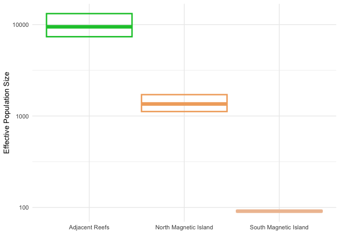
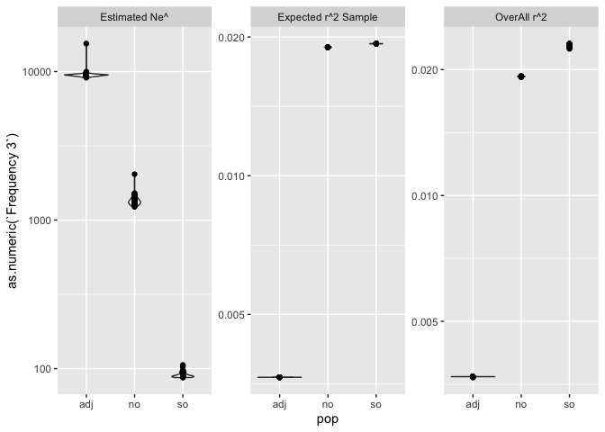

# 5 Ne Estimates
Sandra Erdmann and Ira Cooke

# Effective Population Size

Here we use the LD method implemented in Neestimator2 to estimate
effective population size. This method is based on the fact that as Ne
becomes small even a perfect random-mating population will experience
some inbreeding and this will induce LD. A key assumption of the method
is that the pairs of loci used for this calculation are on separate
chromosomes because we do not want to include LD due to physical
linkage.

Although the original Neestimator2 program doesn’t appear to be
maintained (DNS error attempting to access
<http://www.molecularfisherieslaboratory.com.au/>) a binary is
distributed with the [RLDNe
software](https://github.com/zakrobinson/RLDNe)

Sources of bias

- Age structure downward bias as it can introduce a form of Wahlund
  effect \[@Waples2014-ge\]
- Similarly, individuals from distinct populations are combined into the
  same population this is a classic Wahlund effect and will also
  downwardly bias Ne estimates \[@Kardos2025-ol\]
- Migration can cause upward bias (due to additional parents) and
  downward bias (due to mixture LD), however a simulation study by
  \[@Waples2011-vd\] showed that the LDNe method is generally robust to
  migration as long as it is less than about 5-10% per generation.

Thus we start by installing this package

The path to the NE estimator binary can be obtained as follows (adjust
if not using a mac)

Choice of loci and individuals for Ne estimation follows similar
principles to that of genetic diversity estimates. Thus we can use the
`ak.pop.nm` dataset as a starting point. This is the cleaned dataset
created in [03.population_structure](03.population_structure.md) in
which;

- HWE filtering has been applied
- Migrants and highly admixed individuals have been removed

## Adding chromosome information

To avoid pairing loci on the same chromosome we need to include
chromosome info in our genlight object. This info is available in the
vcf generated via `dart2vcf` in
[01.data_wrangling_and_filtering](01.data_wrangling_and_filtering.md).
To include it we need to generate a vcf with only our loci and
individuals from the `ak.pop.nm` data.

A vcf with these loci and individuals is then created using the script
`dart2vcf/07.filter4.sh`

## Merging populations

Estimation of Ne from LD information benefits from larger sample sizes,
especially when the actual value of Ne is large. We therefore merged
populations into the following units

| Merged Unit | Sampling Locations             | Sample Size |
|-------------|--------------------------------|-------------|
| no          | “HB”, “HFB”, “MB”, “WB”        | 59          |
| so          | “GB”, “MR”, “PB”               | 58          |
| MS          | “BRR”, “JB”, “KR”              | 48          |
| PI          | “SO”, “LPB”, “EP”, “HaR”, “WP” | 239         |

Ne estimates for Midshelf (almost offshore) reefs are astronomically
high and upper confidence intervals are Inf (not estimable). This is
probably due to a combination of low sample size and high Ne leading to
poor estimates. Therefore we combine MS and PI into one population
(Adjacent reefs). So now our populations are

| Merged Unit | Sampling Locations                                | Sample Size |
|-------------|---------------------------------------------------|-------------|
| no          | “HB”, “HFB”, “MB”, “WB”                           | 59          |
| so          | “GB”, “MR”, “PB”                                  | 58          |
| ADJ         | “SO”, “LPB”, “EP”, “HaR”, “WP”, “BRR”, “JB”, “KR” | 287         |

### Ne North and South Magnetic Island vs Adjacent reefs

Running LDNe on the full dataset (all 404) individuals yields the
following values.

| pop | r2 | r2_exp | ne | ne_min | ne_max | r2_nos | r2_nos_exp | ne_nos | ne_nos_min | ne_nos_max | pop_name |
|:---|---:|---:|---:|---:|---:|---:|---:|---:|---:|---:|:---|
| ADJ | 0.003674 | 0.003638 | 9459.8 | 7368.8 | 13185.4 | 0.003693 | 0.003676 | 18675.1 | 14556.7 | 26021.9 | Adjacent Reefs |
| SO | 0.022567 | 0.018988 | 91.0 | 89.5 | 92.6 | 0.021905 | 0.019069 | 115.4 | 113.5 | 117.3 | South Magnetic Island |
| NO | 0.018904 | 0.018659 | 1354.6 | 1119.3 | 1713.0 | 0.018936 | 0.018692 | 1364.1 | 1173.0 | 1628.3 | North Magnetic Island |

The NEEstimator software provides parametric and pseudo-jackknife
methods to provide confidence intervals on Ne estimates. Since we have
plenty of computational power we performed a full Jackknife on samples
(removing each sample successively). This gives wider confidence
intervals but is probably more realistic. The Jackknife estimate
required running LDNe 404 times (one for each sample). Scripts to submit
each sample as a standalone job are found in the [ne](ne) subdirectory.

The plots below show that estimated Ne, and r2 values were fairly
consistent across runs but most highly variable for the larger ADJ
population.

We report the mean of these key statistics (Ne, r2 and expected r2).

    # A tibble: 3 × 4
      pop       ne      r2  r2_exp
      <chr>  <dbl>   <dbl>   <dbl>
    1 adj   9505.  0.00369 0.00365
    2 no    1352.  0.0193  0.0190 
    3 so      91.3 0.0229  0.0193 

And also report the upper and lower jackknife confidence intervals for
ADJ, no and so.

    # A tibble: 3 × 6
      pop   jkmean jkvar jk_se jk_low jk_high
      <chr>  <dbl> <dbl> <dbl>  <dbl>   <dbl>
    1 adj   9494.   1.27  2.10 2217.   40657.
    2 no    1348.   1.15  1.76  446.    4079.
    3 so      91.1  1.06  1.46   43.6    190.
