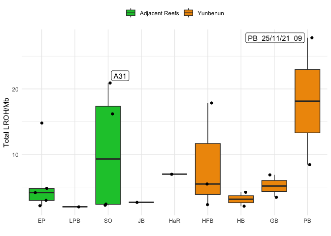
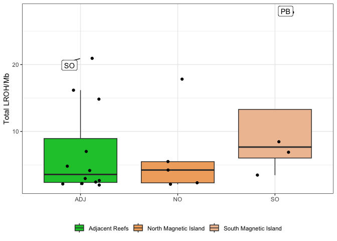
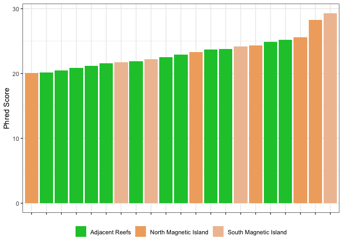

# 6 Long Runs of Homozygosity
Ira Cooke

This analysis must be performed from a vcf file as it requires genomic
positions to be mapped. Crucially, the analysis also makes use of
estimated allele frequencies so we must run it separately for Magnetic
Island and Palms populations. Therefore we used the same filtered
dataset as was used for Ne and genetic diversity analyses (same loci and
individuals).

First setup data we need

``` bash
cd lroh
ln -s ../dart2vcf/ak.pop.nm.ind.vcf.gz .
cat id2pops.txt |awk '$2=="ADJ"{print $1}' > palms_ancestry.txt
cat id2pops.txt |awk '$2=="MI"{print $1}' > maggie_ancestry.txt
```

Now run `bcftools roh` to look for runs of homozygosity

    bcftools roh -S palms_ancestry.txt -G30 --estimate-AF "GT,-" -O r ak.pop.nm.ind.vcf.gz | awk '$8>3' > palms_roh.tsv
    bcftools roh -S maggie_ancestry.txt -G30 --estimate-AF "GT,-" -O r ak.pop.nm.ind.vcf.gz | awk '$8>3' > maggie_roh.tsv

This analysis reveals runs of homozygosity in a high proportion of
samples. The total proportion of the genome in ROH is typically low
\<1Mb = 0.2% but in some individuals is up to 20MB ~ 4%. Interestingly
the individuals with the highest ROH occur in Geoffrey Bay and Picnic
Bay, the two south Maggie Sites where we see very low Ne. While there
are also a few individuals with similarly high LROH in the Palms group
this probably reflects the very high sample size there.



Instead of breaking this down by sampling location we can instead just
look by key locations where we found differences in Ne. Here we see that
the mean LROH follows the inverse trend to Ne



    Analysis of Variance Table

    Response: tot_len
              Df     Sum Sq    Mean Sq F value Pr(>F)
    mi_no_adj  2 7.9486e+13 3.9743e+13  0.7073 0.5062
    Residuals 18 1.0115e+15 5.6194e+13               

    Analysis of Variance Table

    Response: tot_len
              Df     Sum Sq    Mean Sq F value Pr(>F)
    mi_adj     1 1.7939e+13 1.7939e+13  0.3176 0.5796
    Residuals 19 1.0730e+15 5.6476e+13               

It is difficult to know what threshold to filter these ROH. Our power to
detect ROH is quite low due to the sparsity of markers. If we filter to
only the most significant ROH these are found in just two individuals in
South Magnetic Island. One way to work around this is to test whether a
list of ROH is enriched in entries from Magnetic Island. For this we use
the mHG package following the method of Eden 2007 Eden, E. (2007).
Discovering Motifs in Ranked Lists of DNA Sequences. Haifa. Retrieved
from http://bioinfo.cs.technion.ac.il/people/zohar/thesis/eran.pdf
(pages 10-12, 18-20). Since there are potentially multiple ROH per
individual we choose only the mighest PHRED scoring ROH per individual
for this test.




    data:  
    mHG = 0.19048, N = 21, B = 4, n_max = 21, p-value = 0.4035
