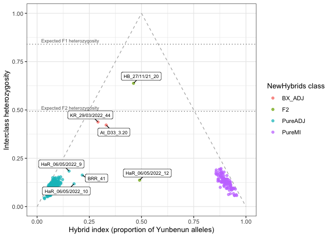
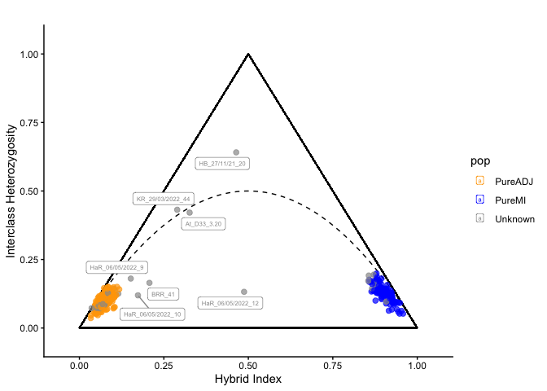

# 7 Tests of hybridisation
Ira Cooke

## Formal classification of hybrids with NewHybrids

Admixture proportions provide an indication that individuals have mixed
ancestry, and therefore might be hybrids, however this analysis cannot
distinguish different types of hybrids that have the same admixture
proportion. This can be done via an analysis that includes information
on heterozygosity. To formally classify these individuals we used
NewHybrids (Anderson & Thompson 2002, Genetics 160:1217-1229), which
computes the posterior probability that each individual belongs to one
of six genealogical classes: pure Magnetic Island, pure adjacent, F1,
F2, backcross to Magnetic Island, or backcross to adjacent.

As input we selected the 200 loci with the highest allele frequency
differential between the two parental groups (differentials 0.73-1.0).
Parental reference groups were defined as individuals sampled at
Magnetic Island sites with \>=99% C1 ancestry (n=110) or at adjacent
sites with \<=1% C1 ancestry (n=279); these were anchored to their
parental class with NewHybrids z flags. The remaining 38 individuals
(putative hybrids, migrants, and individuals with low-level admixture)
were left unassigned for classification.

NewHybrids was compiled from source (commit `6fc8fd9`) and run with the
standard two-generation genotype frequency classes, Jeffreys priors, and
a burn-in of 10,000 sweeps followed by 20,000 sweeps of sampling. To
check MCMC convergence we ran three independent chains with different
random seeds (outputs in `hybrids/`, `hybrids/run2/` and
`hybrids/run3/`).

``` bash

../newhybrids/newhybsng -d nhyb.txt -c ../newhybrids/TwoGensGtypFreq.txt \
  -s 5723 8121 --burn-in 10000 --num-sweeps 20000 --no-gui

# Two further chains with different seeds for convergence checking
(mkdir -p run2; cd run2; ../../newhybrids/newhybsng -d ../nhyb.txt \
  -c ../../newhybrids/TwoGensGtypFreq.txt -s 3391 7254 \
  --burn-in 10000 --num-sweeps 20000 --no-gui)
(mkdir -p run3; cd run3; ../../newhybrids/newhybsng -d ../nhyb.txt \
  -c ../../newhybrids/TwoGensGtypFreq.txt -s 912 6488 \
  --burn-in 10000 --num-sweeps 20000 --no-gui)
```

### MCMC convergence

Posterior probabilities agree closely across the three independent
chains and no individual changes its modal class, indicating the results
are not sensitive to MCMC starting conditions.

    [1] 0.00353

    [1] TRUE

The table below shows NewHybrids classifications for the 7 individuals
flagged as highly admixed (\>5% minor ancestry) by the crude approach
used in [03.population_structure](03.population_structure.md)

| ID                | pop | minor_p | nh_class | nh_maxp |  F1 |  F2 | BX_MI | BX_ADJ |
|:------------------|:----|--------:|:---------|--------:|----:|----:|------:|-------:|
| HB_27/11/21_20    | HB  |   0.478 | F2       |   1.000 |   0 |   1 |     0 |  0.000 |
| HaR_06/05/2022_12 | HaR |   0.460 | F2       |   1.000 |   0 |   1 |     0 |  0.000 |
| At_D33_3.20       | EP  |   0.319 | BX_ADJ   |   1.000 |   0 |   0 |     0 |  1.000 |
| KR_29/03/2022_44  | KR  |   0.291 | BX_ADJ   |   1.000 |   0 |   0 |     0 |  1.000 |
| BRR_41            | BRR |   0.160 | PureADJ  |   0.893 |   0 |   0 |     0 |  0.107 |
| HaR_06/05/2022_10 | HaR |   0.153 | PureADJ  |   1.000 |   0 |   0 |     0 |  0.000 |
| HaR_06/05/2022_9  | HaR |   0.060 | PureADJ  |   1.000 |   0 |   0 |     0 |  0.000 |

Key findings from this analysis are:

1.  No individuals were classified as F1. The two individuals with
    admixture proportions near 0.5 were classified as F2 with posterior
    probability 1.0. This implies that first-generation hybrids existed
    and successfully reproduced. The triangle plot below shows that one
    of these two is in fact better described as a later-generation
    hybrid.
2.  Two individuals with intermediate admixture (0.29-0.32) were
    classified as backcrosses to the adjacent population.
3.  Individuals with minor ancestry fractions between 5% and 16% were
    classified as pure rather than as recent backcrosses, consistent
    with this low-level signal reflecting older introgression rather
    than recent hybridisation. The only ambiguous individual was BRR_41
    (posterior 0.89 pure adjacent, 0.11 backcross).
4.  All migrants were classified as pure representatives of their
    genetic (rather than geographic) population, and all remaining
    unassigned individuals were classified as pure with posterior
    probability ~1.

### Triangle plot

As a visual check that does not depend on the NewHybrids model we
plotted the hybrid index (the proportion of an individual’s alleles that
are of Magnetic Island origin) against interclass heterozygosity (the
proportion of diagnostic loci at which the individual is heterozygous),
using the same 200 loci supplied to NewHybrids. In this space the
genealogical classes occupy predictable positions: pure individuals sit
in the bottom corners, F1s at the apex (hybrid index 0.5 and maximal
heterozygosity, because an F1 receives one gamete from each gene pool),
F2s near hybrid index 0.5 but with roughly half the heterozygosity of an
F1, and first-generation backcrosses midway along the upper edges.

Because our loci are not perfectly fixed between the parental groups
(allele frequency differentials 0.73-1.0) and the parental groups retain
within-population variation, observed values are compressed relative to
the theoretical triangle. We therefore compute the heterozygosity
expected for each genealogical class at these particular loci from the
parental allele frequencies, which provides the relevant set of
references rather than the idealised values of 1 and 0.5. Note that the
F2 and backcross classes have almost identical expected heterozygosity,
so within the upper part of the triangle it is the hybrid index rather
than heterozygosity that separates them.

         F1      F2   BX_MI  BX_ADJ  PureMI PureADJ 
      0.840   0.493   0.502   0.483   0.165   0.126 



The plot corroborates the backcross calls and the pure assignments, but
also shows that the two individuals assigned to F2 are very different
from one another, a distinction that the six-class NewHybrids model
cannot express. Genotype counts at the diagnostic loci (polarised so
that `hom_MI` denotes homozygosity for the Magnetic Island allele) make
the difference explicit.

            HB_27/11/21_20 HaR_06/05/2022_12 KR_29/03/2022_44 At_D33_3.20
    hom_ADJ             43                71               94          88
    het                125                22               84          81
    hom_MI              28                68               14          23
    <NA>                 4                39                8           8


        Chi-squared test for given probabilities

    data:  table(factor(dos_nh["HB_27/11/21_20", ], levels = 0:2))
    X-squared = 17.173, df = 2, p-value = 0.0001866

1.  **HB_27/11/21_20** is an early-generation hybrid, with a hybrid
    index of 0.46 and heterozygosity of 0.64, far above either pure
    cluster. The 70 loci at which it is homozygous exclude an F1, which
    should be heterozygous at essentially every diagnostic locus, and
    this is why NewHybrids assigns it to F2 with posterior probability
    1.0. Its heterozygosity nevertheless exceeds the F2 expectation of
    0.49, and its genotype counts of 43 : 126 : 27 depart significantly
    from the 1 : 2 : 1 ratio expected from an intercross (p = 9e-05)
    through an excess of heterozygotes. We therefore describe it as an
    early-generation hybrid that is close to, but not a clean fit for,
    F2. Because NewHybrids does not model genotyping error, and allelic
    dropout in DArT data inflates apparent homozygosity, the exclusion
    of F1 for this individual should be regarded as provisional.
2.  The two backcrosses, **KR_29/03/2022_44** and **At_D33_3.20**, fall
    along the adjacent-side edge of the triangle with hybrid indices of
    0.30 and 0.32 and heterozygosities of 0.44 and 0.41, both near the
    expected value of 0.49 for a cross between an F1 and a pure adjacent
    individual. Their genotype counts (92 : 84 : 16 and 91 : 79 : 23)
    show the expected pattern of roughly half heterozygous calls with
    almost all remaining calls homozygous for the adjacent allele.
3.  **HaR_06/05/2022_12** has a hybrid index of 0.49 but heterozygosity
    of only 0.13, matching the expectation for a pure individual
    (0.13-0.16) rather than the 0.49 expected for an F2. Its genotypes
    (71 : 21 : 69) show alternative parental alleles fixed at different
    loci rather than combined within loci. This is the signature of a
    later-generation hybrid (F3 or beyond, possibly with some
    inbreeding), in which recombination and drift have homozygosed
    ancestry blocks while preserving an even overall ancestry ratio.
    NewHybrids assigns this individual to F2 with posterior probability
    1.0 only because F2 is the sole class in its two-generation model
    that permits appreciable frequencies of both homozygote types; there
    is no later-generation category available to it. This individual
    also has the highest missingness of the four (39 of 200 loci
    uncalled), though not enough to account for the pattern.
4.  **BRR_41** falls at the fringe of the pure adjacent cluster (hybrid
    index 0.22, heterozygosity 0.17), consistent with its split
    posterior of 0.89 pure adjacent and 0.11 backcross.

We therefore describe HB_27/11/21_20 as an early-generation hybrid and
HaR_06/05/2022_12 as a later-generation hybrid, rather than assigning
both strictly to F2.

## Independent check with triangulaR

As an independent check on the calculations above we repeated the hybrid
index and interclass heterozygosity analysis with the triangulaR package
(Wiens, DeCicco & Colella 2025, Heredity 134:251-262). triangulaR
selects ancestry-informative markers (AIMs) by allele frequency
difference between two parental reference populations, then computes
each individual’s hybrid index and interclass heterozygosity at those
markers. It does not perform model-based classification, so we use it to
verify that the genotype summaries underlying our interpretation of the
NewHybrids results are robust to an independent implementation and locus
panel.

We used the same parental reference groups as for NewHybrids (PureMI and
PureADJ, with the remaining 38 individuals left as Unknown) and an
allele frequency difference threshold of 0.73, matching the differential
range (0.73-1.0) spanned by the 200-locus NewHybrids panel. triangulaR
expects data in vcfR format, so we first convert the genlight object in
memory (REF/ALT are placeholders since only the genotype codes are
used).

    [1] "198 sites passed allele frequency difference threshold"

    [1] 198

    [1] "calculating hybrid indices and heterozygosities based on 198 sites"

195 loci passed the threshold, all of which are in the NewHybrids panel
(the small shortfall relative to 200 reflects the per-group call-count
filter and top-200 ranking used when building the NewHybrids input,
which triangulaR does not apply). The hybrid index and heterozygosity
values agree almost exactly with our manual calculation on the 200-locus
panel (r \> 0.99 for both; maximum absolute difference \<= 0.02).

         cor_hi   cor_het max_diff_hi max_diff_het
    1 0.9999833 0.9978648 0.009546602  0.009798432

In the plot we label the 7 individuals flagged as highly admixed (\>5%
minor ancestry) in
[03.population_structure](03.population_structure.md). `triangle.plot`
labels every individual when `ind.labels = TRUE`, so we blank the ids of
all others (ggrepel skips empty labels).



The dashed curve is the heterozygosity expected under Hardy-Weinberg
proportions at each hybrid index. The triangulaR values for the
individuals highlighted in the NewHybrids analysis reproduce the pattern
described above:

| id                | nh_class | nh_maxp | hybrid.index | heterozygosity | perc.missing |
|:------------------|:---------|--------:|-------------:|---------------:|-------------:|
| HaR_06/05/2022_12 | F2       |   1.000 |        0.487 |          0.132 |        0.197 |
| HB_27/11/21_20    | F2       |   1.000 |        0.464 |          0.641 |        0.015 |
| At_D33_3.20       | BX_ADJ   |   1.000 |        0.326 |          0.421 |        0.040 |
| KR_29/03/2022_44  | BX_ADJ   |   1.000 |        0.289 |          0.432 |        0.040 |
| BRR_41            | PureADJ  |   0.893 |        0.207 |          0.165 |        0.111 |

The triangulaR analysis corroborates the conclusions drawn from
NewHybrids and the manual triangle plot: HB_27/11/21_20 sits high above
the pure clusters (heterozygosity 0.64 at hybrid index 0.46), consistent
with an early-generation hybrid; the two backcrosses to the adjacent
population lie on the adjacent-side limb near the Hardy-Weinberg curve;
HaR_06/05/2022_12 combines an intermediate hybrid index (0.49) with
pure-level heterozygosity (0.13), the signature of a later-generation
hybrid; and BRR_41 falls at the fringe of the pure adjacent cluster. As
before, the pure clusters do not sit exactly at hybrid index 0 and 1
because the AIMs are not perfectly fixed between the parental groups.
