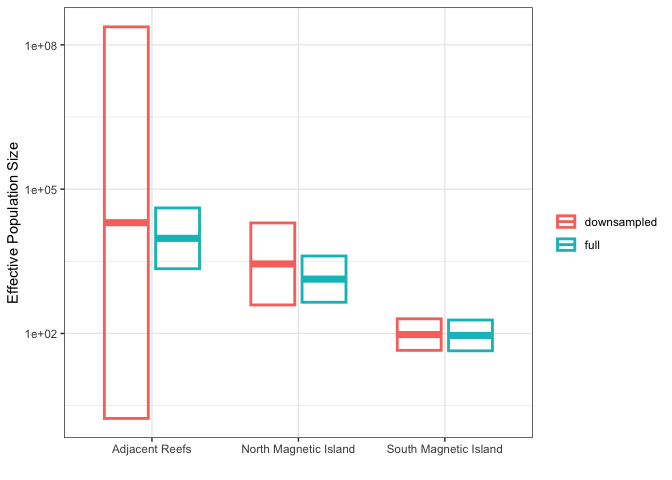
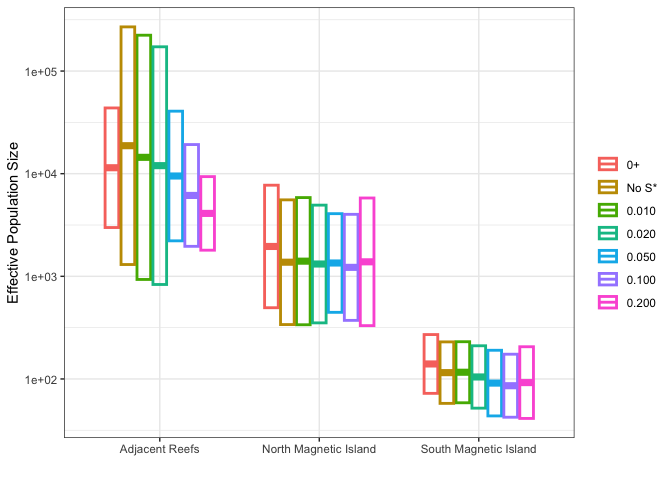
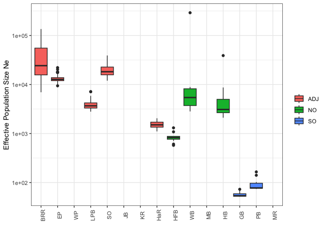
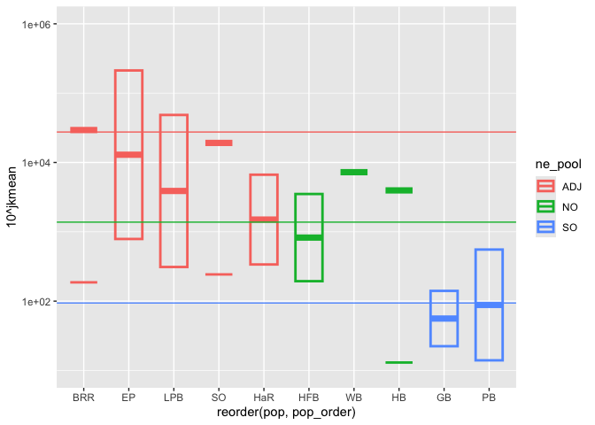
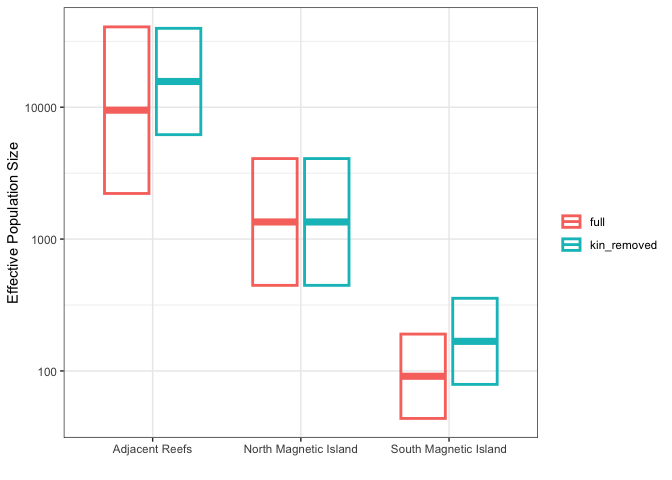
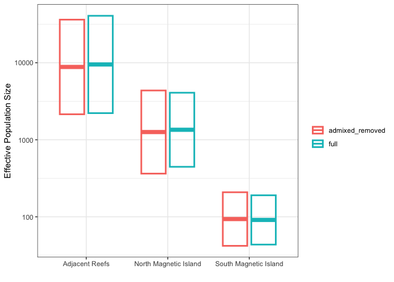
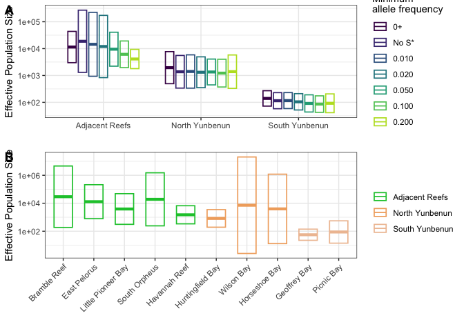
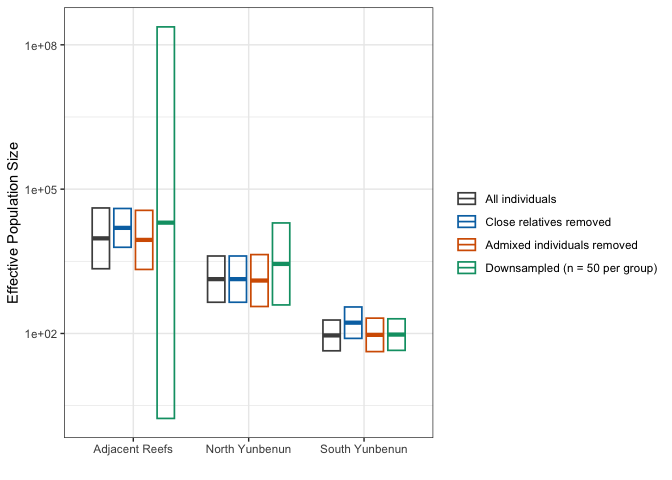

# 8 Sensitivity Analysis for Ne
Ira Cooke

## Downsampling

Our estimates are based on three population groupings which we justified
based on population structure analysis showing that adjacent was largely
panmictic whereas Magnetic Island had some North/South structure.

Sample sizes are as follows;


    adj  so  no 
    287  58  59 

The sample size for the adjacent population is far larger. To assess
whether this imbalance affects our Ne estimates we downsample all three
groupings to a little less than the size of the smallest (SO, n = 58,
downsampled to 50), giving a balanced dataset of 150 individuals.
Individuals are drawn at random without replacement within each
grouping. We retain the full locus set (`mono.rm = FALSE`) so that any
change in Ne is attributable to sample size rather than to a different
set of loci.


    adj  so  no 
     50  50  50 

Note that reducing the sample size inevitably renders some loci
monomorphic (266 of 3411 here). These are uninformative for LD-based Ne
and are ignored by NeEstimator, so the balanced analysis is based on
slightly fewer polymorphic loci than the full analysis.

For this balanced analysis we performed the manual Jackknife procedure
just as we did for the results presented in the paper (including all
individuals), leaving out one individual at a time across all 150 jobs
of the balanced grid (`ne/03.jackknife_ds.sh`).

With balanced sample sizes the point estimates stay within the same
broad ranges, but the jackknife intervals widen substantially for the
two larger groupings.



## Different allele-frequency thresholds

When calculating Ne using the LD method it is common practice to remove
rare alleles because these can inflate estimates of r2 which in turn
leads to depressed estimates of Ne. We used a threshold of 5%, removing
any alleles below this frequency. Here we test the impact of a range of
thresholds including this value and spanning from no filter (“0+”) to an
extremely aggressive filter (\>0.2).

Results show that for the Yunbenun populations there is very little
impact of allele-frequency thresholds. In the adjacent population we see
lower Ne estimates both for the 0+ filter and for very aggressive
filters but this all falls within the margin of error and does not
change the overall conclusions.



## Alternative pooling schemes

To demonstrate that our overall results regarding Ne at Adjacent, North
Yunbenun and South Yunbenun are robust to pooling strategy we provide
results here for unpooled samples. Each sampling site (reef) is treated
separately.

All sites separated (no pooling) which results in the following sample
sizes per site.


    BRR  EP  GB HaR  HB HFB  JB  KR LPB  MB  MR  PB  SO  WB  WP 
     19  94  28  22  22  14  15  14  34   6  12  18  81  17   8 

We exported all data for manual Jackknife sampling to make it comparable
with results in our paper. Estimation failed to give a finite value for
sites with very low sample sizes (\<15) but for those sites that
succeeded we can see that the individual site values are comparable to
those for pooled groups, Adjacent, North Yunbenun and South Yunbenun.





## Sensitivity to close relative inclusion

Previously we identified 8 individuals involved in 13 close relative
pairs ((1/(2^(9/2))) \> relatedness \< 0.35) that could be excluded to
remove all such close relative relationships. These were retained in the
main analysis. Here we exclude them to see if this has any impact on Ne
estimates.

This has basically no impact on results for the adjacent and north
yunbenun locations but it leads to a substantial increase for the south
yunbenun individuals from a mean of 94 to 168. This is not surprising
since 7 of the eight close relatives are from Geoffrey Bay and Picnic
Bay (south Yunbenun). These close relatives most likely contribute
substantial LD signal in south yunbenun lowering the Ne estimate.

``` r
if ( file.exists("ne/ak.chr.mi.adj.kin.rds")){
  ak.chr.mi.adj.kin <- read_rds("ne/ak.chr.mi.adj.kin.rds")
} else {

  # The file lists one row per member of each related pair, so the same
  # individual can appear more than once
  excluded_kin <- read_tsv("relatedness/excluded_kin.tsv", col_names = TRUE) |>
    pull(excluded_kin) |>
    unique()

  # mono.rm = FALSE keeps the locus set identical to the main analysis so that
  # any change in Ne is attributable to the dropped individuals
  ak.chr.mi.adj.kin <- gl.drop.ind(
    ak.chr.mi.adj,
    ind.list = excluded_kin,
    mono.rm = FALSE,
    recalc = TRUE,
    verbose = 0
  )

  # This provides parameters for each job when running the jackknife
  data.frame(id=ak.chr.mi.adj.kin$ind.names,pop=ak.chr.mi.adj.kin$pop) %>% 
    mutate(iteration = row_number()) %>% 
    write_tsv(file = "ne/grid_jk_kin.tsv",col_names = FALSE)
  
  write_rds(ak.chr.mi.adj.kin,file = "ne/ak.chr.mi.adj.kin.rds")
}

table(pop(ak.chr.mi.adj.kin))
```


    adj  so  no 
    286  51  59 



## Sensitivity to low-level admixture

Admixture between two differentiated gene pools generates linkage
disequilibrium between loci that differ in allele frequency between
those pools, even for unlinked loci. Because the LD method attributes
all such disequilibrium to drift, admixed individuals can depress Ne
estimates. Our main analysis already removes migrants and highly admixed
individuals (\>5% minor ancestry fraction, see
[03.population_structure](03.population_structure.md)), but individuals
carrying a trace of the opposing cluster were retained. Here we apply a
far stricter threshold and drop every remaining individual whose minor
admixture fraction exceeds 1%.

The minor admixture fraction is taken from the K = 2 admixture run, as
the smaller of an individual’s two cluster proportions. Only 16
individuals exceed the 1% threshold (8 adjacent, 4 north Yunbenun, 4
south Yunbenun) and the largest minor fraction anywhere in this dataset
is 0.036, so all of these are mild cases. As for the other sensitivity
analyses we keep the locus set fixed (`mono.rm = FALSE`) so that any
change in Ne is attributable to the dropped individuals rather than to a
different set of loci.

``` r
if ( file.exists("ne/ak.chr.mi.adj.admix.rds")){
  ak.chr.mi.adj.admix <- read_rds("ne/ak.chr.mi.adj.admix.rds")
} else {

  # Minor admixture fraction: the smaller of the two K=2 cluster proportions
  mildly_admixed <- read_rds("cache/run12_meta.rds") |>
    group_by(ID) |>
    summarise(minor_p = min(p), .groups = "drop") |>
    filter(minor_p > 0.01) |>
    pull(ID)

  ak.chr.mi.adj.admix <- gl.drop.ind(
    ak.chr.mi.adj,
    ind.list = intersect(mildly_admixed, ak.chr.mi.adj$ind.names),
    mono.rm = FALSE,
    recalc = TRUE,
    verbose = 0
  )

  # This provides parameters for each job when running the jackknife
  data.frame(id=ak.chr.mi.adj.admix$ind.names,pop=ak.chr.mi.adj.admix$pop) %>% 
    mutate(iteration = row_number()) %>% 
    write_tsv(file = "ne/grid_jk_admix.tsv",col_names = FALSE)

  write_rds(ak.chr.mi.adj.admix,file = "ne/ak.chr.mi.adj.admix.rds")
}

table(pop(ak.chr.mi.adj.admix))
```


    adj  so  no 
    279  54  55 

The manual Jackknife was then run on this reduced dataset exactly as for
the main analysis, leaving out one individual at a time
(`ne/06.jackknife_admix.sh` and `ne/run_ne_jk_admix.R`).



## Combination Plots

Publication versions of the sensitivity analyses, assembled with
cowplot.

### Allele frequency thresholds and unpooled sites

Panel A shows Ne for the three groupings across minimum allele frequency
thresholds; panel B shows the unpooled per-site estimates at the 5%
threshold. Sites at which the jackknife did not return a finite variance
(very low sample sizes) are omitted from panel B.



### Individual exclusion and resampling schemes

All three schemes are shown together, distinguished by colour. The
baseline here is the full-dataset jackknife taken from the allele
frequency analysis at the same 5% threshold used by every other series,
rather than the estimate cached in `cache/ne_jk_summary.rds`, which came
from an earlier run on a slightly different dataset. This keeps every
bar in the panel comparable, at the cost of a baseline for the adjacent
grouping that is lower than the value reported in the paper. Note that
the downsampled adjacent interval is very wide (see above) and dominates
the y-axis range of this panel.


