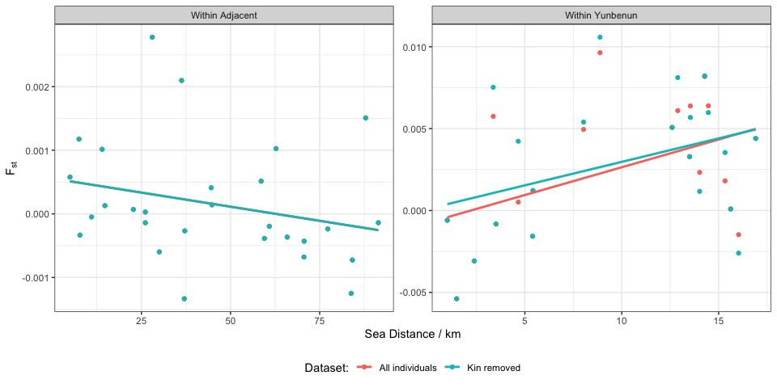
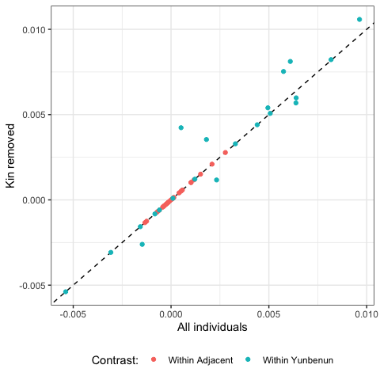
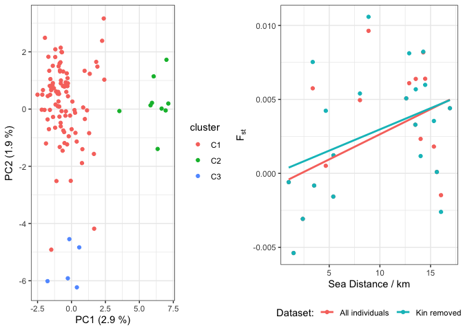
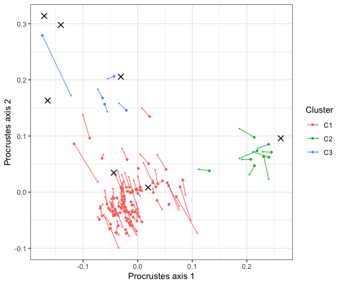

9 Sensitivity of fine scale population structure to close kin
================
Ira Cooke

Fine scale population structure analysis, including PCA and the
isolation-by-distance (IBD) analysis in `03.population_structure.qmd` is
based on a dataset from which a single individual (`A31`) had been
removed. This individual had a relatedness value on the upper limit of
expected values for sibling or parent-child relationships (very close
kin) and was removed because it led to a distortion of signal in PCA.
Subsequent relatedness analysis identified a larger set of related
individuals at lower kinship levels (up to 3rd degree). Note also that
since A31 is from the widespread lineage where we observed no population
structure and its inclusion or exclusion would be unlikely to
meaningfully alter results. Therefore we focus here on sensitivity to
inclusion of the 7 remaining individuals, all of which are from south
Yunbenun.

    ## [1] "A31"              "GB_03/03/2022_27" "GB_03/03/2022_1"  "PB_25/11/21_04"  
    ## [5] "GB_03/03/2022_4"  "PB_25/11/21_11"   "GB_03/03/2022_6"  "PB_25/11/21_26"

## Datasets

The baseline dataset and its pairwise Fst values are read directly from
the cached objects used in `03.population_structure.qmd`.

For the sensitivity analysis we drop the remaining kin (`A31` is already
absent from the baseline dataset) and recompute pairwise Fst.

All of the additionally removed individuals come from two southern
Magnetic Island bays, Geoffrey Bay (GB) and Picnic Bay (PB).

| site | n_all | n_nokin | n_removed |
|:-----|------:|--------:|----------:|
| BRR  |    19 |      19 |         0 |
| EP   |    94 |      94 |         0 |
| GB   |    28 |      24 |         4 |
| HaR  |    22 |      22 |         0 |
| HB   |    22 |      22 |         0 |
| HFB  |    14 |      14 |         0 |
| JB   |    15 |      15 |         0 |
| KR   |    14 |      14 |         0 |
| LPB  |    34 |      34 |         0 |
| MB   |     6 |       6 |         0 |
| MR   |    12 |      12 |         0 |
| PB   |    18 |      15 |         3 |
| SO   |    80 |      80 |         0 |
| WB   |    17 |      17 |         0 |
| WP   |     8 |       8 |         0 |

Removing individuals also renders a small number of loci monomorphic, so
the two analyses are based on slightly different locus sets. The
difference is just 5 loci though.

    ##   all nokin 
    ##  4108  4103

## Fst and sea distance matrices

`gl.fst.pop` returns a lower-triangular matrix; we mirror it so that
every pair can be looked up in either orientation.

Sea distances are the manually measured shortest paths between sites
that avoid crossing land, exactly as used in
`03.population_structure.qmd`.

## Mantel tests

Mantel tests are run separately within Magnetic Island and within the
adjacent reefs, using the same site sets, number of permutations and
random seeds as the original analysis.

| dataset         | test            | n_sites | n_pairs | mantel_r |    R2 |     p |
|:----------------|:----------------|--------:|--------:|---------:|------:|------:|
| All individuals | Magnetic Island |       7 |      21 |    0.474 | 0.225 | 0.036 |
| All individuals | Adjacent        |       8 |      28 |   -0.260 | 0.068 | 0.896 |
| Kin removed     | Magnetic Island |       7 |      21 |    0.372 | 0.138 | 0.050 |
| Kin removed     | Adjacent        |       8 |      28 |   -0.260 | 0.068 | 0.896 |

## Fst versus sea distance

<!-- -->

Pairwise Fst values from the two datasets are also compared directly
below; points falling on the 1:1 line indicate pairs unaffected by kin
removal.

<!-- -->

## Summary

None of the additionally excluded individuals come from adjacent reefs,
so the adjacent test is unchanged (r = -0.26, p = 0.896).

Within Magnetic Island the relationship is weakened but not removed: the
Mantel correlation falls from 0.474 (p = 0.036) to 0.372 (p = 0.05), and
the variance in pairwise Fst explained by sea distance drops from 0.225
to 0.138. Since the excluded kin are all from the two southern bays GB
and PB, this is expected: their removal slightly reduces the north/south
Fst contrast that drives the signal.

## PCA

After removing all close kin identified previously (relatedness \>
0.045) we see that the PCA still retains the same three cluster
structure, however, since many of the removed individuals were from
cluster 3 this cluster is less prominent.

<!-- -->

### Comparing the two ordinations directly

The two PCAs are computed on different individuals (117 vs 110) and
slightly different locus sets, and PC axes are only defined up to
rotation, reflection and scaling. They can therefore not be overlaid
as-is. Instead we use a Procrustes rotation (`vegan::protest`) of the
PC1–PC2 scores for the 110 individuals present in both analyses, which
finds the rotation, reflection and uniform rescaling that best
superimposes one ordination on the other and reports the residual
mismatch.

    ## 
    ## Call:
    ## protest(X = pcoa_ak_filtered_nr_mag$scores[shared_ids, 1:2],      Y = pcoa_ak_filtered_nr_mag_nosibs$scores[shared_ids, 1:2],      permutations = 9999) 
    ## 
    ## Procrustes Sum of Squares (m12 squared):        0.07649 
    ## Correlation in a symmetric Procrustes rotation: 0.961 
    ## Significance:  1e-04 
    ## 
    ## Permutation: free
    ## Number of permutations: 9999

The two configurations agree closely (Procrustes correlation 0.961;
residual sum of squares 0.076 of the total).

In the plot each arrow runs from an individual’s position in the
all-individuals PCA to its position in the kin-removed PCA after
alignment. Crosses mark the seven removed kin at their positions in the
all-individuals PCA.

<!-- -->

Displacements are small relative to the separation between the three
clusters, and no individual changes cluster membership. The table below
summarises the two axes: alongside the proportion of total variance each
explains, we report the proportion of variation along each axis
explained by an individual’s dominant K=3 cluster (both restricted to
the shared individuals, so the comparison is not affected by the change
in sample size).

| metric            | All individuals | Kin removed |
|:------------------|----------------:|------------:|
| % variance PC1    |           3.044 |       2.874 |
| % variance PC2    |           2.593 |       1.899 |
| cluster R2 on PC1 |           0.773 |       0.750 |
| cluster R2 on PC2 |           0.634 |       0.485 |

PC1 is essentially unaffected. PC2 is the axis that responds to kin
removal: its share of total variance falls from 2.6% to 1.9%, and the
proportion of PC2 explained by cluster identity falls from 0.63 to 0.49.
This is consistent with where the removed individuals sat, as four of
the seven were C3 individuals lying at the very top of PC2 (97th–100th
percentile), with a fifth at the C2 extreme.

| ID               | cluster | PC2_all | PC2_percentile |
|:-----------------|:--------|--------:|---------------:|
| GB_03/03/2022_27 | C3      |   0.314 |            100 |
| GB_03/03/2022_1  | C3      |   0.298 |            100 |
| GB_03/03/2022_4  | C3      |   0.205 |             98 |
| PB_25/11/21_04   | C3      |   0.163 |             97 |
| PB_25/11/21_11   | C2      |   0.096 |             93 |
| GB_03/03/2022_6  | C1      |   0.035 |             80 |
| PB_25/11/21_26   | C1      |   0.008 |             70 |

So part of the apparent spread along PC2 in the full dataset was carried
by close kin, and the three-cluster arrangement is correspondingly less
crisp once they are removed. It is not created by them: the same three
groups remain separated on the same axes in the same relative
arrangement, and the alignment between the two ordinations is high.
