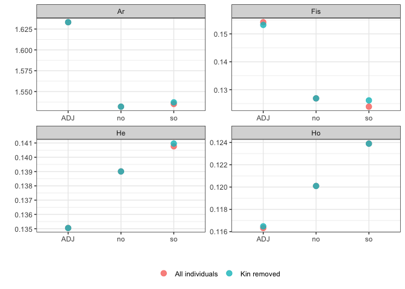
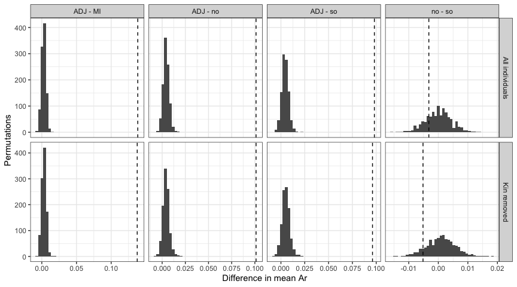

# 10 Sensitivity of genetic diversity to close kin
Ira Cooke

The genetic diversity analyses in `04.genetic_diversity.qmd` are based
on `ak.pop.nm`, a dataset from which duplicates had been removed but not
close kin. Here we recompute allelic richness (Ar), observed and
expected heterozygosity (Ho, Hs) and Fis with kin removed.

    [1] "A31"              "GB_03/03/2022_27" "GB_03/03/2022_1"  "PB_25/11/21_04"  
    [5] "GB_03/03/2022_4"  "PB_25/11/21_11"   "GB_03/03/2022_6"  "PB_25/11/21_26"  

## Datasets

We use `mono.rm = FALSE` so that both datasets retain exactly the same
loci. If monomorphic loci were dropped after kin removal the two
analyses would be averaging over different locus sets, which would
itself change mean diversity irrespective of which individuals were
included. Either way the effect is likely tiny since we are talking
about just 5 SNPs that are monomorphic after removing kin.

      all nokin 
     4108  4108 

Seven of the additionally removed individuals come from two southern
Magnetic Island bays, Geoffrey Bay (GB) and Picnic Bay (PB), and just
one comes from the adjacent population.

| site | n_all | n_nokin | n_removed |
|:-----|------:|--------:|----------:|
| BRR  |    19 |      19 |         0 |
| EP   |    94 |      94 |         0 |
| GB   |    28 |      24 |         4 |
| HaR  |    22 |      22 |         0 |
| HB   |    22 |      22 |         0 |
| HFB  |    14 |      14 |         0 |
| JB   |    15 |      15 |         0 |
| KR   |    14 |      14 |         0 |
| LPB  |    34 |      34 |         0 |
| MB   |     6 |       6 |         0 |
| MR   |    12 |      12 |         0 |
| PB   |    18 |      15 |         3 |
| SO   |    81 |      80 |         1 |
| WB   |    17 |      17 |         0 |
| WP   |     8 |       8 |         0 |

## Population groupings

We report statistics for the three main groupings (adjacent reefs, north
and south Magnetic Island). Merging is done without filtering
monomorphs, again to keep the locus set fixed.

Both sets of objects carry the same loci, and differ only by the eight
individuals.

| grouping | n_ind_all | n_ind_nokin | n_loci |
|:---------|----------:|------------:|-------:|
| site     |       404 |         396 |   4108 |
| no.so    |       404 |         396 |   4108 |
| adj.mi   |       404 |         396 |   4108 |

## Diversity statistics

`allelic.richness` rarefies to `2 * min(ind.count(data))`, i.e. the
smallest number of genotyped individuals seen in any population at any
locus. Since we would like to compare results with/without kin we need
to make sure we set this to the same value in each analysis. We
therefore fix `min.n` to a common value across the two datasets being
compared. This means re-running the analysis including kin (with a
slightly lower min.n) and running analysis without kin at the same min.n

      site  no.so adj.mi 
         2     34     72 

### Three main groupings

| stat | pop | All individuals | Kin removed | difference |
|:-----|:----|----------------:|------------:|-----------:|
| Ar   | ADJ |          1.6332 |      1.6332 |     0.0000 |
| Ar   | no  |          1.5319 |      1.5319 |     0.0000 |
| Ar   | so  |          1.5351 |      1.5371 |     0.0020 |
| Fis  | ADJ |          0.1542 |      0.1532 |    -0.0010 |
| Fis  | no  |          0.1269 |      0.1269 |     0.0000 |
| Fis  | so  |          0.1239 |      0.1262 |     0.0022 |
| Ho   | ADJ |          0.1163 |      0.1165 |     0.0002 |
| Ho   | no  |          0.1201 |      0.1201 |     0.0000 |
| Ho   | so  |          0.1239 |      0.1239 |     0.0000 |
| Hs   | ADJ |          0.1351 |      0.1350 |     0.0000 |
| Hs   | no  |          0.1390 |      0.1390 |     0.0000 |
| Hs   | so  |          0.1408 |      0.1410 |     0.0002 |

Note that these Ar values differ slightly from those reported in
`04.genetic_diversity.qmd` because they are computed at a common
rarefaction depth (34 alleles) across kin-removed and kin-included
rather than at the slightly higher depth used in the main analysis.

## Permutation tests

Significance of the differences between groupings was assessed by
permutation, randomly reassigning individuals to populations and
recomputing each statistic. Both datasets were run as 1000-iteration
slurm array jobs on an external HPC system using the scripts in
`basic_stats`:

| Slurm script | Worker | Input | Output |
|:---|:---|:---|:---|
| `01.ar_perm.sh` | `run_permute.R` | `hfstat.rds` | `perms/` |
| `02.ar_perm_nokin.sh` | `run_permute_nokin.R` | `hfstat_nokin.rds` | `perms_nokin/` |
| `03.ar_perm_all.sh` | `run_permute_all.R` | `hfstat.rds` | `perms_all/` |

We use `perms_all` and `perms_nokin` here. These differ from the
original `perms/` in one respect: the allelic richness rarefaction depth
is fixed at a value common to both datasets rather than the slightly
higher value if only the full dataset is being considered.

The test statistic is the difference in the locus-averaged statistic
between two populations. The p-value is the proportion of permutations
whose absolute difference is at least as large as the observed one,
computed as `(n_extreme + 1) / (n_perm + 1)` so that the smallest
attainable value is 1/1001 rather than zero.

### Allelic richness

| grouping | contrast | dataset         | obs_diff |      p |
|:---------|:---------|:----------------|---------:|-------:|
| adj.mi   | ADJ - MI | All individuals |   0.1383 | 0.0010 |
| adj.mi   | ADJ - MI | Kin removed     |   0.1375 | 0.0010 |
| no.so    | ADJ - no | All individuals |   0.1013 | 0.0010 |
| no.so    | ADJ - no | Kin removed     |   0.1013 | 0.0010 |
| no.so    | ADJ - so | All individuals |   0.0981 | 0.0010 |
| no.so    | ADJ - so | Kin removed     |   0.0961 | 0.0010 |
| no.so    | no - so  | All individuals |  -0.0032 | 0.4406 |
| no.so    | no - so  | Kin removed     |  -0.0052 | 0.2927 |

Adjacent reefs carry significantly higher allelic richness than either
Magnetic Island grouping, while north and south Magnetic Island are not
distinguishable from each other. Both conclusions hold whether or not
close kin are included, and the observed differences are essentially
unchanged.

### Heterozygosity and Fis

Observed Heterozygosity (Ho)

| grouping | contrast | dataset         | obs_diff |     p |
|:---------|:---------|:----------------|---------:|------:|
| adj.mi   | ADJ - MI | All individuals |  -0.0057 | 0.001 |
| adj.mi   | ADJ - MI | Kin removed     |  -0.0054 | 0.001 |
| no.so    | ADJ - no | All individuals |  -0.0038 | 0.001 |
| no.so    | ADJ - no | Kin removed     |  -0.0036 | 0.003 |
| no.so    | ADJ - so | All individuals |  -0.0076 | 0.001 |
| no.so    | ADJ - so | Kin removed     |  -0.0074 | 0.001 |
| no.so    | no - so  | All individuals |  -0.0038 | 0.006 |
| no.so    | no - so  | Kin removed     |  -0.0038 | 0.011 |

Expected Heterozygosity (He)

| grouping | contrast | dataset         | obs_diff |      p |
|:---------|:---------|:----------------|---------:|-------:|
| adj.mi   | ADJ - MI | All individuals |  -0.0052 | 0.1029 |
| adj.mi   | ADJ - MI | Kin removed     |  -0.0052 | 0.1538 |
| no.so    | ADJ - no | All individuals |  -0.0040 | 0.3586 |
| no.so    | ADJ - no | Kin removed     |  -0.0040 | 0.4036 |
| no.so    | ADJ - so | All individuals |  -0.0057 | 0.1818 |
| no.so    | ADJ - so | Kin removed     |  -0.0059 | 0.2348 |
| no.so    | no - so  | All individuals |  -0.0018 | 0.7273 |
| no.so    | no - so  | Kin removed     |  -0.0019 | 0.7313 |

Fis

| grouping | contrast | dataset         | obs_diff |      p |
|:---------|:---------|:----------------|---------:|-------:|
| adj.mi   | ADJ - MI | All individuals |   0.0231 | 0.0010 |
| adj.mi   | ADJ - MI | Kin removed     |   0.0207 | 0.0040 |
| no.so    | ADJ - no | All individuals |   0.0273 | 0.0100 |
| no.so    | ADJ - no | Kin removed     |   0.0263 | 0.0170 |
| no.so    | ADJ - so | All individuals |   0.0303 | 0.0010 |
| no.so    | ADJ - so | Kin removed     |   0.0271 | 0.0280 |
| no.so    | no - so  | All individuals |   0.0030 | 0.7393 |
| no.so    | no - so  | Kin removed     |   0.0007 | 0.9231 |

These results show the same conclusions (based on a p-value threshold of
0.05) as were found in `04.genetic_diversity`. Every contrast involving
observed heterozygosity (Ho) is significant, including north versus
south Magnetic Island, and in each case Magnetic Island is the *higher*
value. None of the expected heterozygosity (Hs) contrasts reach
significance. Fis is significantly lower at Magnetic Island than at
adjacent reefs.

## Summary

| grouping | contrast | stat | All individuals | Kin removed | agree |
|:---------|:---------|:-----|----------------:|------------:|:------|
| adj.mi   | ADJ - MI | Ar   |       0.0009990 |   0.0009990 | TRUE  |
| adj.mi   | ADJ - MI | Fis  |       0.0009990 |   0.0039960 | TRUE  |
| adj.mi   | ADJ - MI | Ho   |       0.0009990 |   0.0009990 | TRUE  |
| adj.mi   | ADJ - MI | Hs   |       0.1028971 |   0.1538462 | TRUE  |
| no.so    | ADJ - no | Ar   |       0.0009990 |   0.0009990 | TRUE  |
| no.so    | ADJ - no | Fis  |       0.0099900 |   0.0169830 | TRUE  |
| no.so    | ADJ - no | Ho   |       0.0009990 |   0.0029970 | TRUE  |
| no.so    | ADJ - no | Hs   |       0.3586414 |   0.4035964 | TRUE  |
| no.so    | ADJ - so | Ar   |       0.0009990 |   0.0009990 | TRUE  |
| no.so    | ADJ - so | Fis  |       0.0009990 |   0.0279720 | TRUE  |
| no.so    | ADJ - so | Ho   |       0.0009990 |   0.0009990 | TRUE  |
| no.so    | ADJ - so | Hs   |       0.1818182 |   0.2347652 | TRUE  |
| no.so    | no - so  | Ar   |       0.4405594 |   0.2927073 | TRUE  |
| no.so    | no - so  | Fis  |       0.7392607 |   0.9230769 | TRUE  |
| no.so    | no - so  | Ho   |       0.0059940 |   0.0109890 | TRUE  |
| no.so    | no - so  | Hs   |       0.7272727 |   0.7312687 | TRUE  |
